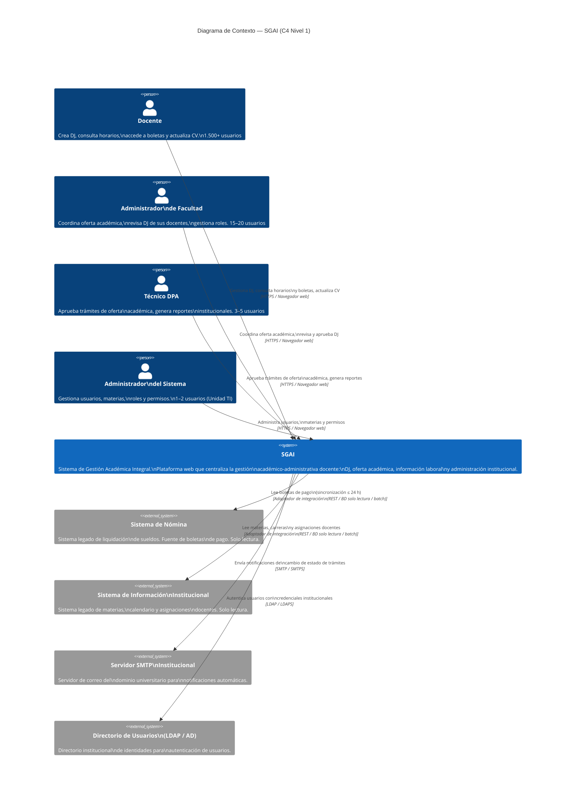

# C4_nivel_1.md — Diagrama de Contexto del Sistema (Nivel 1)
# Sistema de Gestión Académica Integral (SGAI)

---

## 0. Nota Metodológica — C4 Model (c4model.com)

> Este diagrama fue elaborado siguiendo la metodología **C4 Model de Simon Brown** (https://c4model.com), leída directamente desde la fuente oficial. A continuación se resume la base teórica aplicada.

### ¿Qué es el C4 Model?

El C4 Model fue creado como una forma de ayudar a los equipos de desarrollo de software a describir y comunicar la arquitectura de software, tanto durante sesiones de diseño previas como cuando se documenta retrospectivamente un código existente. Es una forma de crear "mapas del código", en varios niveles de detalle, de la misma forma en que se usaría Google Maps para ampliar o reducir un área de interés.

### Las Abstracciones del C4 Model

En el C4 model: un **software system** está compuesto por uno o más **containers** (aplicaciones y almacenes de datos), cada uno de los cuales contiene uno o más **components**, que a su vez son implementados por uno o más elementos de **code** (clases, interfaces, objetos, funciones, etc). Y las **personas** (actores, roles, personas, individuos nombrados, etc) usan los sistemas de software que construimos.

El C4 model es un enfoque "abstraction-first" para diagramar la arquitectura de software, basado en abstracciones que reflejan cómo los arquitectos y desarrolladores de software piensan y construyen software.

Las cuatro abstracciones jerárquicas son:

| Nivel | Abstracción | Descripción |
|-------|-------------|-------------|
| 1 | **Software System** | El nivel más alto de abstracción que entrega valor a los usuarios finales, sean humanos o no. Los sistemas son frecuentemente propiedad de un equipo de desarrollo. |
| 2 | **Container** | Aplicaciones y almacenes de datos que componen un sistema. Son independientemente desplegables y ejecutables (no confundir con contenedores Docker). Por ejemplo: API service, aplicación frontend o app móvil. |
| 3 | **Component** | Agrupación de funcionalidad relacionada encapsulada detrás de una interfaz bien definida, dentro de un container. |
| 4 | **Code** | Generalmente en forma de diagramas de clases UML generados idealmente desde el código real. Este nivel rara vez se usa ya que entra en demasiado detalle técnico para la mayoría de los equipos. |

### El Diagrama de Contexto del Sistema (Nivel 1)

Un diagrama de contexto del sistema es un buen punto de partida para diagramar y documentar un sistema de software, permitiéndote dar un paso atrás y ver el panorama completo. Se dibuja un diagrama mostrando el sistema como una caja en el centro, rodeado de sus usuarios y los otros sistemas con los que interactúa.

El detalle no es importante aquí ya que es la vista reducida que muestra una imagen general del panorama del sistema. El foco debe estar en las **personas** (actores, roles, personas, etc) y los **sistemas de software** en lugar de tecnologías, protocolos y otros detalles de bajo nivel. Es el tipo de diagrama que se podría mostrar a personas no técnicas.

- **Audiencia objetivo:** Todos — tanto personas técnicas como no técnicas, dentro y fuera del equipo de desarrollo de software.
- **¿Es recomendado?** Sí, un diagrama de contexto del sistema es recomendado para todos los equipos de desarrollo de software.
- **Elementos primarios:** El sistema de software dentro del alcance.
- **Elementos de soporte:** Personas (usuarios, actores, roles) y sistemas de software externos directamente conectados al sistema en alcance.

> **Regla de notación C4:** Cada elemento debe tener nombre, tipo y una descripción corta. Las relaciones deben estar etiquetadas con el propósito de la interacción. No se mezclan niveles de abstracción en un mismo diagrama.

---

## 1. Descripción del Sistema en Contexto

**Sistema en alcance:** SGAI — Sistema de Gestión Académica Integral

**Propósito del sistema (en lenguaje de negocio):**
Plataforma web institucional que digitaliza y centraliza el ciclo académico-administrativo docente de una universidad pública boliviana: declaraciones juradas, oferta académica, acceso a información laboral (horarios, boletas de pago) y administración de perfiles y roles.

**Frontera del sistema:**
El SGAI es responsable de la lógica de negocio de gestión académica-administrativa. Los sistemas externos de nómina y de información institucional son fuentes de datos de solo lectura; el servidor SMTP y el directorio de usuarios son servicios de infraestructura institucional. Ninguno de estos sistemas es modificado por el SGAI.

---

## 2. Personas (Actores)

Siguiendo la abstracción C4: las personas representan usuarios humanos del sistema (actores, roles o personas reales).

| ID | Persona | Descripción en contexto |
|----|---------|------------------------|
| P1 | **Docente** | Docente universitario (titular, interino, investigador). Crea y envía declaraciones juradas, consulta horarios y boletas de pago, actualiza su CV. 1.500+ usuarios. |
| P2 | **Administrador de Facultad** | Secretario académico de facultad. Coordina la oferta académica de su facultad, revisa y aprueba DJs de sus docentes, gestiona roles. 15–20 usuarios. |
| P3 | **Técnico DPA** | Técnico del Departamento de Planificación Académica. Revisa y aprueba trámites de oferta académica a nivel institucional, genera reportes consolidados. 3–5 usuarios. |
| P4 | **Administrador del Sistema** | Técnico de la Unidad de TI. Gestiona cuentas de usuario, materias, roles y permisos. 1–2 usuarios. |

---

## 3. Sistemas Externos (Software Systems)

Siguiendo la abstracción C4: los sistemas externos son software systems fuera del alcance y propiedad del SGAI.

| ID | Sistema Externo | Tipo | Descripción en contexto | Dirección de la relación |
|----|----------------|------|------------------------|--------------------------|
| SE1 | **Sistema de Nómina** | Legado institucional (solo lectura) | Sistema de liquidación de sueldos de la universidad. Fuente única de verdad de boletas de pago. El SGAI consume sus datos; no lo modifica. | SE1 → SGAI (datos de boletas) |
| SE2 | **Sistema de Información Institucional** | Legado institucional (solo lectura) | Sistema que administra materias, carreras, asignaciones docentes y carga horaria. El SGAI sincroniza datos desde él; no lo modifica. | SE2 → SGAI (datos académicos) |
| SE3 | **Servidor SMTP Institucional** | Infraestructura institucional | Servidor de correo del dominio universitario. El SGAI lo usa para enviar notificaciones automáticas a usuarios. | SGAI → SE3 (notificaciones) |
| SE4 | **Directorio de Usuarios (LDAP/AD)** | Infraestructura institucional | Directorio de identidades de la universidad. El SGAI lo usa para autenticar usuarios con credenciales institucionales. | SGAI → SE4 (autenticación) |

---

## 4. Diagrama C4 — Nivel 1 (Contexto del Sistema)

> Renderizable en cualquier herramienta compatible con Mermaid C4. Probado en GitHub Markdown y mermaid.live.

---

## 5. Tabla de Relaciones (Narrativa del Contexto)

| Origen | Destino | Propósito | Protocolo | Criticidad |
|--------|---------|-----------|-----------|------------|
| Docente | SGAI | Crear/enviar DJ; consultar horarios y boletas; actualizar CV | HTTPS | Alta |
| Administrador de Facultad | SGAI | Crear y enviar oferta académica; revisar y aprobar DJ; gestionar roles docentes | HTTPS | Alta |
| Técnico DPA | SGAI | Aprobar/observar trámites de oferta; consultar historial; generar reportes | HTTPS | Alta |
| Administrador del Sistema | SGAI | Gestión de usuarios, materias, carreras y permisos del sistema | HTTPS | Alta |
| SGAI | Sistema de Nómina | Leer y sincronizar boletas de pago (solo lectura, sin modificar el sistema origen) | Adaptador (por determinar en Sprint 0) | Alta |
| SGAI | Sistema de Información Institucional | Leer y sincronizar materias, carreras y asignaciones docentes (solo lectura) | Adaptador (por determinar en Sprint 0) | Alta |
| SGAI | Servidor SMTP Institucional | Enviar notificaciones automáticas por correo ante cambios de estado de trámites | SMTP/SMTPS | Media |
| SGAI | Directorio de Usuarios (LDAP/AD) | Autenticar usuarios con sus credenciales institucionales (o migración inicial de cuentas) | LDAP/LDAPS | Alta |

---

## 6. Decisiones de Diseño Implícitas en el Nivel 1

Las siguientes decisiones de diseño son visibles desde el diagrama de contexto y se elevan como candidatas a ADR:

| # | Decisión observada | Impacto | ADR candidato |
|---|--------------------|---------|---------------|
| D1 | El SGAI se integra con los sistemas legados en **modo solo lectura** (no los modifica) mediante adaptadores desacoplados | Define la estrategia de integración completa; desacopla el SGAI de los ciclos de vida de los sistemas legados | ADR-0002 |
| D2 | El acceso de los cuatro tipos de usuarios se realiza exclusivamente vía **navegador web** (no hay app nativa) | Reduce el alcance de desarrollo y despliegue; limita la accesibilidad en dispositivos sin navegador | ADR-0003 |
| D3 | La **autenticación usa el directorio institucional existente** (LDAP/AD) en lugar de un sistema de identidad propio | Reutiliza la infraestructura de identidad institucional; crea dependencia del directorio LDAP/AD | ADR-0004 |
| D4 | Las **notificaciones son asíncronas** (SMTP externo) y no bloquean el flujo de negocio | Mejora la resiliencia del flujo de aprobación; la entrega de correos no está garantizada en tiempo real | Referenciado en ADR-0002 |

---

## 7. Lo que el Nivel 1 NO muestra (intencionalmente)

Siguiendo las convenciones de c4model.com, el Diagrama de Contexto **no muestra**:
- Tecnologías internas del SGAI (lenguajes, frameworks, bases de datos).
- Contenedores internos del sistema (eso corresponde al Nivel 2 — Container Diagram).
- Componentes o clases internas (Niveles 3 y 4).
- Protocolos específicos detallados de las integraciones (se definen en el Nivel 2).
- Infraestructura de despliegue (servidores, red, puertos).

Estos elementos se detallarán en `C4_nivel_2.md` (Container Diagram) y `C4_nivel_3.md` (Component Diagram del módulo de Declaraciones Juradas).

---

## 8. Próximos pasos del C4

| Diagrama | Alcance | Audiencia | Estado |
|----------|---------|-----------|--------|
| **Nivel 1 — Contexto** (este documento) | Sistema completo en su entorno | Todos (técnicos y no técnicos) | ✅ Completo |
| **Nivel 2 — Contenedores** | Containers internos del SGAI (SPA, API, BD, Workers, Adaptadores) | Equipo técnico + PM | 🔴 Pendiente (`C4_nivel_2.md`) |
| **Nivel 3 — Componentes** | Componentes internos del módulo M-DJ (el módulo más crítico) | Arquitecto + Developers | 🔴 Pendiente (`C4_nivel_3_DJ.md`) |
| **Despliegue** | Mapeo de containers a infraestructura de servidores universitarios | DevOps + Unidad TI | 🔴 Pendiente (`C4_deployment.md`) |

---

## 9. Registro de Cambios

| Versión | Fecha | Autor | Cambio |
|---------|-------|-------|--------|
| v1.0 | 10/05/2026 | Equipo SGAI | Versión inicial — Diagrama de Contexto C4 Nivel 1 basado en c4model.com |

---

## 10. Referencias

- **C4 Model (oficial):** https://c4model.com — Simon Brown. Licencia Creative Commons Attribution 4.0 International.
- **Introducción:** https://c4model.com/introduction
- **Abstracciones:** https://c4model.com/abstractions
- **Diagrama de Contexto:** https://c4model.com/diagrams/system-context
- **Trazabilidad con documentación del SGAI:** BRD_v2.md §2 (Contexto del negocio), FSD_v1.md §3 (Actores) y §8 (Integraciones externas), PRD_v1.md §9 (Dependencias e integraciones).
