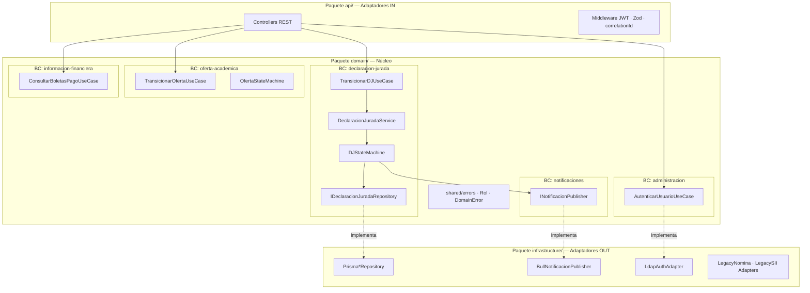
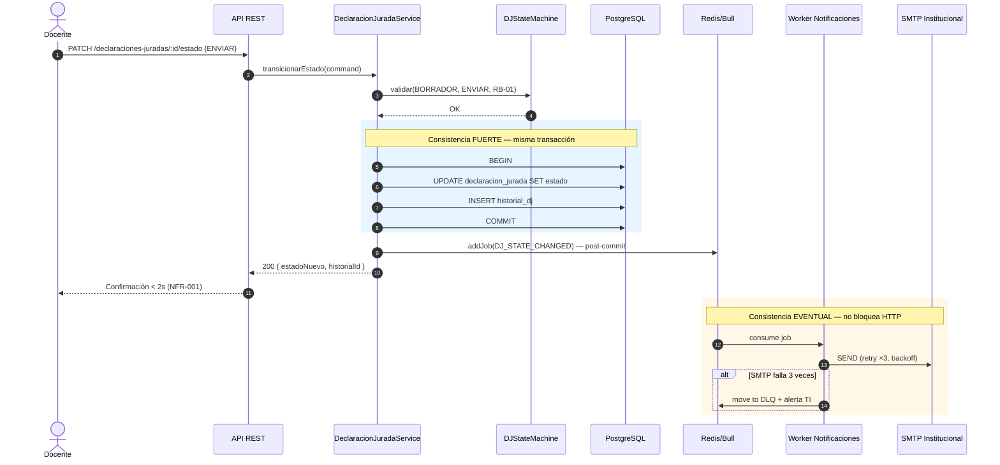
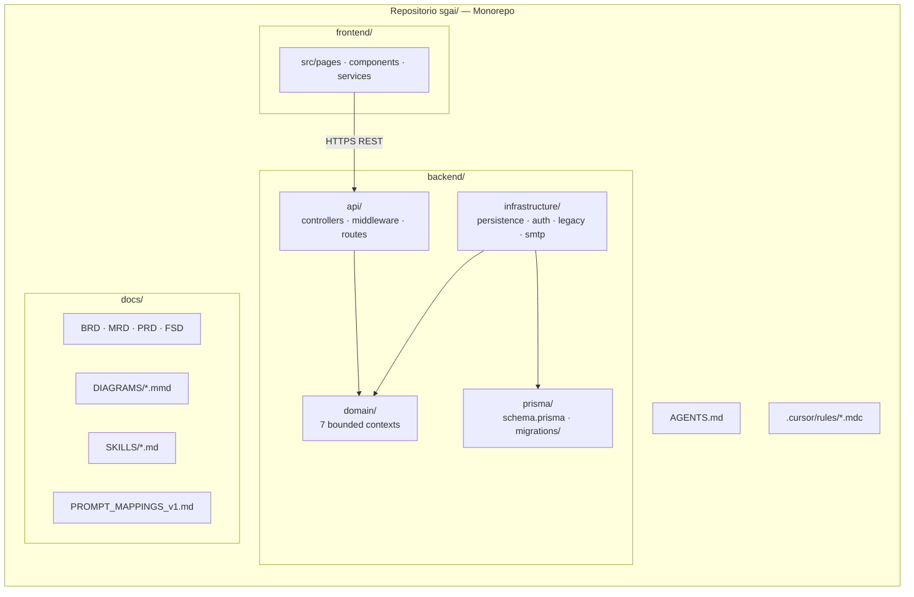
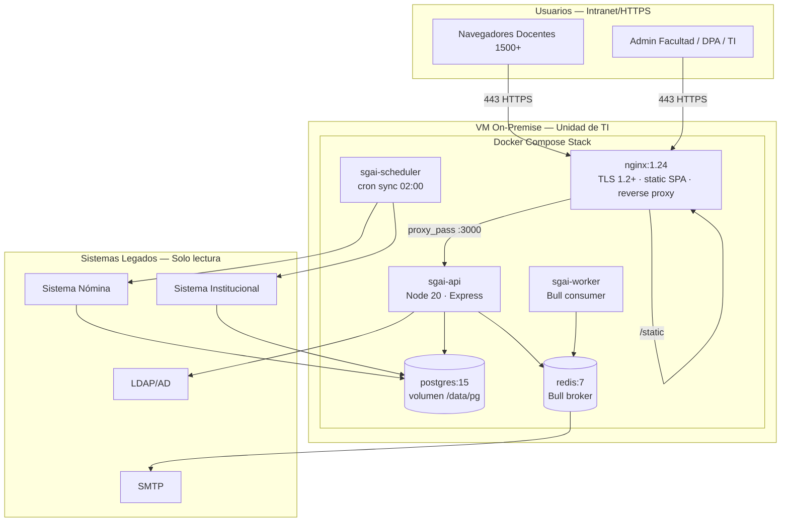
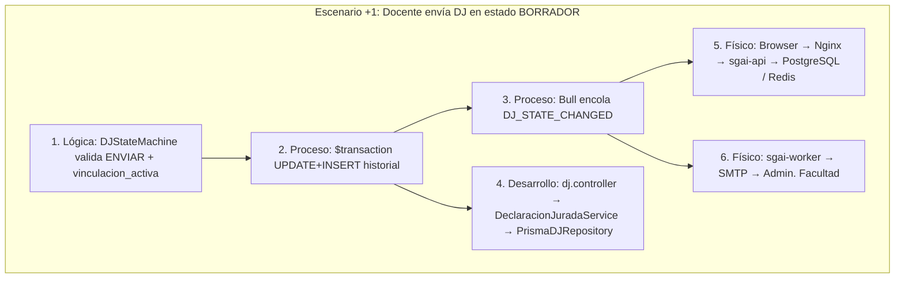

# Avance DTI v1.0 — Vistas Arquitectónicas 4+1 (Kruchten) / C4

> **Producto:** SGAI · **Arquitecto:** Carolina Aguilar · **Fecha:** 17/05/2026  
> **Base normativa:** `docs/DTI_v1.md` · ADR-0001 (monolito hexagonal) · ADR-0004 (on-premise Docker Compose)  
> **Nota:** El runtime v1.0 es **monolito modular hexagonal**, no microservicios ni Kafka. La consistencia entre agregados se garantiza con **transacciones ACID** (RB-06) y efectos secundarios **asíncronos locales** vía Bull + Redis (§7 DTI).

---

## 1. Vista Lógica (Logical View)

### Contenido Técnico

Modela el diseño orientado al dominio (DDD) y la **Arquitectura Hexagonal**: el núcleo `domain/` expone puertos; `api/` e `infrastructure/` implementan adaptadores. No existen dependencias del dominio hacia frameworks.



**Elementos y relaciones:**

| Paquete / BC | Responsabilidad | Entidades / servicios clave |
|--------------|-----------------|----------------------------|
| `declaracion-jurada` | Ciclo DJ, FSM, RB-01/03/06 | `DeclaracionJurada`, `HistorialDJ`, `DJStateMachine` |
| `oferta-academica` | Trámite oferta Facultad→DPA | `OfertaAcademica`, `AsignacionDocente`, `HistorialOferta` |
| `informacion-financiera` | Boletas self-service (RB-04) | `BoletaPago` (cache nómina) |
| `gestion-docente` / `gestion-academica` | Perfil, roles, horarios, calendario | `PerfilDocente`, `CalendarioAcademico` |
| `administracion` | Auth, usuarios, auditoría | `Usuario`, `IAuditLogger` |
| `notificaciones` | Puerto de publicación de eventos de dominio | `INotificacionPublisher` |
| `infrastructure/persistence` | Persistencia Prisma + mappers | `PrismaDJRepository`, transacciones `$transaction` |

**Regla de dependencia:** `api → domain ← infrastructure` (ADR-0001).

### Justificación de Producto

La separación en bounded contexts hexagonales permite que las reglas CEUB (RB-01–RB-07) permanezcan testeables sin acoplamiento a Express o Prisma, habilitando el pipeline AI-SDLC sobre specs verificables — **§3.5**.

---

## 2. Vista de Proceso (Process View)

### Contenido Técnico

Modela la ejecución en tiempo real del escenario crítico **Envío de Declaración Jurada** (FSD-UC-002). La consistencia del estado es **fuerte y síncrona** en PostgreSQL (`$transaction`); la notificación SMTP es **eventual** vía cola Bull (at-least-once), sin saga distribuida entre servicios.



**Patrones de proceso v1.0:**

| Patrón | Alcance | Mecanismo |
|--------|---------|-----------|
| Transacción local | Cambio estado + historial | Prisma `$transaction` (RB-06) |
| Publicación asíncrona | Notificaciones | Bull + Redis (§7.1 DTI) |
| Idempotencia jobs | Reintentos SMTP | `jobId` = f(djId, estadoNuevo, ts) |
| Modo degradado | Legados caídos | Servir cache + `sincronizado_at` (ADR-0002) |

> **No aplica en v1.0:** Sagas distribuidas, Kafka/RabbitMQ entre microservicios (§6 DTI — monolito modular).

### Justificación de Producto

El flujo post-commit con Bull desacopla la latencia HTTP (meta p95 &lt; 2 s) del envío SMTP sin sacrificar atomicidad del trámite académico — **§9**.

---

## 3. Vista de Desarrollo / Implementación (Development View)

### Contenido Técnico

Organización del **monorepo** SGAI: un repositorio, múltiples capas; Prisma como único ORM en `infrastructure/`.



**Dependencias de implementación:**

| Módulo | Tecnología | Restricción |
|--------|------------|------------|
| API | Express 4 + TypeScript strict | Validación Zod antes de dominio |
| Dominio | TS puro | Cero `@prisma/client` |
| Persistencia | Prisma 5 → PostgreSQL 15 | Repos implementan ports `out/` |
| Async | Bull 4 → Redis 7 | Worker proceso separado |
| Auth | JWT + bcrypt + ldapjs | RB-07, NFR-006 |
| IA construcción | Claude + `AGENTS.md` + 8 skills | No runtime IA |

**Convención de módulos críticos:**

```
backend/domain/declaracion-jurada/
  ports/in/TransicionarDJUseCase.ts
  ports/out/IDeclaracionJuradaRepository.ts
  services/DeclaracionJuradaService.ts
  services/DJStateMachine.ts
backend/infrastructure/persistence/dj.repository.ts
backend/api/controllers/dj.controller.ts
```

### Justificación de Producto

Los prompt-contracts (`PR-FSD-UC-001`–`010`) y guardrails en `.cursor/rules/` acotan la generación de código por bounded context, alineando implementación con FSD-UC trazables — **§3.5.1**.

---

## 4. Vista Física (Physical View)

### Contenido Técnico

Despliegue **on-premise** en VM universitaria (Ubuntu 22.04 LTS) con **Docker Compose** — no Kubernetes en v1.0 (ADR-0004). Nginx termina TLS y balancea tráfico hacia el proceso API.



**Nodos y asignación:**

| Nodo lógico | Artefacto físico | CPU/RAM orientativa |
|-------------|------------------|---------------------|
| Proxy + SPA | Contenedor `nginx` | 0.5 vCPU, 256 MB |
| API REST | Contenedor `sgai-api` | 2 vCPU, 512 MB–1 GB |
| Worker | Contenedor `sgai-worker` | 1 vCPU, 256 MB |
| Scheduler | Contenedor `sgai-scheduler` | 0.5 vCPU, 256 MB |
| BD transaccional | `postgres:15` + volumen | 2 vCPU, 2–4 GB RAM |
| Broker | `redis:7` | 0.5 vCPU, 256 MB |

**Entornos:** `dev` (Compose local) · `staging` (VM pre-prod) · `production` (VM dedicada) — §8.3 DTI.

### Justificación de Producto

Docker Compose sobre VM institucional cumple soberanía de datos Ley 164 y capacidad operativa de la Unidad de TI sin exigir orquestación Kubernetes — **§23**.

---

## 5. Vista de Escenarios (+1)

### Escenario seleccionado

**Ciclo Completo de Declaración Jurada — Comando `ENVIAR`** (FSD-UC-002, PR-FSD-UC-002). Anima las cuatro vistas anteriores en un único hilo de ejecución.

### Contenido Técnico



**Secuencia de estados (vista lógica animada):**

```mermaid
stateDiagram-v2
  title Escenario FSD-UC-002 — Transición ENVIAR
  [*] --> BORRADOR
  BORRADOR --> EN_REVISION_FACULTAD : ENVIAR [vinculacion_activa=true]
  EN_REVISION_FACULTAD --> [*] : notificación async Admin.Facultad
```

**Trazabilidad del escenario:**

| Vista 4+1 | Artefacto verificable |
|-----------|----------------------|
| Lógica | `domain/declaracion-jurada/services/DJStateMachine.ts` |
| Proceso | `docs/DIAGRAMS/seq_uc002_dj_envio.mmd` |
| Desarrollo | `backend/api/controllers/dj.controller.ts` |
| Física | `docker-compose.yml` + `nginx.conf` |
| Escenario | Tests E2E Playwright + k6 p95 (NFR-001) |

**Precondiciones:** JWT rol `DOCENTE`; DJ `BORRADOR`; `vinculacion_activa=true` (RB-01).  
**Postcondiciones:** Estado `EN_REVISION_FACULTAD`; fila en `historial_dj`; job SMTP encolado; HTTP 200 &lt; 2 s.

### Justificación de Producto

El escenario ENVIAR concentra RB-01, RB-03 y RB-06 y es el caso con Prompt Coverage documentado al 100 % en `PROMPT_MAPPINGS_v1.md`, sirviendo como golden path de auditoría IA del ciclo de construcción — **§22**.

---

## Mapa de citas por vista

| Vista | Cláusula citada | Naturaleza |
|-------|-----------------|------------|
| Lógica | §3.5 | Arquitectura agéntica / AI-SDLC sobre dominio |
| Proceso | §9 | Métricas latencia p95 y desac acoplamiento |
| Desarrollo | §3.5.1 | Prompts, guardrails, skills, cursor rules |
| Física | §23 | Restricciones despliegue on-premise |
| Escenarios (+1) | §22 | Auditoría decisiones IA del golden path |

> **§3.5.1 (extensión DTI):** Elementos de agente de construcción — `AGENTS.md`, `docs/SKILLS/`, `.cursor/rules/`, `PR-FSD-UC-*` en `PROMPT_MAPPINGS_v1.md`, evaluación §23.1.
