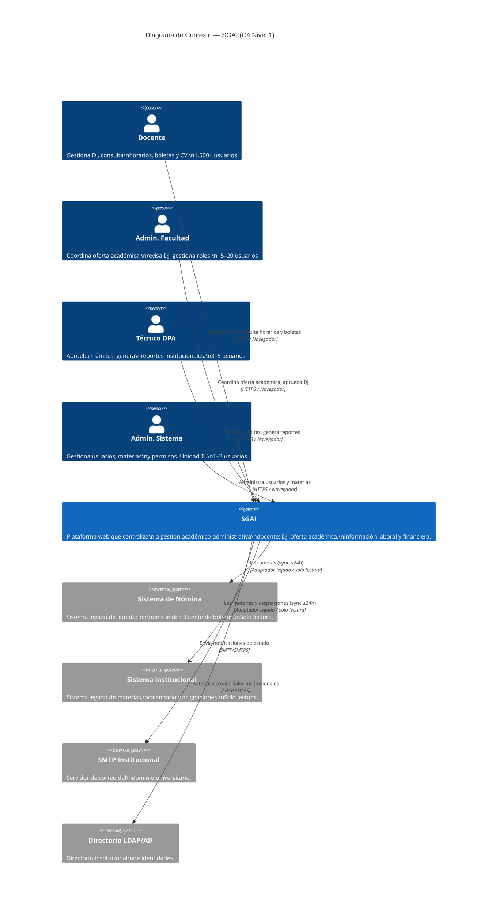
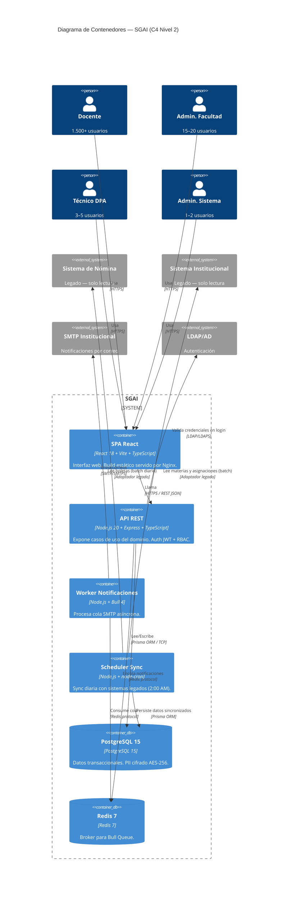
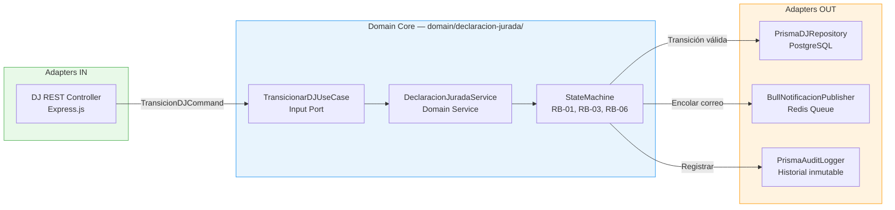
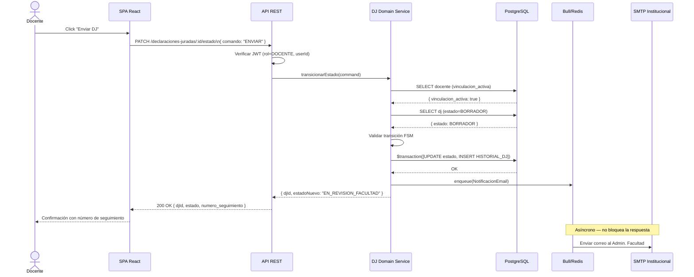
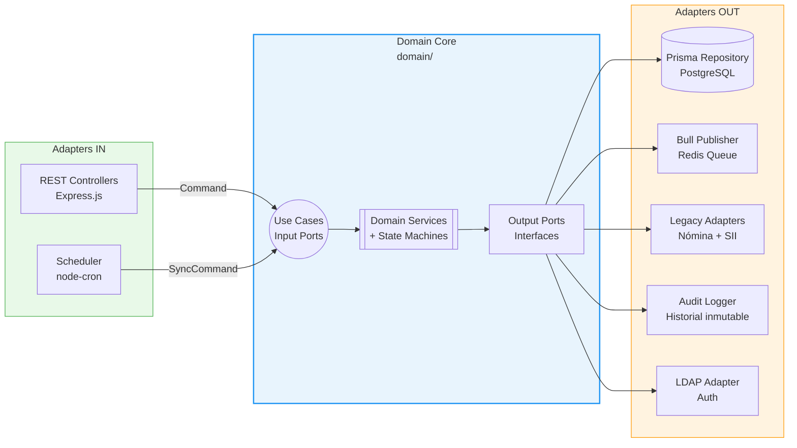
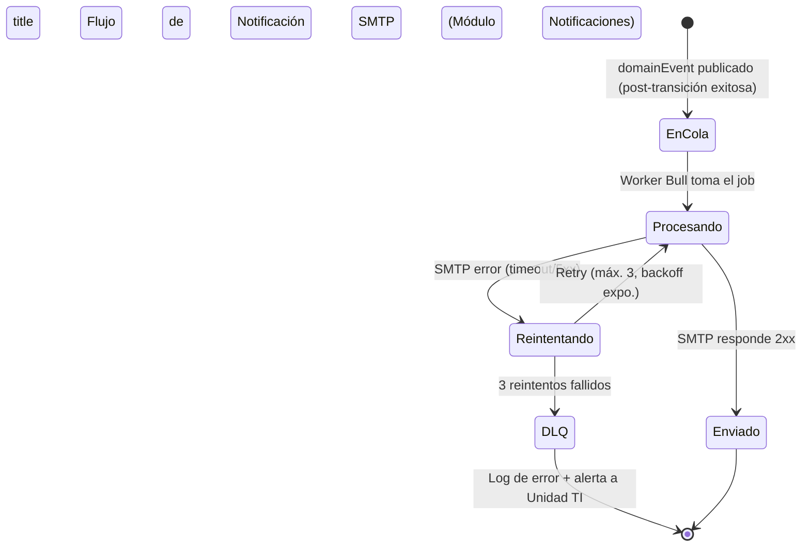
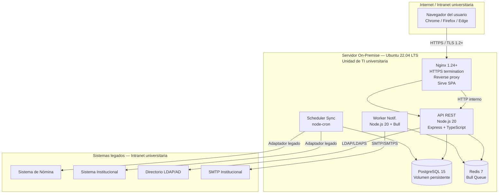

# Documento Técnico Inicial del Producto (DTI) — v1.0
# Sistema de Gestión Académica Integral (SGAI)

> **Propósito:** Contrato técnico inicial del SGAI. Legible tanto por ingenieros humanos como por agentes de IA. Acompaña obligatoriamente al archivo `/AGENTS.md`.
> **Regla de oro:** Si una decisión arquitectónica significativa no está aquí (o referenciada desde aquí), no existe para el equipo ni para los agentes.

---

## 0. Metadatos `[máquina]`

| Campo | Valor |
|-------|-------|
| Producto | Sistema de Gestión Académica Integral (SGAI) |
| Grupo | G01 |
| Versión | v1.0 |
| Fecha | 10/05/2026 |
| Arquitecto responsable | Carolina Aguilar |
| Stakeholders | Director DPA (Sponsor), Unidad de TI, Docentes, Administradores de Facultad |
| Estado | **En revisión** |
| Repositorio | `https://github.com/[org]/sgai` |
| Enlace al BRD | `docs/brd/BRD_v2.md` |
| Enlace al MRD | `docs/mrd/MRD_v1.1.md` |
| Enlace al PRD | `docs/prd/PRD_v1.1.md` |
| Enlace al FSD | `docs/fsd/FSD_v1.1.md` |
| Enlace a `AGENTS.md` | `/AGENTS.md` |
| Enlace a `PROMPT_MAPPINGS.md` | `docs/PROMPT_MAPPINGS.md` |
| C4 Nivel 1 | `docs/diagrams/c4_ctx_sgai.mmd` |
| C4 Nivel 2 | `docs/diagrams/c4_cont_sgai.mmd` |

### 0.1 Rol de Agentes IA en el SDLC `[máquina]`

> Esta tabla declara qué agentes operan en cada fase del ciclo de vida del producto. Espeja con `/AGENTS.md` (agentes activos del proyecto).

| Agente | Fase SDLC | Output | Supervisor humano | Skill propio | Qué se actualiza si el agente falla |
|--------|-----------|--------|-------------------|--------------|--------------------------------------|
| `c4-architect` | Diseño | Diagramas C4 niveles 1–3 en Mermaid | Arquitecto (Carolina Aguilar) | `docs/skills/c4.md` | ADR-0001 + DTI §3 |
| `dj-validator` | Implementación / QA | Código y tests del módulo DJ | Desarrollador | `docs/skills/dj-validator.md` | FSD-UC-002 + tests + AGENTS.md §Skills |
| `offer-auditor` | Implementación / QA | Código y tests del módulo Oferta Académica | Desarrollador | `docs/skills/offer-auditor.md` | FSD-UC-003 + tests |
| `nfr-compliance` | CI / Code Review | Checklist de cumplimiento NFR en PRs | Desarrollador | `docs/skills/nfr-compliance.md` | FSD §8 + k6 scripts |
| `integration-mapper` | Sprint 0 / Implementación | Adaptadores de sistemas legados | Líder técnico | `docs/skills/integration-mapper.md` | ADR-0002 + DTI §12 (POC-01) |
| `mermaid-architect` | Diseño / Docs | Diagramas Mermaid actualizados | Arquitecto | `docs/skills/mermaid-architect.md` | `docs/diagrams/*.mmd` |

> **Nota:** El SGAI v1.0 **no tiene capa de IA en runtime** (no hay agentes, RAG ni modelos en el producto desplegado). Los agentes listados operan **solo en el proceso de construcción** (AI-SDLC). Ver §9 para detalle.

---

## 1. Visión del Producto `[humano]`

**Problema:** Más de 1.500 docentes y 15+ facultades de una universidad pública boliviana gestionan el ciclo académico-administrativo completo —declaraciones juradas, oferta académica, información laboral y financiera— 100 % en papel y presencialmente. Los ciclos de aprobación de oferta académica alcanzan 5–15 días hábiles, las declaraciones juradas carecen de trazabilidad digital, y los docentes no tienen acceso self-service a su información laboral. El costo estimado supera las 800 horas-persona anuales solo en el DPA. El costo de no actuar es la perpetuación de esta ineficiencia y el incumplimiento de plazos normativos del CEUB.

**Usuarios objetivo:**

| Usuario | Descripción | Volumen |
|---------|-------------|---------|
| Docente | Titular, interino, investigador — gestiona DJ, consulta horarios y boletas | 1.500+ |
| Administrador de Facultad | Coordina oferta académica, revisa DJ, gestiona roles docentes | 15–20 |
| Técnico DPA | Aprueba trámites institucionales, genera reportes | 3–5 |
| Administrador del Sistema | Gestiona usuarios, materias, roles y permisos (Unidad TI) | 1–2 |

**Propuesta de valor:** Plataforma web institucional que digitaliza el ciclo académico-administrativo docente con flujo de aprobación multinivel (Docente → Facultad → DPA), acceso self-service 24/7 a información laboral y financiera, integración sin modificar los sistemas legados de nómina e institucional, y operación on-premise con cumplimiento nativo de la Ley N° 164 de Bolivia. Diseñada específicamente para la normativa CEUB.

**Métricas de éxito:**

| Tipo | KPI | Línea base | Meta | Horizonte |
|------|-----|------------|------|-----------|
| **North Star** | Tiempo medio de aprobación de oferta académica | 5–15 días hábiles | ≤ 2 días hábiles | Q1 2027 |
| Secundaria | % de DJ gestionadas digitalmente | 0 % | ≥ 90 % | Q1 2027 |
| Secundaria | % docentes con acceso self-service | 0 % | 100 % | Q2 2027 |
| Secundaria | Satisfacción docente (CSAT 1–5) | Por medir | ≥ 4/5 | Q2 2027 |

**Restricciones de negocio clave:**
- Presupuesto CAPEX máximo: USD 45.000; OPEX: USD 6.000/año.
- Plazo de entrega v1.0 (MVP completo): Q3 2026.
- Operación exclusivamente on-premise (servidores Unidad de TI universitaria) — sin cloud pública sin aprobación.
- Los sistemas legados de nómina y sistema institucional no pueden modificarse (RES-03).
- Cumplimiento obligatorio de la Ley N° 164 de Bolivia y normativa CEUB.

---

## 2. Contexto del Sistema `[humano+máquina]`

### 2.1 Diagrama C4 – Nivel 1 (Contexto)

> Archivo fuente: `docs/diagrams/c4_ctx_sgai.mmd`

### 2.2 Actores Externos y Dependencias

| Actor / Sistema | Tipo | Dirección | Criticidad |
|-----------------|------|-----------|------------|
| Docente | humano | entrada | alta |
| Administrador de Facultad | humano | entrada | alta |
| Técnico DPA | humano | entrada | alta |
| Administrador del Sistema | humano | entrada | alta |
| Sistema de Nómina | sistema | entrada (solo lectura) | alta |
| Sistema de Información Institucional | sistema | entrada (solo lectura) | alta |
| Servidor SMTP Institucional | sistema | salida | media |
| Directorio LDAP/AD | sistema | entrada | alta |

> **Nota:** El SGAI v1.0 no expone ni consume agentes IA externos. No hay actores de tipo `agente IA externo` en esta versión.

---

## 3. Arquitectura de Alto Nivel `[humano+máquina]`

### 3.1 Estilo Arquitectónico Adoptado

- [x] **Monolito modular** con **arquitectura hexagonal (Clean Architecture)** en el núcleo de dominio.

**Justificación:** El SGAI tiene un equipo de desarrollo pequeño (1–4 devs), presupuesto CAPEX de USD 45.000, necesidad de mantenimiento por Unidad de TI local con capacidades estándar, y un dominio con reglas de negocio fuertes y bien delimitadas (máquinas de estados de DJ y Oferta Académica, RBAC por rol, cumplimiento Ley 164). Los microservicios añadirían complejidad operativa (service discovery, distributed tracing, contratos de API entre servicios) sin beneficio real para el volumen esperado (≤ 200 usuarios concurrentes). La arquitectura hexagonal en el core garantiza que las reglas de negocio sean independientes del stack y testeables unitariamente con cobertura ≥ 80 %. **ADR asociado:** `docs/adr/0001-monolito-hexagonal-nodejs-postgresql.md`.

### 3.2 Diagrama C4 – Nivel 2 (Contenedores)

> Archivo fuente: `docs/diagrams/c4_cont_sgai.mmd`

### 3.3 Diagrama C4 – Nivel 3 (Componentes del módulo crítico: M-DJ)

> Módulo más crítico: **Declaraciones Juradas (M-DJ)** — contiene las reglas de negocio RB-01, RB-03, RB-06 y la máquina de estados más compleja del sistema.

**Responsabilidad de cada componente:**

| Componente | Tipo | Responsabilidad | Reglas |
|------------|------|-----------------|--------|
| `DJ REST Controller` | Adapter IN | Recibe HTTP, valida JWT, convierte a Command | — |
| `TransicionarDJUseCase` | Input Port | Contrato del caso de uso (interfaz) | — |
| `DeclaracionJuradaService` | Domain Service | Orquesta la transición; delega al FSM | RB-01, RB-03 |
| `StateMachine` | Domain Service | Valida transiciones válidas; aplica guardas | RB-01, RB-03, RB-06 |
| `PrismaDJRepository` | Adapter OUT | Persistencia atómica: UPDATE + INSERT historial | RB-06 |
| `BullNotificacionPublisher` | Adapter OUT | Encola notificación SMTP asíncrona | — |
| `PrismaAuditLogger` | Adapter OUT | Inserta HISTORIAL_DJ inmutable | RB-06 |

### 3.4 Data Flow Diagram — FSD-UC-002 (Envío de Declaración Jurada)

> Según [c4model.com](https://c4model.com/diagrams/dynamic), este es el Dynamic Diagram del C4 para el caso de uso más crítico. Archivo fuente: `docs/diagrams/seq_uc002_dj_envio.mmd`

### 3.5 Contenedores Agénticos del Producto `[humano+máquina]`

> **N/A en runtime — El SGAI v1.0 no expone agentes en el producto desplegado.** La IA participa exclusivamente en la cadena de construcción (AI-SDLC). Ver §0.1, §3.5.1, §9.2 y §23.

**Arquitectura agéntica de construcción (resumen):**

| Capa | Artefacto | Función |
|------|-----------|---------|
| Contrato | `/AGENTS.md` | Reglas inviolables para agentes de código |
| Skills | `docs/SKILLS/*.md` (8) | Procedimientos por bounded context / NFR |
| Rules | `.cursor/rules/*.mdc` (4) | Enforcement en IDE (dominio, seguridad, Prisma, API) |
| Trazabilidad | `docs/PROMPT_MAPPINGS/PROMPT_MAPPINGS_v1.md` | Input → Prompt → Output |

**Vistas arquitectónicas 4+1 (Kruchten):** `docs/DTI_AVANCE_VISTAS_4MAS1.md`.

### 3.5.1 Elementos de Agentes — Prompts, Guardrails y Tools `[máquina]`

| Elemento | Ubicación | Propósito |
|----------|-----------|-----------|
| Prompt-contracts UC | `PR-FSD-UC-001` … `010` en `PROMPT_MAPPINGS_v1.md` | Anatomía Role·Task·Context·Reasoning·Stop·Output por FSD-UC |
| Guardrails dominio | `.cursor/rules/sgai-domain.mdc` | Enums, RB-01–07, terminología CEUB |
| Guardrails seguridad | `.cursor/rules/security-ley164.mdc` | PII, JWT, bcrypt — alwaysApply |
| Guardrails persistencia | `.cursor/rules/prisma-stack.mdc` | Prisma, transacciones RB-06 |
| Guardrails API | `.cursor/rules/express-api-sgai.mdc` | Zod, controllers, HTTP |
| Tools (skills) | `dj-validator`, `offer-auditor`, `boleta-privacy-guard`, `auth-rbac-guard`, etc. | Invocación obligatoria antes de implementar UC |
| Evaluación | §23.1 | PII leakage, hallucination IDs, contradicción RB |

---

## 4. Modelo de Dominio `[humano+máquina]`

### 4.1 Bounded Contexts

| Contexto | Responsabilidad | Entidades principales | Integración |
|----------|-----------------|-----------------------|-------------|
| `DeclaracionJurada` | Ciclo de vida completo de las DJ | `DeclaracionJurada`, `HistorialDJ` | Síncrona con `GestionDocente`; evento async a `Notificaciones` |
| `OfertaAcademica` | Ciclo de vida del trámite de oferta | `OfertaAcademica`, `AsignacionDocente`, `HistorialOferta` | Síncrona con `GestionAcademica`; evento async a `Notificaciones` |
| `GestionDocente` | Perfil, CV, roles y vinculación docente | `Docente`, `PerfilDocente`, `RolDocente` | Consumidor de `SistemaInstitucional` (adaptador) |
| `GestionAcademica` | Materias, carreras, horarios, calendario | `Materia`, `Carrera`, `AsignacionHoraria`, `CalendarioAcademico` | Consumidor de `SistemaInstitucional` (adaptador) |
| `InformacionFinanciera` | Boletas de pago (sync desde nómina) | `BoletaPago` | Consumidor de `SistemaNomina` (adaptador) |
| `Administracion` | Usuarios, roles, permisos, auditoría | `Usuario`, `Rol`, `Permiso`, `LogAuditoria` | Transversal — todos los bounded contexts |
| `Notificaciones` | Envío de correos ante cambios de estado | `NotificacionPendiente` | Consumidor de eventos DJ y Oferta; produce hacia SMTP |

### 4.2 Entidades, Value Objects y Aggregates

| Tipo | Nombre | Invariantes | Ciclo de vida |
|------|--------|-------------|---------------|
| Aggregate Root | `DeclaracionJurada` | Estado solo cambia vía FSM; historial atómico (RB-06); no editable si APROBADA (RB-03) | Creada por Docente activo (RB-01); estados terminales: APROBADA, RECHAZADA |
| Aggregate Root | `OfertaAcademica` | Estado solo vía FSM; materias completas antes de ENVIAR_DPA; bloqueo para Facultad en EN_REVISION_DPA (RB-02) | Creada por Admin.Facultad; estado terminal: APROBADO |
| Entity | `AsignacionDocente` | `docente_id` no nulo antes del envío al DPA | Dentro del aggregate `OfertaAcademica` |
| Entity | `Usuario` | Email único; rol válido del enum; `vinculacion_activa` booleano | Soft-delete (nunca hard-delete) |
| Entity | `BoletaPago` | `fuente_externa_id` único; `sincronizado_at` actualizado en cada sync | Inmutable post-sincronización |
| Value Object | `EstadoDJ` | Enum: BORRADOR, EN_REVISION_FACULTAD, APROBADA, DEVUELTA, EN_REVISION_DPA, RECHAZADA | Inmutable; transiciones solo vía FSM |
| Value Object | `EstadoOferta` | Enum: EN_ELABORACION, EN_REVISION_DPA, APROBADO, OBSERVADO | Inmutable; transiciones solo vía FSM |
| Value Object | `PeriodoAcademico` | Formato: "YYYY-I" o "YYYY-II"; no puede ser futuro sin autorización | Inmutable |

### 4.3 DTOs Principales

| DTO | Uso (capa) | Campos clave | Mapeo a entidad |
|-----|------------|--------------|-----------------|
| `TransicionDJCommand` | API → Domain | `djId, comando, actorId, actorRol, observaciones?` | `DeclaracionJurada` |
| `TransicionDJResult` | Domain → API | `djId, estadoAnterior, estadoNuevo, historialId, notificacionEncolada` | `DeclaracionJurada` + `HistorialDJ` |
| `TransicionOfertaCommand` | API → Domain | `ofertaId, comando, actorId, actorRol, actorFacultadId, observaciones?` | `OfertaAcademica` |
| `BoletaPagoDTO` | Domain → API | `id, periodo, haber_basico, descuentos, neto, sincronizado_at` | `BoletaPago` (sin CI ni datos PII adicionales) |
| `LoginCommand` | API → Auth | `email, password, ip` | `Usuario` |
| `JwtPayload` | Auth → API | `userId, email, rol, facultadId, iat, exp` | `Usuario` |
| `AsignacionDocenteDTO` | API → Domain | `docenteId, materiaId, horario, aula, cargaHorariaSemanal` | `AsignacionDocente` |

---

## 5. Arquitectura Hexagonal del Core `[humano+máquina]`

### 5.1 Puertos (Ports)

| Puerto | Tipo | Definido en | Propósito |
|--------|------|-------------|-----------|
| `TransicionarDJUseCase` | input | `domain/declaracion-jurada/ports/in/` | Ejecutar transición de estado de una DJ |
| `CrearOfertaAcademicaUseCase` | input | `domain/oferta-academica/ports/in/` | Crear/actualizar trámite de oferta |
| `TransicionarOfertaUseCase` | input | `domain/oferta-academica/ports/in/` | Ejecutar transición de estado de una oferta |
| `ConsultarBoletasPagoUseCase` | input | `domain/informacion-financiera/ports/in/` | Obtener boletas del docente autenticado (RB-04) |
| `AutenticarUsuarioUseCase` | input | `domain/administracion/ports/in/` | Login JWT + LDAP (RB-07) |
| `IDeclaracionJuradaRepository` | output | `domain/declaracion-jurada/ports/out/` | Persistencia de DJ + historial |
| `IOfertaAcademicaRepository` | output | `domain/oferta-academica/ports/out/` | Persistencia de oferta + historial |
| `IBoletaPagoRepository` | output | `domain/informacion-financiera/ports/out/` | Lectura de boletas (cacheadas) |
| `INotificacionPublisher` | output | `domain/notificaciones/ports/out/` | Publicación de eventos de notificación |
| `ILegacyNominaAdapter` | output | `infrastructure/legacy-adapters/` | Lectura de datos del sistema de nómina |
| `ILegacySIIAdapter` | output | `infrastructure/legacy-adapters/` | Lectura de datos del sistema institucional |
| `IAuditLogger` | output | `domain/administracion/ports/out/` | Registro de auditoría inmutable (RB-06) |

### 5.2 Adaptadores (Adapters)

| Adaptador | Implementa | Tecnología | Ubicación |
|-----------|-----------|------------|-----------|
| `DJRestController` | `TransicionarDJUseCase` | Express.js | `api/controllers/dj.controller.ts` |
| `OfertaRestController` | `TransicionarOfertaUseCase` | Express.js | `api/controllers/oferta.controller.ts` |
| `AuthRestController` | `AutenticarUsuarioUseCase` | Express.js + JWT | `api/controllers/auth.controller.ts` |
| `PrismaDJRepository` | `IDeclaracionJuradaRepository` | Prisma 5 + PostgreSQL | `infrastructure/persistence/dj.repository.ts` |
| `PrismaOfertaRepository` | `IOfertaAcademicaRepository` | Prisma 5 + PostgreSQL | `infrastructure/persistence/oferta.repository.ts` |
| `PrismaBoletaRepository` | `IBoletaPagoRepository` | Prisma 5 + PostgreSQL | `infrastructure/persistence/boleta.repository.ts` |
| `BullNotificacionPublisher` | `INotificacionPublisher` | Bull 4 + Redis 7 | `infrastructure/smtp/bull.publisher.ts` |
| `RestNominaAdapter` | `ILegacyNominaAdapter` | Axios / pg-readonly | `infrastructure/legacy-adapters/nomina.adapter.ts` |
| `RestSIIAdapter` | `ILegacySIIAdapter` | Axios / pg-readonly | `infrastructure/legacy-adapters/sii.adapter.ts` |
| `PrismaAuditLogger` | `IAuditLogger` | Prisma 5 + PostgreSQL | `infrastructure/persistence/audit.logger.ts` |
| `LdapAuthAdapter` | Bind LDAP | ldapjs | `infrastructure/auth/ldap.adapter.ts` |

### 5.3 Diagrama de Puertos y Adaptadores

**Regla invariante hexagonal:** `domain/` no importa de `infrastructure/`, `api/`, Express, Prisma, Redis, ni ningún framework. La dirección de dependencias es: `api/ → domain/ ← infrastructure/`.

---

## 6. Arquitectura Distribuida `[humano+máquina]`

> **No aplica en v1.0.** El SGAI es un **monolito modular**. No hay microservicios independientes, mensajería distribuida entre servicios, ni sagas compensatorias. La comunicación asíncrona (notificaciones SMTP) se implementa con Bull + Redis **dentro del monolito**, no como servicios distribuidos.

**Patrones de resiliencia aplicados dentro del monolito:**

| Patrón | Dónde | Configuración |
|--------|-------|---------------|
| Retry + backoff exponencial | Adaptadores de sistemas legados | 3 intentos, delay: 1s, 2s, 4s |
| Modo degradado | Módulos M-BOLETAS y M-INFO-LABORAL | Servir datos cacheados si sync falla; advertencia en respuesta |
| Rate limiting | `POST /auth/login` | Bloqueo tras 5 intentos fallidos (RB-07) |
| Timeout | Llamadas LDAP y adaptadores legados | 5 segundos; fallback a auth local si LDAP timeout |
| Dead Letter Queue | Cola Bull de notificaciones | Mensajes fallidos tras 3 reintentos → DLQ + log de error |

> Si en v2.0 se extrae el Worker de Notificaciones como servicio independiente, se crea ADR-0005 antes de ejecutar esa separación.

---

## 7. Arquitectura Asíncrona / Event-Driven `[humano+máquina]`

### 7.1 Catálogo de Eventos (Internos al Monolito)

| Evento | Productor | Consumidor | Payload | Garantía |
|--------|-----------|------------|---------|----------|
| `DJ_STATE_CHANGED` | `DeclaracionJuradaService` | `BullNotificacionPublisher` | `{ djId, estadoNuevo, destinatario_email, tipo_notif }` | at-least-once (Bull retry) |
| `OFERTA_STATE_CHANGED` | `OfertaAcademicaService` | `BullNotificacionPublisher` | `{ ofertaId, estadoNuevo, destinatario_email }` | at-least-once |
| `SYNC_NOMINA_COMPLETED` | `Scheduler` | Log + alerta si error | `{ records_upserted, errors, timestamp }` | best-effort |
| `SYNC_SII_COMPLETED` | `Scheduler` | Log + alerta si error | `{ records_upserted, errors, timestamp }` | best-effort |

### 7.2 Flujo de Notificaciones (Dynamic Diagram)

**Idempotencia:** Los jobs de notificación tienen `jobId` único derivado de `(djId|ofertaId, estadoNuevo, timestamp)`. Bull no re-encola un job ya completado.

**Timeouts:** SMTP timeout = 10 s. LDAP timeout = 5 s. Adaptadores legados timeout = 5 s.

---

## 8. Despliegue — On-Premise Universitario `[humano+máquina]`

> El SGAI se despliega **on-premise en servidores de la Unidad de TI universitaria** (RES-02 del BRD). No se usa infraestructura cloud pública sin aprobación explícita.

### 8.1 Mapeo de Componentes a Infraestructura

| Componente | Tecnología de despliegue | Justificación |
|------------|--------------------------|---------------|
| SPA React (frontend) | Build estático servido por **Nginx** | Sin servidor de renderizado; bajo costo operativo; Nginx ya requerido |
| API REST | **Node.js 20** en contenedor Docker | Runtime estable; footprint 64–128 MB vs. 256–512 MB de JVM |
| Base de datos | **PostgreSQL 15** en contenedor Docker con volumen persistente | ACID, JSONB nativo, soporte Ubuntu 22.04 LTS |
| Cola de tareas | **Redis 7** en contenedor Docker | Liviano (< 50 MB RAM); ya requerido para Bull |
| Worker de notificaciones | **Node.js 20** en mismo proceso o contenedor separado | Proceso Bull worker; separable en v2.0 sin cambio de dominio |
| Scheduler de sync | **node-cron** en proceso separado del API | Aislamiento de fallos; no impacta latencia del API |
| Proxy inverso / HTTPS | **Nginx 1.24+** | TLS termination, reverse proxy, rate limiting básico |
| Gestión de contenedores | **Docker Compose** | Operable por Unidad de TI sin Kubernetes |

### 8.2 Diagrama de Despliegue

### 8.3 Entornos

| Entorno | Infraestructura | Propósito | Actualización |
|---------|----------------|-----------|---------------|
| `dev` | Docker Compose en laptop/workstation del dev | Desarrollo local | Automática (hot reload) |
| `staging` | VM dedicada — Unidad de TI (pre-producción) | QA, pruebas de carga, demo al sponsor | Manual tras PR aprobado |
| `production` | VM dedicada — Unidad de TI (separada de staging) | Uso en producción institucional | Manual con aprobación del líder técnico |

### 8.4 Estrategia de Disaster Recovery

- **RPO objetivo:** ≤ 24 horas (backup diario de volumen PostgreSQL a las 3:00 AM).
- **RTO objetivo:** ≤ 4 horas (restauración desde backup + `docker-compose up`).
- **Estrategia:** Backup-Restore — apropiada para el presupuesto y recursos de TI disponibles.
- **Backup:** `pg_dump` diario comprimido en directorio local del servidor + copia semanal a storage externo de la Unidad de TI.
- **Monitoreo de backup:** El scheduler verifica que el backup del día anterior existe y tiene tamaño > 0. Alerta a Unidad de TI si falla.

---

## 9. Capa de IA / Agentes `[humano+máquina]`

### 9.1 IA en el Producto (Runtime)

> **El SGAI v1.0 NO incluye componentes de inteligencia artificial en el producto desplegado.** No hay agentes, RAG, chatbots, clasificadores ni modelos en runtime.

**Evaluación para versiones futuras (v2.0+):**

| Capacidad | Versión objetivo | Justificación |
|-----------|-----------------|---------------|
| Clasificación automática de tipo de DJ | v2.0 | Pre-completar formularios; reducir errores del docente |
| Detección de anomalías en oferta académica | v2.0 | Materias con carga horaria inusual; docentes con sobre-asignación |
| Asistente de búsqueda de trámites (NLP) | v2.1 | Consultas en lenguaje natural sobre estado de trámites |

### 9.2 IA en el Proceso de Construcción (AI-SDLC)

El SGAI fue construido con un proceso **AI-Native** documentado en `docs/PROMPT_MAPPINGS.md`. Modelo utilizado: **Claude Sonnet (Anthropic)** vía claude.ai.

**Métricas AI-SDLC actuales** (ver `docs/PROMPT_MAPPINGS.md` §1):

| Métrica | Valor | Umbral |
|---------|-------|--------|
| Prompt Coverage | 10/10 = 100 % | ≥ 80 % |
| Spec Fidelity | ~92 % | ≥ 90 % |
| Hallucination Rate | < 4 % | ≤ 5 % |
| Reversion Rate | ~8 % | ≤ 10 % |

### 9.3 Política de Eval Futuro (para v2.0 con agentes en runtime)

Cuando el SGAI incorpore agentes en runtime, se requerirá:
- Tests de prompt injection, jailbreaking y PII leakage en CI (bloqueantes).
- Canary rollout 5 % → 25 % → 100 % con métricas observables.
- Kill switch por agente (desactivación < 1 minuto sin redeploy).
- Human-in-the-loop para decisiones que afecten datos laborales o financieros.

---

## 10. Estrategia de Prompt Mapping `[máquina]`

> Documento completo: `docs/PROMPT_MAPPINGS.md` (v2.0 — 19 entradas, 10 prompt-contracts).

| Artefacto | Prompts asociados | IDs |
|-----------|-------------------|-----|
| BRD_v2.md | Refinamiento estratégico, BMC, riesgos | PR-BRD-001, PR-BRD-002 |
| MRD_v1.1.md | MRD completo, competidores, personas | PR-MRD-001, PR-MRD-002, PR-MRD-003 |
| PRD_v1.1.md | 20 US + Journeys + Roadmap, Gherkin E1 | PR-PRD-001, PR-PRD-002 |
| FSD_v1.1.md | FSD+LFSD, modelo ER, prompt-contracts, tasks | PR-FSD-001 a PR-FSD-005 |
| FSD-UC-001 a UC-010 | 10 Prompt-Contracts completos | PR-FSD-UC-001 a PR-FSD-UC-010 |

---

## 11. NFRs Consolidados `[máquina]`

> Espejo de FSD_v1.1.md §8. Fuente de verdad para agentes que operen sobre este repositorio.

| ID | Categoría ISO 25010 | Umbral | Mecanismo de verificación |
|----|---------------------|--------|---------------------------|
| NFR-001 | Eficiencia rendimiento — temporal | p95 < 2 s (CRUD) | k6 load test (200 VU, 10 min) |
| NFR-002 | Eficiencia rendimiento — temporal | < 10 s (reportes) | Test Jest mock dataset 500 filas |
| NFR-003 | Fiabilidad — disponibilidad | ≥ 99 % uptime mensual (horario hábil) | Uptime Robot + alerta automática |
| NFR-004 | Seguridad — confidencialidad | Cifrado en reposo AES-256 (PII, financiero) | Auditoría configuración PostgreSQL |
| NFR-005 | Seguridad — integridad | TLS 1.2+ en tránsito | SSL Labs scan ≥ A |
| NFR-006 | Seguridad — autenticidad | Sesión expira en ≤ 8 h inactividad | Test Jest mock timer |
| NFR-007 | Seguridad — cumplimiento | Ley 164 Bolivia 100 % | Revisión legal + OWASP ASVS |
| NFR-008 | Eficiencia rendimiento — recursos | ≥ 200 usuarios concurrentes | k6 stress test (200 VU, 10 min, error < 1 %) |

---

## 12. POCs Críticas `[humano+máquina]`

### 12.1 POC-01 — Integración con Sistemas Legados

- **Riesgo que mitiga:** Los sistemas legados (nómina y sistema institucional) no tienen documentación de API conocida. Sin integración, los módulos de boletas e información laboral no tienen datos.
- **Hipótesis:** Es posible leer datos del sistema de nómina y del sistema institucional mediante al menos un mecanismo (REST API, consulta BD solo lectura, o archivo CSV/batch) sin modificar los sistemas de origen.
- **Criterio de éxito medible:** En entorno de prueba provisto por la Unidad de TI, el adaptador del SGAI recupera ≥ 10 boletas de pago reales y ≥ 20 asignaciones docentes correctamente en < 5 s de latencia.
- **Alcance:** Solo la capa de adaptador (interfaz `ILegacyAdapter` + prueba de lectura). Sin UI del SGAI.
- **Cronograma:** Sprint 0 — 5 días hábiles.
- **Responsable:** Líder técnico + Unidad de TI.
- **Resultado:** ⬜ Pendiente de ejecución.

### 12.2 POC-02 — Máquina de Estados bajo Concurrencia

- **Riesgo que mitiga:** Race condition si dos actores intentan aprobar/devolver la misma DJ simultáneamente, generando estado inconsistente.
- **Hipótesis:** La transacción Prisma atómica (`$transaction([UPDATE estado, INSERT historial])`) previene estados inconsistentes bajo carga concurrente moderada.
- **Criterio de éxito medible:** Con k6, 50 VUs enviando comandos concurrentes sobre la misma DJ, la DJ termina en exactamente 1 estado final sin entradas de historial huérfanas ni estados duplicados. Verificado con consulta a BD post-test.
- **Alcance:** Endpoint `PATCH /declaraciones-juradas/:id/estado` + BD PostgreSQL en Docker. Sin UI.
- **Cronograma:** Sprint 1 — 3 días hábiles.
- **Responsable:** Desarrollador backend.
- **Resultado:** ⬜ Pendiente de ejecución.

---

## 13. Seguridad `[humano+máquina]`

### 13.1 Modelo de Amenazas STRIDE

| Amenaza | Superficie | Control mitigante |
|---------|-----------|-------------------|
| **Spoofing** (suplantación) | `POST /auth/login` | JWT firmado HS256 + bloqueo 15 min tras 5 intentos (RB-07) |
| **Tampering** (manipulación) | DJ aprobada modificada sin autorización | Validación de estado en dominio (RB-03); HTTP 403 + audit log |
| **Repudiation** (repudio) | Actor niega haber aprobado un trámite | `HISTORIAL_DJ` / `HISTORIAL_OFERTA` inmutables con actor + timestamp (RB-06) |
| **Information Disclosure** | Acceso a boletas de otro docente | `assertOwnData()` en endpoint boletas (RB-04); HTTP 403 |
| **Denial of Service** | Saturación endpoint login o reportes | Rate limiting Nginx; reportes grandes en cola Bull asíncrona |
| **Elevation of Privilege** | Docente ejecuta acción de Admin.Facultad | RBAC middleware en Express; rol validado en JWT en cada request |

### 13.2 AuthN / AuthZ

- **Autenticación:** JWT (HS256) con expiración 8 horas. Fallback a bcrypt local si LDAP no disponible.
- **Autorización:** RBAC con 4 roles: `DOCENTE`, `ADMIN_FACULTAD`, `TECNICO_DPA`, `ADMIN_SISTEMA`. Rol embebido en JWT; validado en middleware de Express por endpoint.
- **Bloqueo de cuenta:** 5 intentos fallidos → bloqueo 15 minutos (RB-07). Campo `bloqueado_hasta` en tabla `USUARIO`.

### 13.3 Gestión de Secretos

- Secretos en variables de entorno (`.env` en `.gitignore`).
- En staging/producción: variables en Docker Compose gestionadas por Unidad de TI.
- Sin AWS Secrets Manager (restricción on-premise).
- Rotación de `JWT_SECRET`: semestral.

### 13.4 Protección de Datos (Ley 164 Bolivia)

- Cifrado AES-256 en reposo para campos PII (`ci`, datos financieros de `BOLETA_PAGO`).
- TLS 1.2+ para todos los endpoints (configurado en Nginx).
- Campos PII **nunca** en logs: `password`, `password_hash`, `ci`, `haber_basico`, `descuentos`, `neto`.
- Datos almacenados exclusivamente en servidores locales de la universidad.

---

## 14. Observabilidad `[humano+máquina]`

- **Logs estructurados:** JSON con campos obligatorios: `timestamp`, `level`, `correlationId`, `userId`, `action`, `module`, `durationMs`. Sin PII en logs.
- **CorrelationId:** Generado en cada request (middleware en Express); propagado a todos los logs de ese request (NFR-009).
- **Métricas:** Contador de requests por endpoint, latencia p50/p95/p99, tasa de errores 4xx/5xx, longitud de cola Bull. Formato Prometheus-compatible.
- **Dashboard:** Grafana básico + Prometheus en Docker Compose del entorno de producción.
- **Alertas mínimas:**
  - Uptime < 99 % en ventana de 1 hora.
  - Cola Bull con > 100 mensajes pendientes.
  - Sincronización con sistemas legados fallida 3 veces consecutivas.
  - Error rate > 5 % en 5 minutos.
- **Trazas distribuidas:** `correlationId` end-to-end; sin OpenTelemetry en v1.0 (evaluación en v1.1).

---

## 15. DevOps y Ciclo de Vida `[humano+máquina]`

### 15.1 Ciclo de Vida Clásico

- **Branching:** `main` (producción) + `develop` (integración) + `feature/<nombre>` (desarrollo). No se hace merge a `main` sin PR aprobado y CI verde. Releases en `release/x.y.z`.
- **CI/CD:** GitHub Actions. CI: `lint → jest-unit → jest-integration → build-docker`. CD a staging: automático tras merge a `develop`. CD a producción: manual con aprobación.
- **Pirámide de testing:** Unitario (Jest, dominio ≥ 80 % cobertura) → Integración (Supertest, endpoints) → E2E (Playwright, flujos FSD-UC-001 a UC-005) → Carga (k6, NFR-001 y NFR-008).
- **Contract tests:** Los 10 prompt-contracts de `docs/PROMPT_MAPPINGS.md` tienen tests Jest asociados que verifican las invariantes declaradas.
- **Feature flags:** No en v1.0. Variable de entorno `AUTH_MODE=ldap|local` como único flag de configuración.
- **Rollback:** Manual por Unidad de TI — revertir a imagen Docker anterior. Tiempo estimado: < 15 minutos.

### 15.2 Integraciones Agénticas de Desarrollo

| Integración | Propósito | Entorno | Propietario |
|-------------|-----------|---------|-------------|
| Claude Sonnet (claude.ai) | Generación y revisión de artefactos de documentación (BRD, PRD, FSD, DTI) | dev (offline, sin MCP server) | Carolina Aguilar |
| Skills en `.claude/skills/` | Orquestación de tareas específicas (DJ, Oferta, NFR, C4, Legados) | dev | Carolina Aguilar |
| Cursor Rules en `.cursor/rules/` | Guardrails de dominio, seguridad y stack durante la edición de código | dev | Carolina Aguilar |

> **Nota:** En v1.0, la integración con Claude es vía interfaz web (no MCP server). Si se adopta Claude Code en v1.1, se configura `.cursor/mcp.json` con los MCP servers de GitHub y PostgreSQL.

### 15.3 Estrategia de Release de Agentes IA

> **N/A — El SGAI v1.0 no tiene agentes en runtime.** Ver §9.3 para la política aplicable cuando se incorporen agentes en v2.0.

---

## 16. Antipatrones Auditados `[humano]`

| Antipatrón | ¿Se detectó? | Mitigación aplicada |
|------------|--------------|---------------------|
| Big Ball of Mud | No | Módulos separados por bounded context con interfaces explícitas (arquitectura hexagonal) |
| God Service / God Class | Riesgo en `DeclaracionJuradaService` | Separación Domain Service + State Machine; máx. 5 responsabilidades por clase |
| Distributed Monolith | No aplica | SGAI es monolito modular intencionalmente; no hay servicios distribuidos en v1.0 |
| Leaky Abstraction | Riesgo en adaptadores legados | Interfaz `ILegacyAdapter` con contrato estricto; detalles del legado no filtran al dominio |
| Shared Database entre servicios | No aplica | Una sola BD; acceso mediado exclusivamente por repositorios del dominio |
| Reglas de negocio en la UI | Riesgo detectado y mitigado | Principio P3 (Constitution PRD): reglas viven en el dominio; UI solo renderiza estado |
| Data Swamp | Riesgo en sync de legados | Data contracts con validación Zod en cada ingesta; logs de errores de sincronización |
| Hardcoded secrets | No | `.env` en `.gitignore`; secretos solo en variables de entorno; verificado en CI |

---

## 17. Trade-offs Arquitectónicos `[humano]`

| Decisión | Opción elegida | Alternativas descartadas | Razones | Consecuencias | ADR |
|----------|----------------|--------------------------|---------|---------------|-----|
| Estilo arquitectónico | Monolito modular + hexagonal | Microservicios, Serverless | Equipo pequeño, presupuesto limitado, operación TI local | Mayor acoplamiento que microservicios; escala vertical | ADR-0001 |
| Stack backend | Node.js 20 + TypeScript + Express | Spring Boot, Django | Familiaridad del equipo; menor footprint en servidores on-premise | Sin tipado estático nativo (mitigado con TypeScript strict) | ADR-0001 |
| Base de datos | PostgreSQL 15 | MongoDB, MySQL | Transacciones ACID requeridas por máquinas de estados; JSONB nativo | Escalar escrituras requiere sharding (no necesario en v1.0) | ADR-0001 |
| Integración legados | Adaptadores solo lectura + cache local | Modificar legados, consulta en tiempo real | RES-03 (no modificar legados); modo degradado; NFR-001 | Desfase ≤ 24 h en datos; dependencia de disponibilidad del legado | ADR-0002 |
| Autenticación | JWT stateless + LDAP | Sesiones en servidor, OAuth2 externo | Sin servidor de estado adicional; LDAP institucional ya existe | Revocación requiere blacklist o esperar expiración (8 h) | ADR-0003 |
| Despliegue | Docker Compose on-premise | Kubernetes, cloud pública | RES-02 (on-premise obligatorio); Unidad de TI sin expertise K8s | Escalabilidad limitada (mitigable con vertical scaling) | ADR-0004 |

---

## 18. Riesgos Técnicos `[humano]`

| Riesgo | Prob. | Impacto | Mitigación | Plan de contingencia |
|--------|-------|---------|------------|----------------------|
| Sistemas legados sin API ni documentación | Alta | Alto | Sprint 0 / POC-01 obligatorio; diseño con modo degradado | MVP sin módulos boletas e info. laboral si POC-01 falla |
| Race condition en máquina de estados DJ | Media | Alto | POC-02 + `$transaction` Prisma; k6 pre-launch | `SELECT FOR UPDATE` si transacción no es suficiente |
| Servidores TI con capacidad insuficiente | Media | Medio | Solicitar specs antes de Q3 2026; Docker permite escala vertical | Optimizar queries y reducir footprint si RAM es limitada |
| Acoplamiento entre bounded contexts | Media | Medio | Code review con foco en dependencias cross-module; tests de integración | Refactorizar módulo acoplado en v1.1 si se detecta temprano |
| Incumplimiento Ley 164 por config incorrecta | Baja | Alto | Revisión legal pre-lanzamiento; auditoría de cifrado en staging | Rollback inmediato; notificación al sponsor y Asesoría Legal |
| LDAP no disponible en go-live | Media | Alto | Implementar fallback bcrypt local (modo `AUTH_MODE=local`) | Activar modo local hasta que LDAP esté disponible |

---

## 19. Roadmap Técnico `[humano]`

| Fase | Actividades técnicas | Entregables | Fecha |
|------|---------------------|-------------|-------|
| **Sprint 0** | POC-01 (integración legados), POC-02 (concurrencia FSM), setup CI/CD | DTI v1.0, ADRs 0001–0004, POC resultados | Q2 2026 |
| **Sprint 1–2** | M-AUTH (JWT+LDAP), M-DJ (CRUD + FSM), M-ADMIN básico | v0.1 MVP parcial — DJ operativo | Q3 2026 inicio |
| **Sprint 3–4** | M-OFERTA, M-NOTIF (Bull+SMTP), M-ADMIN-ROL, adaptadores legados (post-POC-01) | v0.2 — Oferta académica operativa |  Q3 2026 |
| **Sprint 5–6** | M-BOLETAS, M-INFO-LABORAL, M-PERFIL, M-REPORTES, pruebas E2E y carga | **v1.0** lista para producción | Q3–Q4 2026 |
| **Post-lanzamiento** | Monitoreo, KPIs, corrección errores, planificación v1.1 | Reporte North Star (≤ 2 días hábiles aprobación) | Q1 2027 |

---

## 20. Glosario y Referencias `[humano+máquina]`

### Glosario

| Término | Definición |
|---------|------------|
| DJ | Declaración Jurada — documento institucional obligatorio para docentes con vinculación activa |
| DPA | Departamento de Planificación Académica — unidad supervisora de la planificación académica |
| CEUB | Comité Ejecutivo de la Universidad Boliviana — organismo rector del sistema universitario público |
| Bounded Context | Límite explícito donde un modelo de dominio es internamente consistente (DDD) |
| Puerto (Port) | Interfaz que define cómo el dominio interactúa con el exterior (Arquitectura Hexagonal) |
| Adaptador (Adapter) | Implementación concreta de un puerto; conecta el dominio con tecnología específica |
| Modo degradado | El sistema opera sin conexión a un legado, sirviendo datos cacheados con advertencia visible |
| FSM | Finite State Machine — máquina de estados finita; implementa las transiciones de DJ y Oferta |
| vinculacion_activa | Campo booleano del docente que indica si tiene contrato vigente (prerrequisito RB-01) |
| AI-SDLC | Software Development Lifecycle acelerado por IA; el proceso de construcción del SGAI |

### Referencias

- **C4 Model:** https://c4model.com — Simon Brown. CC BY 4.0.
- **Clean Architecture:** Robert C. Martin (2017).
- **Hexagonal Architecture:** Alistair Cockburn — https://alistair.cockburn.us/hexagonal-architecture/
- **Domain-Driven Design:** Eric Evans (2003).
- **OWASP ASVS:** https://owasp.org/www-project-application-security-verification-standard/
- **Prisma ORM:** https://www.prisma.io/docs
- **Bull Queue:** https://github.com/OptimalBits/bull
- **Ley N° 164 Bolivia:** Ley de Telecomunicaciones y TIC del Estado Plurinacional de Bolivia.

---

## 21. Registro de Decisiones Arquitectónicas (ADR) `[máquina]`

| ADR | Título | Estado | Fecha |
|-----|--------|--------|-------|
| 0001 | Monolito modular con arquitectura hexagonal, Node.js 20 y PostgreSQL 15 | **Aceptada** | 10/05/2026 |
| 0002 | Adaptadores de solo lectura para sistemas legados con modo degradado | **Aceptada** | 10/05/2026 |
| 0003 | Autenticación JWT stateless con integración LDAP/AD institucional | **Aceptada** | 10/05/2026 |
| 0004 | Despliegue on-premise con Docker Compose en servidores universitarios | **Aceptada** | 10/05/2026 |

> ADR completas con contexto, alternativas, consecuencias y plan de reversión: `docs/adr/`

---

## 22. Auditoría de Decisiones IA `[humano+máquina]`

### 22.1 Campos Auditables Mínimos

| Campo | Descripción | Ejemplo |
|-------|-------------|---------|
| `prompt_id` | ID estable del prompt aplicado | `PR-FSD-UC-002` |
| `agente` | Agente que ejecutó | `claude-sonnet` (claude.ai) |
| `modelo` | Modelo y versión | `claude-sonnet-4-6` |
| `fecha` | ISO 8601 | `2026-05-10T15:30:00-04:00` |
| `accion_tomada` | Qué hizo el agente | `generó docs/fsd/FSD_v1.1.md §4-§7` |
| `nivel_riesgo` | low / medium / high | `medium` (cambio de documentación spec) |
| `retencion` | Plazo según §22.2 | `1 año` |

### 22.2 Política de Retención

| Nivel | Definición | Retención |
|-------|------------|-----------|
| `low` | Sugerencias, autocomplete, ediciones reversibles de docs | **30 días** |
| `medium` | Generación de código, diagramas, documentación de spec, ejecución de POCs | **1 año** |
| `high` | Decisiones que afectan datos productivos, comunicaciones externas, o acciones irreversibles | **3 años** o según Ley 164 Bolivia |

> **En v1.0:** Todas las interacciones con Claude son de nivel `medium` (documentación de spec). No hay interacciones `high` porque el agente no tiene acceso al sistema en producción.

### 22.3 Responsable de Auditoría

| Rol | Responsabilidad | Periodicidad |
|-----|-----------------|--------------|
| Carolina Aguilar (Arquitecto / PM) | Revisar muestras `medium` del `PROMPT_MAPPINGS.md` | Por sprint |
| Docente | Auditar entregables de cada release | Por hito (`release/1.0.0`, `release/1.0.1`, `release/2.0.0`) |

---

## 23. Eval de Agentes y Prompts `[humano+máquina]`

### 23.1 Tests de Guardrails Obligatorios

> Aplica a los prompts del AI-SDLC (Claude Sonnet en construcción). En v1.0 no hay agentes en runtime, pero los guardrails del proceso de construcción se auditan igualmente.

| Test | Qué valida | Criterio de pass |
|------|-----------|------------------|
| PII leakage en outputs | Claude no emite datos sensibles en los artefactos generados (contraseñas, CI, datos financieros reales) | 0 tolerancia — 1 leakage invalida el artefacto |
| Hallucination de IDs | Claude no inventa IDs de BR-*, PRD-REQ-*, FSD-UC-* que no existan en los docs fuente | Spec Fidelity ≥ 90 % (verificación manual por Carolina Aguilar) |
| Contradicción de reglas de negocio | Claude no genera código o spec que viole RB-01 a RB-07 | Revisión humana en cada PR antes de merge |

### 23.2 Reproducibilidad

- **Dueño:** Carolina Aguilar.
- **Suite:** Verificación manual por revisión de `docs/PROMPT_MAPPINGS.md` en cada sprint.
- **Automatización:** A implementar en v1.1 con tests Jest que validan los prompt-contracts contra los artefactos generados.

---

## Checklist de Entrega del DTI

- [x] Visión del producto + métricas de éxito (§1).
- [x] Diagramas C4 niveles 1, 2 y 3 del módulo crítico (§2.1, §3.2, §3.3).
- [x] Data flow diagram del caso de uso más crítico (§3.4 — FSD-UC-002).
- [x] Modelo de dominio con Aggregates, Entities, VOs, DTOs (§4).
- [x] Arquitectura hexagonal documentada — puertos y adaptadores (§5).
- [x] Arquitectura distribuida: N/A justificado (§6).
- [x] Despliegue on-premise con justificación (§8) — sin AWS (restricción institucional).
- [x] Capa de IA: N/A en runtime con justificación; AI-SDLC documentado (§9).
- [x] NFRs con umbrales y verificación ISO 25010 (§11).
- [x] 2 POCs críticas con criterio de éxito medible (§12).
- [x] Seguridad STRIDE, AuthN/AuthZ, Ley 164 (§13).
- [x] Observabilidad: logs, métricas, alertas (§14).
- [x] DevOps: branching, CI/CD, testing, rollback (§15).
- [x] Antipatrones auditados (§16).
- [x] Trade-offs con ADR asociado (§17).
- [x] Riesgos técnicos (§18).
- [x] 4 ADRs registradas en §21.
- [x] `AGENTS.md` sincronizado con este DTI (§0.1).
- [x] `PROMPT_MAPPINGS.md` sincronizado (§10).
- [x] §0.1 Rol de agentes IA en el SDLC poblado.
- [x] §3.5 Contenedores agénticos: N/A con justificación.
- [x] §15.2 Integraciones agénticas de desarrollo declaradas.
- [x] §15.3 Estrategia de release agentes: N/A con justificación.
- [x] §22 Auditoría de decisiones IA completa.
- [x] §23 Eval de agentes: guardrails del AI-SDLC documentados.

---

## Registro de Cambios

| Versión | Fecha | Autor | Cambio |
|---------|-------|-------|--------|
| v0.1 | 02/05/2026 | Carolina Aguilar | Borrador inicial — §0 y §1 completos; §2–§21 en borrador |
| v1.0 | 10/05/2026 | Carolina Aguilar | DTI completo — todas las secciones del template v2 cubiertas; C4 niveles 1–3; §22 Auditoría IA; §23 Eval guardrails; 4 ADRs aceptadas |
| v1.1 | 17/05/2026 | Carolina Aguilar | §3.5.1 prompts/guardrails/tools; anexo vistas 4+1 en `docs/DTI_AVANCE_VISTAS_4MAS1.md` |
