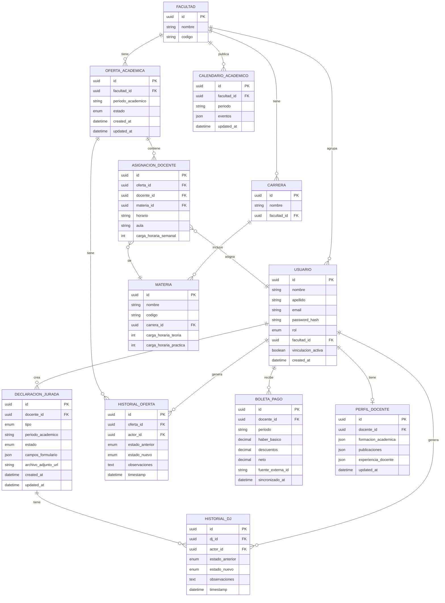

# Functional Specification Document (FSD) — v1.0
# Sistema de Gestión Académica Integral (SGAI)

---

## 0. Metadatos ⚡🔧

| Campo | Valor |
|-------|-------|
| Producto | Sistema de Gestión Académica Integral (SGAI) |
| Grupo | G01 |
| Versión del documento | v1.0 |
| Fecha | 10/05/2026 |
| Autores | Equipo de Desarrollo SGAI |
| Revisores | Docente + 1 grupo par |
| Estado | Borrador |
| **Modo elegido** | **FSD clásico 🔧** |
| Trazabilidad a PRD | PRD_SGAI_v1.0 |
| Fase Spec Kit cubierta | Specify ✅ / Plan ✅ / Tasks ⬜ / Implement ⬜ |
| Prompts utilizados | PR-FSD-001, PR-FSD-002, PR-FSD-003 (ver PROMPT_MAPPINGS.md) |

---

## 1. Resumen Ejecutivo ⚡🔧

El SGAI es una plataforma web institucional que digitaliza y centraliza el ciclo académico-administrativo de una universidad pública boliviana con más de 1.500 docentes y 15+ facultades. El sistema resuelve el problema crítico de los procesos manuales y presenciales: ciclos de aprobación de oferta académica de 8–15 días, declaraciones juradas en papel sin trazabilidad, e información laboral inaccesible sin desplazamiento físico.

El sistema implementa cuatro dominios funcionales principales: (1) Gestión de Declaraciones Juradas con flujo de aprobación multinivel (Docente → Facultad → DPA), (2) Gestión de Oferta Académica entre facultades y el Departamento de Planificación Académica, (3) Información Laboral y Financiera con acceso self-service (horarios, carga horaria, boletas de pago), y (4) Administración del sistema (usuarios, materias, roles y permisos).

La arquitectura propuesta es una aplicación web de tres capas (Frontend SPA + Backend REST API + Base de datos relacional) con integraciones de solo lectura hacia los sistemas legados de nómina y el sistema de información institucional. El stack tecnológico prioriza tecnologías estables, de bajo costo operativo y mantenibles por el equipo de TI universitario.

El valor diferencial técnico radica en las reglas de negocio embebidas en el dominio (no en la UI), garantizando la integridad de los flujos de aprobación independientemente del canal de acceso.

---

## 2. Alcance ⚡🔧

### 2.1 Dentro del Alcance

- Módulo de Declaraciones Juradas: creación, edición (en borrador), envío, revisión por Facultad, revisión/aprobación/observación por DPA.
- Módulo de Oferta Académica: elaboración por Facultad, revisión técnica/aprobación/observación por DPA.
- Módulo de Perfil Docente: gestión de CV (formación, publicaciones, experiencia).
- Módulo de Información Laboral: consulta de horarios, carga horaria y calendario académico (datos sincronizados desde sistema institucional).
- Módulo de Boletas de Pago: visualización de boletas (datos sincronizados desde sistema de nómina).
- Módulo de Roles y Estados Docentes: gestión de roles Autoridad, Investigador, Administrativo.
- Módulo de Administración: CRUD de usuarios, materias, carreras y permisos.
- Notificaciones automáticas por correo institucional (SMTP).
- Generación de reportes (PDF, Excel) para el Técnico DPA.
- Historial de auditoría: registro de todos los cambios de estado de DJ y trámites de oferta.
- Integraciones de lectura: sistema de nómina (boletas) y sistema institucional (materias, carreras, carga horaria).

### 2.2 Fuera del Alcance (Explícito)

- Aplicación móvil nativa (iOS/Android).
- Firma digital con certificado electrónico legal.
- Modificación de los sistemas de nómina o sistema institucional.
- LMS, videoconferencia o cualquier funcionalidad de gestión de aprendizaje.
- Gestión de matrícula de estudiantes.
- Concurso de méritos o procesos de contratación docente.

### 2.3 Supuestos y Dependencias

**Supuestos técnicos:**
- Los sistemas legados pueden exponerse mediante al menos uno de: API REST, consulta a base de datos en modo solo lectura, o archivo de exportación programado (batch).
- El servidor universitario soporta despliegue de aplicaciones Node.js y bases de datos PostgreSQL.
- La institución cuenta con servidor SMTP configurado para el dominio universitario.
- El directorio de usuarios (LDAP/Active Directory) es accesible para autenticación o se puede replicar una base de usuarios inicial.

**Dependencias externas:**
- Documentación técnica del sistema de nómina (entrega esperada: Sprint 0).
- Documentación técnica del sistema institucional (entrega esperada: Sprint 0).
- Credenciales de acceso al servidor SMTP institucional.
- Entorno de servidores provistos por la Unidad de TI (dev, staging, producción).

### 2.4 Plan Técnico (Spec Kit — Fase Plan) 🔧

| Bloque | Contenido |
|--------|-----------|
| **Stack tecnológico** | Backend: Node.js 20 LTS + Express.js / Frontend: React 18 + Vite / BD: PostgreSQL 15 / ORM: Prisma / Autenticación: JWT + bcrypt / Reportes: PDFKit + ExcelJS / Cola de tareas: Bull + Redis |
| **Arquitectura prevista** | Arquitectura en capas (Layered Architecture): Presentación (React SPA) → API REST (Express) → Dominio (servicios de negocio) → Infraestructura (repositorios, adaptadores de integración). Los adaptadores de integración encapsulan la comunicación con sistemas legados, permitiendo operar sin ellos en modo degradado. |
| **Project structure** | `backend/` (api/, domain/, infrastructure/, config/) / `frontend/` (src/pages/, src/components/, src/services/) / `infra/` (docker-compose, nginx, scripts de BD) / `docs/` (brd/, prd/, fsd/, adr/) |
| **Decisiones técnicas anticipadas** | REST sobre GraphQL (menor complejidad operativa para el equipo de TI); PostgreSQL sobre MongoDB (datos relacionales con reglas de integridad fuertes); JWT stateless (escalabilidad horizontal simple); Adaptador de integración con interfaz común (ILegacyAdapter) para desacoplar del sistema legado específico |
| **Restricciones técnicas** | Los sistemas legados NO pueden modificarse; solo lectura. No se puede usar infraestructura cloud pública sin aprobación de la Unidad de TI. El sistema debe operar en servidores locales de la universidad. |

### 2.5 Descomposición en Tasks (Spec Kit) ⚡🔧

| Task ID | Descripción | Caso de uso (FSD-UC) | Dependencias | Prompt asociado | Estado |
|---------|-------------|----------------------|--------------|-----------------|--------|
| T-001 | Configurar estructura del proyecto (monorepo, linting, CI básico) | Todos | — | PR-FSD-001 | Pendiente |
| T-002 | Implementar modelo de datos base en PostgreSQL (migraciones Prisma) | Todos | T-001 | PR-FSD-002 | Pendiente |
| T-003 | Implementar sistema de autenticación JWT + manejo de roles | FSD-UC-001 | T-002 | PR-FSD-003 | Pendiente |
| T-004 | Implementar endpoints CRUD de Declaraciones Juradas | FSD-UC-002 | T-003 | PR-FSD-004 | Pendiente |
| T-005 | Implementar máquina de estados de DJ (Borrador → En revisión → Aprobada/Devuelta) | FSD-UC-002 | T-004 | PR-FSD-005 | Pendiente |
| T-006 | Implementar endpoints CRUD de Oferta Académica | FSD-UC-003 | T-003 | PR-FSD-006 | Pendiente |
| T-007 | Implementar adaptador de integración con sistema de nómina | FSD-UC-005 | T-002 | PR-FSD-007 | Pendiente |
| T-008 | Implementar adaptador de integración con sistema institucional | FSD-UC-004 | T-002 | PR-FSD-008 | Pendiente |
| T-009 | Implementar servicio de notificaciones SMTP | FSD-UC-002, FSD-UC-003 | T-003 | PR-FSD-009 | Pendiente |
| T-010 | Implementar generador de reportes PDF/Excel | FSD-UC-007 | T-006 | PR-FSD-UC-007 | Pendiente |
| T-011 | Implementar perfil CV docente (Zod + UPSERT) | FSD-UC-006 | T-003 | PR-FSD-UC-006 | Pendiente |
| T-012 | Implementar calendario académico por facultad | FSD-UC-008 | T-003 | PR-FSD-UC-008 | Pendiente |
| T-013 | Implementar gestión de roles institucionales | FSD-UC-009 | T-003 | PR-FSD-UC-009 | Pendiente |
| T-014 | Implementar administración usuarios y materias | FSD-UC-010 | T-003 | PR-FSD-UC-010 | Pendiente |

---

## 3. Actores y Roles del Sistema ⚡🔧

| Actor | Tipo | Responsabilidad principal | Permisos clave |
|-------|------|---------------------------|----------------|
| Docente | Humano | Gestionar DJ, consultar información laboral, actualizar CV | Crear/editar DJ propias (en borrador); ver horarios, boletas, calendario; editar propio CV |
| Administrador de Facultad | Humano | Coordinar oferta académica, revisar DJ de su facultad | Revisar/aprobar/devolver DJ de su facultad; crear/editar/enviar trámite de oferta académica; gestionar roles docentes de su facultad |
| Técnico DPA | Humano | Revisar y aprobar la planificación institucional, generar reportes | Aprobar/observar todos los trámites de oferta académica; ver todas las DJ; generar reportes institucionales |
| Administrador del Sistema | Humano | Administrar usuarios, materias y permisos | CRUD completo de usuarios, materias, carreras y roles; acceso al log de auditoría |
| Sistema de Nómina | Sistema externo (legado) | Fuente de datos de boletas de pago | Solo lectura (integración unidireccional) |
| Sistema Institucional | Sistema externo (legado) | Fuente de datos de materias, carreras y carga horaria | Solo lectura (integración unidireccional) |
| Servidor SMTP Institucional | Sistema | Canal de notificaciones por correo electrónico | Envío de correos desde dominio universitario |

---

## 4. Casos de Uso Funcionales ⚡🔧

### 4.1 FSD-UC-001 — Autenticación y Control de Acceso por Roles

- **Trazabilidad:** PRD-REQ-001, PRD-REQ-011, BR-011
- **Actor principal:** Cualquier usuario del sistema
- **Precondiciones:**
  1. El usuario tiene una cuenta creada por el Administrador del Sistema.
  2. El sistema está disponible y accesible vía navegador web.
- **Disparador:** El usuario accede a la URL del sistema e ingresa sus credenciales.
- **Flujo principal:**
  1. El usuario ingresa su nombre de usuario y contraseña en la pantalla de inicio de sesión.
  2. El sistema valida las credenciales contra la base de datos de usuarios.
  3. El sistema verifica el rol asignado al usuario (Docente / Admin. Facultad / Técnico DPA / Admin. Sistema).
  4. El sistema genera un token JWT con el ID del usuario, rol y facultad asignada.
  5. El sistema redirige al usuario al panel correspondiente a su rol.
- **Flujos alternativos / excepciones:**
  - **A1:** Credenciales incorrectas → el sistema muestra mensaje de error genérico ("Usuario o contraseña incorrectos") sin especificar cuál falló. Bloqueo temporal tras 5 intentos fallidos.
  - **A2:** Token expirado (> 8 horas de inactividad) → el sistema redirige automáticamente al login con mensaje "Sesión expirada".
- **Postcondiciones:**
  1. El usuario está autenticado con un token JWT válido.
  2. Cada request posterior incluye el token en el header Authorization.
- **Reglas de negocio:** RB-04 (Ley 164 — seguridad de acceso).
- **Datos de entrada:** username (string), password (string).
- **Datos de salida:** JWT token (string), rol, nombre completo, facultad asignada.
- **Criterios de aceptación:**

```gherkin
Dado un usuario con cuenta activa en el sistema
Cuando ingresa sus credenciales correctas
Entonces el sistema le redirige al panel de su rol en < 2 segundos
Y genera un token JWT válido por 8 horas

Dado un usuario que ingresa credenciales incorrectas 5 veces
Cuando intenta el sexto inicio de sesión
Entonces el sistema bloquea la cuenta temporalmente por 15 minutos
Y registra el evento en el log de seguridad
```

---

### 4.2 FSD-UC-002 — Ciclo Completo de Declaración Jurada

- **Trazabilidad:** PRD-REQ-002, PRD-REQ-004, PRD-REQ-005, PRD-REQ-010, BR-001, BR-006, BR-007, RB-01, RB-03
- **Actor principal:** Docente (creación/envío); Administrador de Facultad (revisión); Técnico DPA (revisión final, opcional según configuración)
- **Precondiciones:**
  1. El docente tiene vinculación activa en el sistema.
  2. El Administrador de Facultad tiene asignada la facultad del docente.
- **Disparador:** El docente selecciona "Nueva Declaración Jurada" en el módulo correspondiente.
- **Flujo principal:**
  1. El sistema verifica que el docente tiene vinculación activa (consulta estado en BD).
  2. El docente completa el formulario de DJ (campos predefinidos según tipo de DJ).
  3. El sistema valida los campos obligatorios en tiempo real (validación client-side + server-side).
  4. El docente guarda como borrador o envía directamente.
  5. Si envía: el estado cambia a `EN_REVISION_FACULTAD`; se dispara notificación por correo al Admin. de Facultad.
  6. El Administrador de Facultad revisa la DJ en su bandeja de entrada.
  7. El Administrador aprueba → estado `APROBADA`; o devuelve con observaciones → estado `DEVUELTA`.
  8. Si devuelta: el docente recibe notificación con observaciones; puede editar y reenviar.
  9. El sistema registra cada cambio de estado en el historial de auditoría (actor, timestamp, estado anterior, estado nuevo).
- **Flujos alternativos / excepciones:**
  - **A1:** Docente sin vinculación activa → el sistema muestra mensaje de error y no permite crear la DJ.
  - **A2:** Admin. Facultad intenta editar una DJ aprobada → el sistema deniega la acción (HTTP 403) y muestra mensaje explicativo.
  - **A3:** Campo obligatorio vacío al enviar → validación server-side retorna error 422 con detalle de campos faltantes.
- **Postcondiciones:**
  1. La DJ queda en estado `APROBADA` o en un estado intermedio con historial completo.
  2. Todos los actores involucrados recibieron notificaciones correspondientes.
- **Reglas de negocio:** RB-01, RB-03.
- **Datos de entrada:** tipo_dj (enum), período_académico (date range), campos_formulario (JSON), archivo_adjunto (opcional, PDF).
- **Datos de salida:** dj_id (UUID), estado_actual, historial_cambios (array).
- **Criterios de aceptación:**

```gherkin
Dado un docente con vinculación activa autenticado
Cuando envía una DJ completamente llenada
Entonces el estado cambia a EN_REVISION_FACULTAD
Y el Admin. de Facultad recibe notificación por correo en < 60 segundos
Y el sistema retorna el ID de la DJ en < 2 segundos

Dado una DJ en estado APROBADA
Cuando cualquier usuario intenta editar sus campos vía API
Entonces el sistema retorna HTTP 403 con mensaje "DJ no editable en estado APROBADA"
Y registra el intento en el log de auditoría
```

---

### 4.3 FSD-UC-003 — Ciclo Completo de Oferta Académica

- **Trazabilidad:** PRD-REQ-003, PRD-REQ-010, BR-002, BR-003, RB-02
- **Actor principal:** Administrador de Facultad (elaboración); Técnico DPA (revisión y aprobación)
- **Precondiciones:**
  1. El Administrador de Facultad tiene acceso al módulo de Oferta Académica.
  2. Las materias de la facultad están sincronizadas desde el sistema institucional.
  3. El período académico está configurado por el Administrador del Sistema.
- **Disparador:** El Administrador de Facultad selecciona "Nuevo trámite de oferta académica" para un período.
- **Flujo principal:**
  1. El sistema crea el trámite en estado `EN_ELABORACION`.
  2. El sistema pre-carga la lista de materias de la facultad desde el sistema institucional (sincronización).
  3. El Administrador asigna docentes a cada materia con carga horaria, días y horarios.
  4. El Administrador puede guardar avances parciales (estado permanece `EN_ELABORACION`).
  5. Al completar, el Administrador envía el trámite al DPA → estado `EN_REVISION_DPA`.
  6. El Técnico DPA recibe notificación; accede a la bandeja y revisa el trámite.
  7. Técnico DPA aprueba → estado `APROBADO`; o genera observaciones → estado `OBSERVADO`.
  8. Si observado: la Facultad recibe notificación con detalle; corrige y reenvía.
  9. Cada cambio de estado queda registrado en historial de auditoría.
- **Flujos alternativos:**
  - **A1:** Docente asignado no tiene DJ aprobada para el período → el sistema muestra advertencia (no bloquea, pero la registra en el trámite como alerta).
  - **A2:** Trámite enviado con materias sin docente asignado → el sistema valida y solicita completar antes de enviar.
- **Postcondiciones:**
  1. Trámite en estado `APROBADO` con trazabilidad completa de revisores y fechas.
- **Reglas de negocio:** RB-02 (revisión facultad antes de pasar al DPA es obligatoria y la garantiza el flujo del sistema).
- **Datos de entrada:** período_académico, lista_asignaciones (materia_id, docente_id, horario, aula, carga_horaria).
- **Datos de salida:** tramite_id (UUID), estado, historial_cambios.
- **Criterios de aceptación:**

```gherkin
Dado un Administrador de Facultad con un trámite EN_ELABORACION completo
Cuando selecciona "Enviar al DPA"
Entonces el estado cambia a EN_REVISION_DPA
Y el Técnico DPA recibe notificación en < 60 segundos
Y el trámite queda bloqueado para edición por la Facultad

Dado un trámite en estado OBSERVADO
Cuando el Administrador corrige las observaciones y reenvía
Entonces el estado vuelve a EN_REVISION_DPA
Y el sistema registra la nueva versión en el historial con diferencia respecto a la versión anterior
```

---

### 4.4 FSD-UC-004 — Consulta de Información Laboral (Horarios y Carga Horaria)

- **Trazabilidad:** PRD-REQ-007, BR-004, PRD-US-010, PRD-US-012
- **Actor principal:** Docente
- **Precondiciones:**
  1. El docente está autenticado.
  2. Los datos de horarios/carga horaria han sido sincronizados desde el sistema institucional (máximo 24 h de desfase).
- **Disparador:** El docente accede al módulo "Mi Horario" o "Calendario Académico".
- **Flujo principal:**
  1. El sistema recupera las asignaciones del docente desde la BD local (tabla sincronizada desde sistema institucional).
  2. El sistema presenta la vista de horarios: materias, días, horas, aula, carga horaria semanal/semestral.
  3. El docente puede filtrar por semestre o año académico.
  4. El docente puede visualizar el calendario académico institucional y el de su facultad.
- **Flujos alternativos:**
  - **A1:** Datos no sincronizados (sistema institucional no disponible) → el sistema muestra los últimos datos disponibles con timestamp de última sincronización y banner de advertencia.
- **Datos de entrada:** docente_id (del token JWT), período_académico (opcional, filtro).
- **Datos de salida:** lista de asignaciones, calendario_académico, última sincronización timestamp.
- **Criterios de aceptación:**

```gherkin
Dado un docente autenticado con asignaciones en el período actual
Cuando accede al módulo "Mi Horario"
Entonces el sistema muestra las materias, días, horarios y aula con datos de máximo 24h de antigüedad
Y el tiempo de carga de la página es < 2 segundos
```

---

### 4.5 FSD-UC-005 — Consulta de Boletas de Pago

- **Trazabilidad:** PRD-REQ-006, PRD-REQ-012, BR-005, BR-009, RB-06
- **Actor principal:** Docente
- **Precondiciones:**
  1. El docente está autenticado.
  2. La liquidación del período solicitado ha sido procesada en el sistema de nómina.
  3. La sincronización del adaptador de nómina ha ejecutado en las últimas 24 h.
- **Flujo principal:**
  1. El docente accede al módulo "Boletas de Pago".
  2. El sistema consulta las boletas del docente (filtradas por docente_id del token JWT).
  3. El sistema presenta la lista de boletas disponibles por período.
  4. El docente selecciona una boleta; el sistema presenta el detalle (haberes, descuentos, neto).
  5. El docente puede descargar la boleta en formato PDF.
- **Flujos alternativos:**
  - **A1:** No hay boletas sincronizadas para el período solicitado → el sistema muestra mensaje informativo con la fecha de última sincronización.
  - **A2:** Otro usuario (no el docente titular) intenta acceder a boletas de otro docente → el sistema retorna HTTP 403.
- **Reglas de negocio:** RB-06 (acceso exclusivo al docente titular).
- **Criterios de aceptación:**

```gherkin
Dado un docente autenticado cuya boleta del mes actual fue sincronizada desde nómina
Cuando accede al módulo "Boletas de Pago" y selecciona el período
Entonces el sistema muestra el detalle de la boleta en < 2 segundos
Y el botón "Descargar PDF" genera el PDF en < 5 segundos

Dado un Administrador de Facultad autenticado
Cuando intenta acceder a las boletas de cualquier docente vía URL directa
Entonces el sistema retorna HTTP 403 "Acceso no autorizado"
```

---

### 4.6 FSD-UC-006 — Gestión de Perfil y CV Docente

- **Trazabilidad:** MRD-N-01, PRD-REQ-002, PRD-US-013, BR-013
- **Actor principal:** Docente (edición); Administrador del Sistema (solo lectura)
- **Precondiciones:** Docente autenticado; perfil puede no existir aún (se crea en primer PATCH).
- **Disparador:** El docente accede a "Mi Perfil" y edita una sección del CV.
- **Flujo principal:**
  1. El docente selecciona la sección (`formacion_academica`, `publicaciones` o `experiencia_docente`).
  2. El sistema valida el JSON de la sección con schema Zod.
  3. El sistema hace UPSERT en `PERFIL_DOCENTE` y actualiza `updated_at`.
  4. El sistema retorna el perfil actualizado.
- **Flujos alternativos:**
  - **A1:** Schema inválido → HTTP 422 con detalle de campos.
  - **A2:** Docente intenta editar perfil ajeno → HTTP 403.
- **Reglas de negocio:** RB-04 (solo titular edita); Ley 164 (no loggear contenido del CV).
- **Diagrama:** `docs/DIAGRAMS/seq_uc006_perfil_cv.mmd`

```gherkin
Dado un docente autenticado con perfil existente
Cuando actualiza la sección formacion_academica con JSON válido
Entonces el sistema persiste los cambios y retorna updated_at en < 2 segundos

Dado un docente autenticado
Cuando intenta PATCH /perfil-docente/:otroDocenteId
Entonces el sistema retorna HTTP 403 FORBIDDEN_PROFILE_EDIT
```

---

### 4.7 FSD-UC-007 — Generación de Reportes DPA

- **Trazabilidad:** MRD-N-06, PRD-REQ-009, PRD-US-009, BR-012, NFR-002
- **Actor principal:** Técnico DPA; Administrador del Sistema
- **Precondiciones:** Usuario con rol `TECNICO_DPA` o `ADMIN_SISTEMA`; datos del período disponibles en BD.
- **Disparador:** El actor solicita un reporte consolidado (oferta, DJ, docentes o asignaciones).
- **Flujo principal:**
  1. El sistema valida rol y parámetros (`tipo`, `periodo`, `formato`).
  2. El sistema estima filas con COUNT.
  3. Si ≤ 500 filas: genera PDF/Excel síncrono y retorna stream.
  4. Si > 500 filas: encola job en Bull y retorna `jobId` con estado `GENERANDO`.
  5. El cliente consulta `GET /reportes/:jobId` hasta estado `LISTO` y descarga.
- **Flujos alternativos:**
  - **A1:** Sin datos para el período → reporte vacío estructurado (HTTP 200).
  - **A2:** Rol no autorizado → HTTP 403.
- **Reglas de negocio:** No incluir montos de boletas en reportes agregados (Ley 164).
- **Diagrama:** `docs/DIAGRAMS/seq_uc007_reportes_dpa.mmd`

```gherkin
Dado un técnico DPA autenticado
Cuando solicita reporte OFERTA_POR_FACULTAD período 2026-I formato PDF con 120 filas
Entonces el sistema entrega el archivo en < 10 segundos

Dado un docente autenticado
Cuando solicita POST /reportes
Entonces el sistema retorna HTTP 403 FORBIDDEN_REPORTS_ACCESS
```

---

### 4.8 FSD-UC-008 — Gestión y Consulta de Calendario Académico

- **Trazabilidad:** MRD-N-03, PRD-REQ-007, PRD-US-012, BR-004
- **Actor principal:** Administrador de Facultad (publicación); Docente (consulta)
- **Precondiciones:** Período académico configurado; Admin. Facultad con `facultad_id` en JWT.
- **Disparador:** Publicación o consulta de eventos del calendario.
- **Flujo principal (publicación):**
  1. Admin. Facultad define eventos (`INICIO_SEMESTRE`, `EXAMENES`, etc.) con fechas válidas.
  2. El sistema valida `fecha_fin >= fecha_inicio` y UPSERT en `CALENDARIO_ACADEMICO`.
  3. Los docentes consultan calendario de su facultad + calendario institucional fusionados.
- **Flujos alternativos:**
  - **A1:** Admin. Facultad publica en otra facultad → HTTP 403 `CROSS_FACULTY_FORBIDDEN`.
  - **A2:** Fechas incoherentes → HTTP 422.
- **Diagrama:** `docs/DIAGRAMS/seq_uc008_calendario.mmd`

```gherkin
Dado un administrador de facultad autenticado de la facultad F1
Cuando publica el calendario 2026-I para F1 con eventos válidos
Entonces los docentes de F1 ven los eventos ordenados por fecha_inicio

Dado un administrador de facultad de F1
Cuando intenta publicar calendario para facultad F2
Entonces el sistema retorna HTTP 403 CROSS_FACULTY_FORBIDDEN
```

---

### 4.9 FSD-UC-009 — Gestión de Roles Institucionales de Docentes

- **Trazabilidad:** MRD-N-08, PRD-REQ-011, PRD-US-016, BR-008, RB-05
- **Actor principal:** Administrador de Facultad; Administrador del Sistema
- **Precondiciones:** Docente objetivo existe; actor con permisos de gestión de roles.
- **Disparador:** Asignación o revocación de rol institucional (`AUTORIDAD`, `INVESTIGADOR`, `ADMINISTRATIVO`).
- **Flujo principal:**
  1. El sistema recupera el docente objetivo.
  2. Si actor es `ADMIN_FACULTAD`: verifica misma `facultad_id` (RB-05).
  3. El sistema actualiza `rol_institucional` e inserta log de auditoría en la misma transacción.
- **Flujos alternativos:**
  - **A1:** Docente de otra facultad → HTTP 403.
  - **A2:** Rol inválido → HTTP 422.
- **Diagrama:** `docs/DIAGRAMS/seq_uc009_roles_docente.mmd`

```gherkin
Dado un administrador de facultad de la facultad F1
Cuando asigna rol INVESTIGADOR a un docente de F1
Entonces el rol queda persistido y el log de auditoría registra actor y timestamp

Dado un administrador de facultad de F1
Cuando intenta asignar rol a docente de F2
Entonces el sistema retorna HTTP 403 CROSS_FACULTY_FORBIDDEN
```

---

### 4.10 FSD-UC-010 — Administración de Usuarios y Materias

- **Trazabilidad:** MRD-N-10, PRD-REQ-001, PRD-REQ-011, PRD-US-014, PRD-US-015, BR-011
- **Actor principal:** Administrador del Sistema
- **Precondiciones:** Actor con rol `ADMIN_SISTEMA`.
- **Disparador:** Creación de cuenta, actualización de usuario o configuración de materia/carrera.
- **Flujo principal (crear usuario):**
  1. Validar schema Zod (email institucional único, rol, facultad).
  2. Generar contraseña temporal; hashear con bcrypt (cost 12).
  3. INSERT usuario; encolar email de bienvenida; registrar auditoría.
  4. Retornar `userId` y email (sin password en respuesta ni logs).
- **Flujo principal (crear materia):**
  1. Validar código único por carrera y cargas horarias > 0.
  2. INSERT materia; registrar auditoría.
- **Flujos alternativos:**
  - **A1:** Email duplicado → HTTP 422.
  - **A2:** Actor sin rol Admin. Sistema → HTTP 403.
- **Diagrama:** `docs/DIAGRAMS/seq_uc010_admin_usuarios.mmd`

```gherkin
Dado un administrador del sistema autenticado
Cuando crea un usuario con email institucional único y datos válidos
Entonces el sistema retorna 201 con userId y encola notificación de bienvenida

Dado un administrador del sistema
Cuando crea materia con código duplicado en la misma carrera
Entonces el sistema retorna HTTP 422 DUPLICATE_SUBJECT_CODE
```

---

### 4.11 Mapa de Casos de Uso ↔ Diagramas

| FSD-UC | Tipo diagrama | Archivo `.mmd` |
|--------|---------------|----------------|
| FSD-UC-001 | Secuencia | `seq_uc001_autenticacion.mmd` |
| FSD-UC-002 | Secuencia + Estado | `seq_uc002_dj_envio.mmd`, `state_dj.mmd` |
| FSD-UC-003 | Secuencia + Estado | `seq_uc003_oferta_envio_dpa.mmd`, `state_oferta_academica.mmd` |
| FSD-UC-004 | Secuencia | `seq_uc004_horario_consulta.mmd` |
| FSD-UC-005 | Secuencia | `seq_uc005_boleta_consulta.mmd` |
| FSD-UC-006 | Secuencia | `seq_uc006_perfil_cv.mmd` |
| FSD-UC-007 | Secuencia | `seq_uc007_reportes_dpa.mmd` |
| FSD-UC-008 | Secuencia | `seq_uc008_calendario.mmd` |
| FSD-UC-009 | Secuencia | `seq_uc009_roles_docente.mmd` |
| FSD-UC-010 | Secuencia | `seq_uc010_admin_usuarios.mmd` |
| Transversal | ER + C4 + Gantt + Sync | `er_sgai_core.mmd`, `c4_cont_sgai_v1.mmd`, `gantt_roadmap_v1.mmd`, `seq_sync_legados.mmd` |

---

## 5. Reglas de Negocio ⚡🔧

| ID | Regla | Tipo | Origen | Casos de uso afectados |
|----|-------|------|--------|------------------------|
| BR-001 | Solo los docentes con vinculación activa (campo `vinculacion_activa = true`) pueden crear DJ | Validación | Reglamento interno | FSD-UC-002 |
| BR-002 | La oferta académica debe pasar por la Facultad antes de llegar al DPA (el flujo técnico lo garantiza; no existe ruta de envío directo Facultad→DPA sin validación previa en el sistema) | Política de flujo | Reglamento interno | FSD-UC-003 |
| BR-003 | Una DJ en estado `APROBADA` o `EN_REVISION_*` no puede ser modificada; solo puede editarse si está en `BORRADOR` o `DEVUELTA` | Validación de estado | Reglamento interno | FSD-UC-002 |
| BR-004 | Las boletas de pago solo son visibles para el docente titular; se valida comparando el `docente_id` del token JWT con el `docente_id` de la boleta | Control de acceso | Reglamento interno / Privacidad laboral | FSD-UC-005 |
| BR-005 | Los roles Autoridad, Investigador y Administrativo solo pueden ser asignados por el Admin. de Facultad de la unidad correspondiente | Control de acceso | Reglamento interno | FSD-UC-001 |
| BR-006 | El sistema debe registrar en el log de auditoría: actor, timestamp, acción, estado anterior y estado nuevo para cada cambio de estado de DJ y Oferta Académica | Trazabilidad | Ley 164 / CEUB | FSD-UC-002, FSD-UC-003 |
| BR-007 | El bloqueo temporal de cuenta tras 5 intentos fallidos de autenticación se aplica durante 15 minutos | Seguridad | Buenas prácticas OWASP / Ley 164 | FSD-UC-001 |

---

## 6. Modelo de Datos Funcional ⚡🔧

### 6.1 Diagrama ER (Mermaid)



### 6.2 Diccionario de Datos

| Entidad | Atributo | Tipo | Obligatorio | Validaciones | Origen |
|---------|----------|------|-------------|--------------|--------|
| USUARIO | id | UUID v4 | Sí | Auto-generado | Sistema |
| USUARIO | email | string(150) | Sí | Formato email institucional, único | Admin. Sistema |
| USUARIO | rol | ENUM | Sí | [DOCENTE, ADMIN_FACULTAD, TECNICO_DPA, ADMIN_SISTEMA] | Admin. Sistema |
| USUARIO | vinculacion_activa | boolean | Sí | Default true; false al desactivar cuenta | Admin. Sistema |
| DECLARACION_JURADA | estado | ENUM | Sí | [BORRADOR, EN_REVISION_FACULTAD, APROBADA, DEVUELTA, EN_REVISION_DPA, RECHAZADA] | Sistema (máquina de estados) |
| DECLARACION_JURADA | campos_formulario | JSON | Sí | Validado contra schema JSON del tipo de DJ | Docente |
| OFERTA_ACADEMICA | estado | ENUM | Sí | [EN_ELABORACION, EN_REVISION_DPA, APROBADO, OBSERVADO] | Sistema (máquina de estados) |
| BOLETA_PAGO | fuente_externa_id | string | Sí | ID del registro en el sistema de nómina | Adaptador de nómina |
| BOLETA_PAGO | sincronizado_at | datetime | Sí | Timestamp de última sincronización | Sistema |
| HISTORIAL_DJ | observaciones | text | No | Obligatorio si estado_nuevo es DEVUELTA | Actor |
| ASIGNACION_DOCENTE | carga_horaria_semanal | int | Sí | > 0, ≤ 40 | Admin. Facultad |

---

## 7. Prompt como Contrato Funcional ⚡🔧

### 7.1 Prompt-contrato para FSD-UC-002 (Ciclo DJ)

```markdown
# Role
Eres el servicio de dominio de Declaraciones Juradas del SGAI.

# Task
Procesar la transición de estado de una Declaración Jurada dado un comando (ENVIAR, APROBAR, DEVOLVER)
y retornar el nuevo estado, disparar las notificaciones correspondientes y registrar en el historial.

# Context
- Entrada: { dj_id: UUID, comando: string, actor_id: UUID, observaciones: string|null }
- Estado actual de la DJ: recuperado de BD por dj_id
- Reglas de negocio aplicables: BR-001 (vinculación activa), BR-003 (estados editables), BR-006 (historial)
- Restricciones: solo el actor con el rol correcto puede ejecutar cada comando

# Reasoning
Pasos obligatorios:
1. Recuperar la DJ por dj_id; si no existe, retornar error 404.
2. Verificar que el actor tiene el rol correcto para el comando (Docente → ENVIAR; Admin.Facultad → APROBAR/DEVOLVER).
3. Verificar que la transición de estado es válida según la máquina de estados.
4. Si el comando es ENVIAR: verificar vinculación activa del docente (BR-001).
5. Si el comando es DEVOLVER: verificar que `observaciones` no es null o vacío.
6. Ejecutar la transición: actualizar estado en BD.
7. Insertar registro en HISTORIAL_DJ.
8. Encolar notificación por correo al actor destino.
9. Retornar el nuevo estado y el ID del registro de historial.

# Stop condition
Detente si: estado actual no permite la transición solicitada (error 422), o el actor no tiene el rol correcto (error 403), o la DJ no existe (error 404).

# Output
Formato: JSON
{
  "dj_id": "uuid",
  "estado_nuevo": "string",
  "historial_id": "uuid",
  "notificacion_enviada": true|false
}

Invariants:
- Nunca se puede hacer APROBAR sobre una DJ ya APROBADA.
- DEVOLVER siempre requiere observaciones no nulas.
- El historial siempre se inserta en la misma transacción que el cambio de estado.

Failure modes:
- 404: DJ no encontrada.
- 403: Actor sin permisos para este comando.
- 422: Transición de estado inválida | observaciones requeridas pero ausentes.
- 500: Error de BD — rollback total.
```

### 7.2 Prompt-contrato para FSD-UC-003 (Ciclo Oferta Académica)

```markdown
# Role
Eres el servicio de dominio de Oferta Académica del SGAI.

# Task
Procesar la transición de estado de un trámite de Oferta Académica dado un comando
(ENVIAR_DPA, APROBAR, OBSERVAR) y registrar en el historial con trazabilidad completa.

# Context
- Entrada: { oferta_id: UUID, comando: string, actor_id: UUID, observaciones: string|null }
- Reglas: RB-02 (flujo mandatorio facultad→DPA); BR-006 (historial obligatorio)
- Restricciones: Admin.Facultad solo puede ENVIAR_DPA; Técnico DPA puede APROBAR/OBSERVAR

# Reasoning
1. Recuperar oferta por oferta_id; error 404 si no existe.
2. Verificar rol del actor vs. comando permitido.
3. Verificar que la transición de estado es válida.
4. Si ENVIAR_DPA: verificar que todas las materias tienen docente asignado.
5. Si OBSERVAR: verificar que observaciones no es null.
6. Ejecutar transición; insertar en HISTORIAL_OFERTA en la misma transacción.
7. Encolar notificación al actor destino.
8. Retornar nuevo estado.

# Stop condition
Error si transición inválida, actor sin rol correcto, o materias sin asignar al intentar ENVIAR_DPA.

# Output
{ "oferta_id": "uuid", "estado_nuevo": "string", "historial_id": "uuid" }

Invariants:
- No se puede APROBAR un trámite ya APROBADO.
- OBSERVAR siempre requiere texto de observaciones.

Failure modes: 404, 403, 422 (materias sin asignar), 422 (transición inválida), 500.
```

### 7.3 Prompt-contrato para FSD-UC-005 (Boletas de Pago)

```markdown
# Role
Eres el servicio de consulta de Boletas de Pago del SGAI.

# Task
Retornar las boletas de pago del docente solicitante, verificando que solo accede a sus propios datos.

# Context
- Entrada: { docente_id_solicitante: UUID (del JWT), período: string|null }
- Restricción: docente_id_solicitante DEBE coincidir con el docente_id de las boletas retornadas (BR-004).

# Reasoning
1. Extraer docente_id del JWT (no del body de la request).
2. Consultar BOLETA_PAGO WHERE docente_id = docente_id_solicitante.
3. Si período especificado: agregar filtro por período.
4. Retornar lista con detalle (haber_basico, descuentos, neto, período, sincronizado_at).

# Stop condition
Error 403 si cualquier request intenta especificar un docente_id distinto al del JWT.

# Output
{ "boletas": [{ "id", "período", "haber_basico", "descuentos", "neto", "sincronizado_at" }] }

Invariants: docente_id en respuesta SIEMPRE igual al docente_id del JWT.
Failure modes: 403 (acceso a boletas ajenas), 404 (sin boletas para el período).
```

---

## 8. Contratos de API REST 🔧

> Convenciones: prefijo `/api/v1`; autenticación `Authorization: Bearer <JWT>` salvo `/auth/login`; respuestas de error incluyen `correlationId`.

| Método | Endpoint | FSD-UC | Rol(es) | Request (resumen) | Response éxito |
|--------|----------|--------|---------|-------------------|----------------|
| POST | `/auth/login` | UC-001 | Público | `{ email, password }` | `200 { token, rol, facultadId, expiresIn }` |
| GET | `/declaraciones-juradas` | UC-002 | DOCENTE, ADMIN_FACULTAD, TECNICO_DPA | Query: `estado?, page` | `200 { items[], total }` |
| POST | `/declaraciones-juradas` | UC-002 | DOCENTE | `{ tipo, periodoAcademico, camposFormulario }` | `201 { id, estado: BORRADOR }` |
| PATCH | `/declaraciones-juradas/:id/estado` | UC-002 | Según comando | `{ comando, observaciones? }` | `200 { id, estadoNuevo, historialId }` |
| POST | `/oferta-academica` | UC-003 | ADMIN_FACULTAD | `{ periodoAcademico, asignaciones[] }` | `201 { id, estado }` |
| PATCH | `/oferta-academica/:id/estado` | UC-003 | ADMIN_FACULTAD, TECNICO_DPA | `{ comando, observaciones? }` | `200 { id, estadoNuevo }` |
| GET | `/mi-horario` | UC-004 | DOCENTE | Query: `periodo?` | `200 { asignaciones[], ultimaSincronizacion }` |
| GET | `/boletas-pago` | UC-005 | DOCENTE | Query: `periodo?` | `200 { boletas[] }` — docenteId solo del JWT |
| GET | `/perfil-docente` | UC-006 | DOCENTE, ADMIN_SISTEMA | — | `200 { perfil }` |
| PATCH | `/perfil-docente` | UC-006 | DOCENTE | `{ seccion, data }` | `200 { perfil, updatedAt }` |
| POST | `/reportes` | UC-007 | TECNICO_DPA, ADMIN_SISTEMA | `{ tipo, periodo, formato }` | `200 stream` o `202 { jobId }` |
| GET | `/reportes/:jobId` | UC-007 | TECNICO_DPA, ADMIN_SISTEMA | — | `200 { estado, urlDescarga? }` |
| GET | `/calendario-academico` | UC-008 | DOCENTE | Query: `periodo` | `200 { eventos[] }` |
| PUT | `/calendario-academico` | UC-008 | ADMIN_FACULTAD, ADMIN_SISTEMA | `{ periodo, eventos[] }` | `200 { calendario }` |
| PATCH | `/admin/docentes/:id/rol-institucional` | UC-009 | ADMIN_FACULTAD, ADMIN_SISTEMA | `{ rolInstitucional }` | `200 { docenteId, rolNuevo }` |
| POST | `/admin/usuarios` | UC-010 | ADMIN_SISTEMA | `{ nombre, apellido, email, rol, facultadId }` | `201 { userId, email }` |
| POST | `/admin/materias` | UC-010 | ADMIN_SISTEMA | `{ nombre, codigo, carreraId, cargaHorariaTeoria, cargaHorariaPractica }` | `201 { id, codigo }` |

**Códigos de error estándar:** `401` auth; `403` dominio (RB-04, RB-05, etc.); `422` validación Zod; `429` bloqueo cuenta (RB-07); `500` con `correlationId` sin detalle técnico en producción.

---

## 9. Integraciones Externas 🔧

| Sistema | Tipo | Protocolo | Operaciones | SLA esperado | Autenticación |
|---------|------|-----------|-------------|--------------|---------------|
| Sistema de Nómina | Síncrono o batch (por determinar en Sprint 0) | REST o consulta BD directa (solo lectura) | GET boletas por período y docente | Disponibilidad en horario hábil; latencia < 5 s si REST | Credenciales de servicio (a definir con Unidad de TI) |
| Sistema Institucional | Batch / programado | Archivo CSV / REST / BD directa (solo lectura) | GET materias, carreras, asignaciones docentes | Sincronización diaria en horario fuera de pico | Credenciales de servicio |
| Servidor SMTP | Asíncrono | SMTP / SMTPS | SEND correo de notificación | Entrega < 60 s | Credenciales SMTP institucionales |
| Directorio institucional (LDAP) | Síncrono | LDAP / LDAPS | BIND para autenticación (o migración inicial de usuarios) | Disponibilidad en horario hábil | Bind DN + contraseña |

> **Nota de diseño:** Todos los adaptadores de integración implementan la interfaz `ILegacyAdapter` con métodos `fetchData()` y `healthCheck()`. Si el sistema externo no está disponible, el adaptador retorna los últimos datos cacheados en la BD local con un timestamp de última sincronización visible para el usuario.

---

## 10. Interfaces de Usuario (Referencia) ⚡🔧

| Pantalla | Caso de uso cubierto |
|----------|----------------------|
| `/login` | FSD-UC-001 |
| `/dashboard` | Portal principal por rol |
| `/declaraciones-juradas` | FSD-UC-002 (lista y estado) |
| `/declaraciones-juradas/nueva` | FSD-UC-002 (creación) |
| `/declaraciones-juradas/:id` | FSD-UC-002 (detalle y revisión) |
| `/oferta-academica` | FSD-UC-003 (lista y bandeja) |
| `/oferta-academica/nueva` | FSD-UC-003 (elaboración) |
| `/oferta-academica/:id` | FSD-UC-003 (revisión DPA) |
| `/mi-horario` | FSD-UC-004 |
| `/calendario` | FSD-UC-004 |
| `/boletas-pago` | FSD-UC-005 |
| `/mi-perfil` | PRD-US-013 |
| `/admin/usuarios` | FSD-UC-001 (gestión) |
| `/admin/materias` | PRD-US-015 |
| `/reportes` | PRD-US-009 |

### 10.1 Trazabilidad con M2 (UI/UX) ⚡🔧

| Wireframe / mockup M2 | Pantalla FSD | Caso de uso (FSD-UC) | Estado de la traza |
|-----------------------|--------------|----------------------|---------------------|
| wireframe_login.png | `/login` | FSD-UC-001 | ✅ Cubierto |
| wireframe_dashboard_docente.png | `/dashboard` (rol Docente) | FSD-UC-001 | ✅ Cubierto |
| wireframe_dj_nueva.png | `/declaraciones-juradas/nueva` | FSD-UC-002 | ✅ Cubierto |
| wireframe_dj_listado.png | `/declaraciones-juradas` | FSD-UC-002 | ✅ Cubierto |
| wireframe_oferta_academica.png | `/oferta-academica/nueva` | FSD-UC-003 | ✅ Cubierto |
| wireframe_bandeja_dpa.png | `/oferta-academica` (rol DPA) | FSD-UC-003 | ✅ Cubierto |
| wireframe_horario_docente.png | `/mi-horario` | FSD-UC-004 | ✅ Cubierto |
| wireframe_boletas.png | `/boletas-pago` | FSD-UC-005 | ✅ Cubierto |

---

## 11. Requerimientos No Funcionales (NFR) ⚡🔧

### 11.1 Tabla NFR cuantificable (ISO/IEC 25010)

| ID | Característica ISO 25010 | Requisito | Métrica | Umbral | Cómo se verifica |
|----|-----------|-----------|---------|--------|------------------|
| NFR-001 | Rendimiento | Latencia de operaciones CRUD principales | p95 | < 2 s | Prueba de carga con k6 |
| NFR-002 | Rendimiento | Generación de reportes PDF/Excel | tiempo máximo | < 10 s | Prueba funcional automatizada |
| NFR-003 | Disponibilidad | Uptime del sistema en horario hábil | uptime mensual | ≥ 99 % | Monitoreo con Uptime Robot |
| NFR-004 | Seguridad | Cifrado de datos en reposo (PII, financieros) | estándar | AES-256 | Auditoría de configuración de BD |
| NFR-005 | Seguridad | Cifrado de datos en tránsito | protocolo | TLS 1.2+ | Escaneo SSL Labs |
| NFR-006 | Seguridad | Expiración de sesión por inactividad | tiempo | ≤ 8 horas | Test automatizado de sesión |
| NFR-007 | Cumplimiento | Protección de datos personales — Ley 164 Bolivia | aplicable | 100 % cumplimiento | Revisión legal + auditoría |
| NFR-008 | Escalabilidad | Usuarios concurrentes soportados | número | ≥ 200 simultáneos | Prueba de estrés k6 |
| NFR-009 | Observabilidad | Trazabilidad de requests con correlationId | % de requests | 100 % | Revisión de logs en producción |
| NFR-010 | Mantenibilidad — Testeabilidad | Cobertura de tests unitarios en dominio core | % líneas | ≥ 80 % | Reporte de Jest/Vitest en CI |

**Cobertura ISO 25010 (8 características):** Rendimiento (NFR-001, 002, 008), Fiabilidad/Disponibilidad (NFR-003), Seguridad (NFR-004, 005, 006), Cumplimiento (NFR-007), Mantenibilidad/Observabilidad (NFR-009, 010).

---

## 12. Trazabilidad MRD → PRD → FSD ⚡🔧

| MRD | PRD | FSD-UC | NFR | TC |
|-----|-----|--------|-----|-----|
| MRD-N-01 | PRD-REQ-002, PRD-US-001–005 | FSD-UC-002 | NFR-004, NFR-009 | TC-001, TC-003 |
| MRD-N-02 | PRD-REQ-003, PRD-US-006–008 | FSD-UC-003 | NFR-001, NFR-009 | TC-002 |
| MRD-N-03 | PRD-REQ-007, PRD-US-010, PRD-US-012 | FSD-UC-004, FSD-UC-008 | NFR-001 | TC-006, TC-009 |
| MRD-N-04 | PRD-REQ-006, PRD-US-011 | FSD-UC-005 | NFR-004 | TC-004, TC-005 |
| MRD-N-05 | PRD-REQ-007 | FSD-UC-004 | NFR-001 | TC-006 |
| MRD-N-06 | PRD-REQ-009, PRD-US-009 | FSD-UC-007 | NFR-002 | TC-008 |
| MRD-N-07 | PRD-NFR-004–007 | FSD-UC-001, UC-005 | NFR-004–007 | TC-007 |
| MRD-N-08 | PRD-REQ-011, PRD-US-016 | FSD-UC-009 | — | TC-010 |
| MRD-N-09 | PRD-NFR-008 | Todos (carga) | NFR-008 | k6 stress |
| MRD-N-10 | PRD-REQ-001, PRD-US-014–015 | FSD-UC-010 | NFR-010 | TC-011 |
| — | PRD-REQ-010 | FSD-UC-002, UC-003 | NFR-009 | Historial E2E |
| — | PRD-US-013 | FSD-UC-006 | NFR-004 | TC-012 perfil CV |

> Matriz extendida BRD ↔ MRD ↔ PRD: `docs/TRAZABILIDAD_COMPLETA.md`

---

## 13. Plan de Pruebas Funcionales 🔧

**Estrategia:**
- **Unitarias:** Servicios de dominio (máquinas de estado DJ y Oferta Académica, validaciones de reglas de negocio). Herramienta: Jest.
- **Integración:** Endpoints REST con BD de prueba. Herramienta: Supertest + Jest.
- **E2E:** Flujos críticos completos (DJ completo, Oferta Académica completa). Herramienta: Playwright.
- **Carga:** Endpoints críticos bajo 200 usuarios concurrentes. Herramienta: k6.
- **Contract testing:** Verificación de prompt-contratos del §7. Herramienta: Suite Jest personalizada con fixtures.

**Cobertura mínima aceptada:** 80 % en módulos de dominio (servicios de DJ, Oferta Académica, autenticación).

**Ambientes:** Unitarias e integración en CI (GitHub Actions); E2E y carga en staging antes de cada release.

---

## 14. Riesgos Funcionales ⚡🔧

| Riesgo | Probabilidad | Impacto | Mitigación | Responsable |
|--------|--------------|---------|------------|-------------|
| Sistemas legados sin API documentada impiden integración | Alta | Alto | Sprint 0 de análisis técnico; diseño con adaptadores que operan en modo degradado | Líder técnico |
| Complejidad de la máquina de estados de DJ mal implementada genera estados inconsistentes | Media | Alto | Tests unitarios exhaustivos de la máquina de estados; revisión de código por pares | Dev Backend |
| Volumen de notificaciones SMTP sobrecarga el servidor en períodos de alta actividad | Media | Medio | Cola de tareas asíncrona (Bull + Redis); reintento automático con backoff exponencial | Dev Backend |
| Datos inconsistentes en sistemas legados afectan la visualización de horarios/boletas | Media | Medio | Rutinas de validación y logs de errores de sincronización; banner de advertencia en UI | Dev Backend + TI |
| Incumplimiento de Ley 164 por mala configuración de permisos de acceso a datos | Baja | Alto | Revisión legal antes del lanzamiento; auditoría de permisos en staging | Líder técnico + Legal |

---

## 15. Glosario 🔧

| Término | Definición |
|---------|------------|
| DJ | Declaración Jurada — documento institucional obligatorio para docentes con vinculación activa |
| DPA | Departamento de Planificación Académica — unidad institucional responsable de la planificación académica |
| CEUB | Comité Ejecutivo de la Universidad Boliviana — organismo rector del sistema universitario público boliviano |
| Vinculación activa | Estado del docente que tiene contrato vigente con la universidad y puede ejercer actividades académicas |
| Oferta académica | Planificación semestral o anual de materias, docentes, horarios y aulas de una facultad |
| JWT | JSON Web Token — mecanismo de autenticación stateless utilizado en el sistema |
| Adaptador de integración | Componente de software que encapsula la comunicación con un sistema legado, implementando la interfaz ILegacyAdapter |
| Modo degradado | Estado del sistema en el que opera sin conexión a un sistema legado, mostrando los últimos datos disponibles con aviso al usuario |

---

## 16. Anexos 🔧

| Anexo | Contenido | Ubicación |
|-------|-----------|-----------|
| A | Diagramas Mermaid (16 archivos) | `docs/DIAGRAMS/*.mmd` |
| B | Prompt-contracts (10 UC) | `docs/PROMPT_MAPPINGS/PROMPT_MAPPINGS_v1.md` §3 |
| C | Matriz de trazabilidad completa | `docs/TRAZABILIDAD_COMPLETA.md` |
| D | Métricas AI-SDLC | `docs/PROMPT_MAPPINGS/PROMPT_MAPPINGS_v1.md` §1 |
| E | Cumplimiento rúbrica Módulo 4 | `docs/ENTREGA_MODULO4_CUMPLIMIENTO.md` |

**Inventario de elementos FSD (≥ 30):** 10 casos de uso · 7 reglas RB · 12 bloques Gherkin · 16 endpoints API · 10 NFR · 14 tasks · 7 actores · ER + diccionario · 10 prompt-contratos · 5 riesgos · 8 términos glosario · 5 anexos = **94 elementos documentados**.

---

## 17. Registro de Cambios ⚡🔧

| Versión | Fecha | Autor | Cambio |
|---------|-------|-------|--------|
| v1.0 | 10/05/2026 | Equipo SGAI | Versión inicial — 5 casos de uso, modelo ER, 3 prompt-contratos, 10 NFRs |
| v1.1 | 17/05/2026 | Carolina Aguilar | +5 UC (006–010), contratos API §8, 6 diagramas secuencia, trazabilidad MRD→PRD→FSD, mapa UC↔diagramas |

---

## Checklist de Entrega — FSD Clásico 🔧

- [x] §0 Metadatos completos, modo declarado como FSD clásico 🔧.
- [x] §1 Resumen ejecutivo (150–250 palabras).
- [x] §2 Alcance y fuera de alcance + §2.4 Plan técnico + §2.5 Tasks (10 tasks).
- [x] §3 Actores y permisos (7 actores).
- [x] ≥ 10 casos de uso críticos con flujo principal, alternos y Gherkin verificables (10 UC — §4).
- [x] §5 Reglas de negocio con tipo y origen (7 reglas).
- [x] §6 Modelo de datos completo (diagrama Mermaid + diccionario).
- [x] 10 prompt-contratos con anatomía completa (§7 + PROMPT_MAPPINGS_v1).
- [x] §8 Contratos API REST (16 endpoints).
- [x] §9 Integraciones externas con SLA y autenticación.
- [x] §10 + §10.1 Trazabilidad con M2 (Wireframe → Pantalla → UC).
- [x] §11 NFRs ISO 25010 con métrica, umbral y verificación (10 NFRs, 8 características).
- [x] §12 Matriz de trazabilidad MRD → PRD → FSD → NFR → prueba.
- [x] §13 Plan de pruebas detallado.
- [x] §14 Riesgos funcionales (5 riesgos).
- [x] §15 Glosario (8 términos).
- [x] §16 Anexos + inventario ≥ 30 elementos.
- [x] §17 Registro de cambios.
