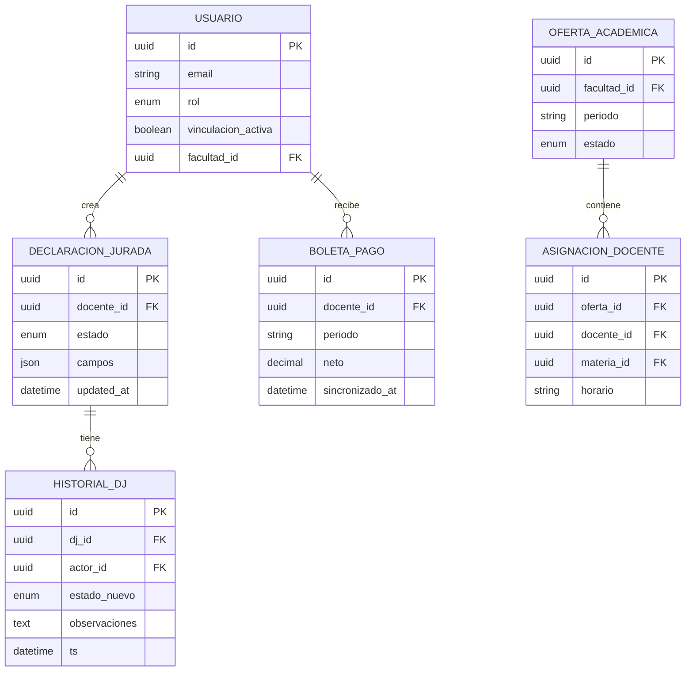

# Lightweight FSD (LFSD) — v1.0 ⚡
# Sistema de Gestión Académica Integral (SGAI)

> **Propósito del LFSD:** Documento ágil vivo, actualizado sprint a sprint. Prioriza velocidad de entrega y validación sobre cobertura documental exhaustiva. Convive con el FSD clásico: el FSD es la fuente de verdad de arquitectura; el LFSD es el tablero de trabajo diario del equipo.

---

## 0. Metadatos ⚡

| Campo | Valor |
|-------|-------|
| Producto | SGAI |
| Versión | v1.0 (actualizar en cada sprint) |
| Fecha | 10/05/2026 |
| Sprint actual | Sprint 1 |
| Modo | **LFSD ⚡** |
| FSD de referencia | FSD_SGAI_v1.0 |
| PRD de referencia | PRD_SGAI_v1.0 |
| Estado | Activo — actualización continua |

---

## 1. ¿Qué hace el sistema? (En 5 frases)

1. Permite a los docentes crear y enviar declaraciones juradas digitales que fluyen automáticamente a la Facultad y al DPA para aprobación.
2. Digitaliza el trámite de oferta académica entre las Facultades y el Departamento de Planificación Académica, eliminando el intercambio presencial.
3. Da a cada docente acceso self-service a su carga horaria, horarios de clase y boletas de pago actualizadas.
4. Automatiza las notificaciones entre actores ante cada cambio de estado de los trámites.
5. Provee al Técnico DPA una bandeja de trabajo centralizada y herramientas de reporte institucional.

---

## 2. Módulos y Componentes — Vista Rápida ⚡

| Módulo | Responsabilidad | Sprint objetivo | Estado |
|--------|----------------|-----------------|--------|
| M-AUTH | Autenticación JWT + control de acceso por roles | Sprint 1 | 🔴 Pendiente |
| M-DJ | CRUD + máquina de estados de Declaraciones Juradas | Sprint 1–2 | 🔴 Pendiente |
| M-OFERTA | CRUD + máquina de estados de Oferta Académica | Sprint 2–3 | 🔴 Pendiente |
| M-INFO-LABORAL | Consulta de horarios y calendario (datos sincronizados) | Sprint 3 | 🔴 Pendiente |
| M-BOLETAS | Consulta de boletas (adaptador de nómina) | Sprint 3–4 | 🔴 Pendiente |
| M-PERFIL | Gestión de CV y datos del docente | Sprint 4 | 🔴 Pendiente |
| M-ADMIN | Gestión de usuarios, materias, roles y permisos | Sprint 1 | 🔴 Pendiente |
| M-NOTIF | Servicio de notificaciones SMTP asíncrono | Sprint 2 | 🔴 Pendiente |
| M-REPORTES | Generación de reportes PDF/Excel para DPA | Sprint 5 | 🔴 Pendiente |
| M-INTEGR | Adaptadores de sistemas legados (nómina + institucional) | Sprint 0–1 (análisis) | 🟡 En análisis |

**Leyenda:** 🔴 Pendiente | 🟡 En progreso | 🟢 Completado | ⚫ Bloqueado

---

## 3. Actores — Vista Compacta ⚡

| Actor | Módulos que usa | Restricción clave |
|-------|----------------|-------------------|
| Docente | M-DJ, M-INFO-LABORAL, M-BOLETAS, M-PERFIL | Solo ve sus propios datos; solo crea DJ con vinculación activa |
| Admin. Facultad | M-DJ (revisión), M-OFERTA, M-ADMIN (roles docentes) | Solo ve docentes de su facultad |
| Técnico DPA | M-OFERTA (aprobación), M-REPORTES | Ve todos los trámites institucionales |
| Admin. Sistema | M-ADMIN (completo) | Acceso total a configuración; sin acceso a datos sensibles de docentes |

---

## 4. Casos de Uso Críticos — Formato Compacto ⚡

### UC-L-01: Enviar Declaración Jurada

**Actor:** Docente → **Precondición:** Vinculación activa → **Resultado:** DJ en estado `EN_REVISION_FACULTAD` + notificación al Admin. Facultad

```
BORRADOR ──enviar──► EN_REVISION_FACULTAD ──aprobar──► APROBADA
                              │
                           devolver
                              │
                              ▼
                          DEVUELTA ──reenviar──► EN_REVISION_FACULTAD
```

**Gherkin mínimo:**
```gherkin
Dado un docente activo autenticado
Cuando envía su DJ completamente llenada
Entonces el estado cambia a EN_REVISION_FACULTAD y el Admin. de Facultad recibe notificación
```

**Regla crítica:** DJ en estado APROBADA o EN_REVISION → no editable. HTTP 403 si se intenta.

---

### UC-L-02: Procesar Oferta Académica (Facultad → DPA)

**Actor:** Admin. Facultad (elabora) + Técnico DPA (aprueba)

```
EN_ELABORACION ──enviar──► EN_REVISION_DPA ──aprobar──► APROBADO
                                   │
                               observar
                                   │
                                   ▼
                              OBSERVADO ──corregir/reenviar──► EN_REVISION_DPA
```

**Gherkin mínimo:**
```gherkin
Dado un trámite de oferta completo en EN_ELABORACION
Cuando el Admin. de Facultad lo envía al DPA
Entonces el estado cambia a EN_REVISION_DPA y el Técnico DPA recibe notificación
Y el trámite queda bloqueado para edición por la Facultad
```

**Validación de entrada:** Todas las materias deben tener docente asignado antes de poder enviar.

---

### UC-L-03: Consultar Boleta de Pago

**Actor:** Docente → **Precondición:** Boleta sincronizada desde nómina (≤ 24 h)

**Regla crítica:** `docente_id` del JWT debe coincidir con `docente_id` de la boleta. HTTP 403 si no coincide.

```gherkin
Dado un docente autenticado con boleta del mes actual sincronizada
Cuando accede a "Mis Boletas de Pago"
Entonces ve el detalle (haber, descuentos, neto) y puede descargar PDF
Y no puede ver boletas de otros docentes
```

---

## 5. Reglas de Negocio — Tabla de Referencia Rápida ⚡

| ID | Regla (en una línea) | Módulo afectado | Test de referencia |
|----|----------------------|-----------------|--------------------|
| RB-01 | DJ solo para docentes con vinculación_activa = true | M-DJ | TC-001 |
| RB-02 | Oferta académica: facultad primero, luego DPA (el flujo lo garantiza) | M-OFERTA | TC-002 |
| RB-03 | DJ en APROBADA o EN_REVISION → solo lectura (HTTP 403 al intentar editar) | M-DJ | TC-003 |
| RB-04 | Boletas → acceso solo al docente titular (validación JWT vs. docente_id) | M-BOLETAS | TC-004 |
| RB-05 | Roles Autoridad/Investigador → solo asigna Admin. Facultad de la misma facultad | M-ADMIN | TC-005 |
| RB-06 | Log de auditoría en toda transición de estado (actor, timestamp, estados) | M-DJ, M-OFERTA | TC-006 |
| RB-07 | 5 intentos fallidos de login → bloqueo 15 min | M-AUTH | TC-007 |

---

## 6. Modelo de Datos — Vista Simplificada ⚡



> Para el modelo completo con todos los atributos y relaciones, ver FSD_v1.md §6.

---

## 7. Tasks del Sprint Actual (Sprint 1) ⚡

| Task ID | Qué hacer | UC relacionado | Quién | Estado | Prompt |
|---------|-----------|----------------|-------|--------|--------|
| T-001 | Setup del proyecto: estructura monorepo, linting ESLint + Prettier, CI básico con GitHub Actions | Todos | Dev Lead | 🔴 | PR-FSD-001 |
| T-002 | Migraciones Prisma: tablas USUARIO, FACULTAD, MATERIA, CARRERA, DECLARACION_JURADA, HISTORIAL_DJ | M-AUTH, M-DJ | Backend Dev | 🔴 | PR-FSD-002 |
| T-003 | Endpoint POST /auth/login + generación JWT + middleware de roles | M-AUTH | Backend Dev | 🔴 | PR-FSD-003 |
| T-004 | Endpoint POST /declaraciones-juradas (crear DJ en BORRADOR) | M-DJ | Backend Dev | 🔴 | PR-FSD-004 |
| T-005 | Endpoint PATCH /declaraciones-juradas/:id/estado (máquina de estados) | M-DJ | Backend Dev | 🔴 | PR-FSD-005 |
| T-006 | Pantalla de login (React) + integración con T-003 | M-AUTH | Frontend Dev | 🔴 | PR-FSD-001 |
| T-007 | Pantalla lista y detalle de DJ para el docente | M-DJ | Frontend Dev | 🔴 | PR-FSD-004 |
| T-008 | Análisis técnico de sistemas legados (nómina + institucional): documentar APIs disponibles | M-INTEGR | Dev Lead + TI | 🟡 | — |

---

## 8. Definition of Done (DoD) — por Task ⚡

Una task está **Done** cuando:
- [ ] El código pasa todos los tests unitarios (Jest, cobertura ≥ 80 % en el módulo).
- [ ] Los endpoints tienen tests de integración con Supertest.
- [ ] Las reglas de negocio del módulo están cubiertas por al menos 1 test por regla.
- [ ] El PR fue revisado y aprobado por al menos 1 developer del equipo.
- [ ] Los criterios Gherkin del caso de uso asociado están verificados (manual o automatizado).
- [ ] No hay secrets hardcodeados en el código.
- [ ] El cambio está documentado en el CHANGELOG del módulo.

---

## 9. Interfaces de Usuario — Mapa de Pantallas ⚡

| Pantalla | Ruta | UC cubierto | Sprint | Wireframe M2 |
|----------|------|-------------|--------|--------------|
| Login | `/login` | UC-L-01 (auth) | S1 | wireframe_login.png |
| Dashboard Docente | `/dashboard` | — | S1 | wireframe_dashboard_docente.png |
| Nueva DJ | `/declaraciones-juradas/nueva` | UC-L-01 | S1 | wireframe_dj_nueva.png |
| Listado DJ | `/declaraciones-juradas` | UC-L-01 | S1 | wireframe_dj_listado.png |
| Detalle DJ (revisión Admin. Facultad) | `/declaraciones-juradas/:id` | UC-L-01 | S2 | wireframe_dj_listado.png |
| Nueva Oferta Académica | `/oferta-academica/nueva` | UC-L-02 | S2 | wireframe_oferta_academica.png |
| Bandeja DPA | `/oferta-academica` (rol DPA) | UC-L-02 | S3 | wireframe_bandeja_dpa.png |
| Mis Boletas | `/boletas-pago` | UC-L-03 | S3 | wireframe_boletas.png |
| Mi Horario | `/mi-horario` | FSD-UC-004 | S3 | wireframe_horario_docente.png |
| Panel Admin | `/admin/usuarios` | FSD-UC-001 | S1 | — |

---

## 10. NFRs Críticos — Referencia Rápida ⚡

| ID | Qué | Umbral | Verificación |
|----|-----|--------|--------------|
| NFR-001 | Latencia CRUD principal | p95 < 2 s | k6 en staging |
| NFR-004 | Cifrado en reposo (PII, financiero) | AES-256 | Auditoría de BD |
| NFR-005 | Cifrado en tránsito | TLS 1.2+ | SSL Labs |
| NFR-007 | Cumplimiento Ley 164 | 100 % | Revisión legal |
| NFR-008 | Concurrencia | ≥ 200 usuarios simultáneos | k6 stress test |

> NFRs completos con métricas y mecanismos de verificación: FSD_v1.md §10.

---

## 11. Trazabilidad Rápida ⚡

| LFSD UC | PRD US | BRD BR | FSD UC completo |
|---------|--------|--------|-----------------|
| UC-L-01 | PRD-US-001 a 005 | BR-001, BR-006, BR-007 | FSD-UC-002 |
| UC-L-02 | PRD-US-006 a 009 | BR-002, BR-003 | FSD-UC-003 |
| UC-L-03 | PRD-US-011 | BR-005, BR-009 | FSD-UC-005 |

---

## 12. Plan de Pruebas — Vista Compacta ⚡

| Tipo | Herramienta | Cuándo | Cobertura objetivo |
|------|-------------|--------|--------------------|
| Unitario (dominio) | Jest | En cada commit (CI) | ≥ 80 % módulos de dominio |
| Integración (API) | Supertest | En cada PR | Todos los endpoints críticos |
| E2E (flujos completos) | Playwright | Antes de cada release | UC-L-01, UC-L-02, UC-L-03 |
| Carga | k6 | Antes del go-live staging | 200 usuarios concurrentes, 10 min |

---

## 13. Riesgos Activos ⚡

| Riesgo | Impacto | Acción esta semana |
|--------|---------|---------------------|
| Sistemas legados sin documentación de API | 🔴 Alto | T-008: análisis técnico en curso con Unidad de TI |
| Máquina de estados de DJ con casos borde no cubiertos | 🟡 Medio | Mapeo completo de transiciones antes de T-005 |
| SMTP institucional sin credenciales disponibles | 🟡 Medio | Solicitar acceso a Unidad de TI (semana actual) |

---

## 14. Log de Actualizaciones del LFSD ⚡

| Fecha | Sprint | Cambio | Autor |
|-------|--------|--------|-------|
| 10/05/2026 | Sprint 1 | Versión inicial del LFSD | Equipo SGAI |

> **Instrucción:** Actualizar este log al cierre de cada sprint con los cambios realizados al LFSD (tasks completadas, módulos actualizados, riesgos resueltos).

---

## Checklist LFSD ⚡

- [x] §0 Metadatos con modo LFSD declarado.
- [x] §1 Descripción del sistema en 5 frases.
- [x] §2 Mapa de módulos con sprint objetivo y estado.
- [x] §3 Actores con módulos y restricciones clave.
- [x] ≥ 3 casos de uso críticos con máquina de estados y Gherkin mínimo.
- [x] §5 Tabla de reglas de negocio con referencia a test.
- [x] §6 Modelo ER simplificado (Mermaid).
- [x] §7 Tasks del sprint actual con responsable y estado.
- [x] §8 Definition of Done.
- [x] §9 Mapa de pantallas con trazabilidad a wireframes M2.
- [x] §10 NFRs críticos con umbrales.
- [x] §11 Trazabilidad rápida LFSD ↔ PRD ↔ BRD ↔ FSD.
- [x] §12 Plan de pruebas compacto.
- [x] §13 Riesgos activos con acción inmediata.
- [x] §14 Log de actualizaciones.
