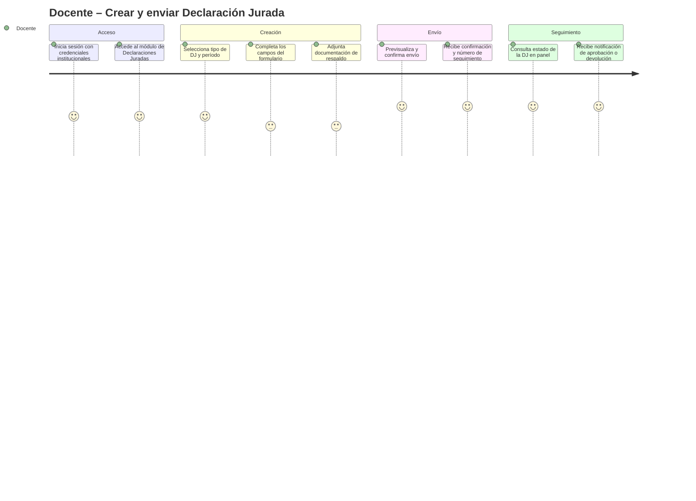
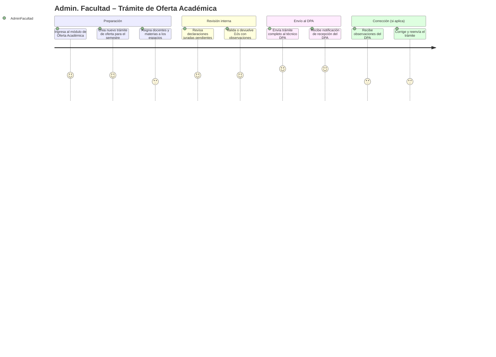

# Product Requirements Document (PRD) — vFinal (Defensa)

> **Trazabilidad:** derivado de `docs/mrd/MRD_vFinal.md` · roadmap v2.0 en `docs/roadmap.md`

# Product Requirements Document (PRD) — v1.0
# Sistema de Gestión Académica Integral (SGAI)

---

## 0. Metadatos

| Campo | Valor |
|-------|-------|
| Producto | Sistema de Gestión Académica Integral (SGAI) |
| Grupo | G01 |
| Versión | v1.0 |
| Fecha | 10/05/2026 |
| Product Manager / Autor | Equipo de Desarrollo SGAI |
| Revisores | Docente + Tech Lead + QA |
| Estado | Borrador |
| BRD de referencia | BRD_SGAI_v2.0 |
| MRD de referencia | MRD_SGAI_v1.0 (pendiente) |
| Fase Spec Kit cubierta | Specify ✅ / Plan ⬜ / Tasks ⬜ / Implement ⬜ |
| Prompts utilizados | PR-PRD-001, PR-PRD-002 (ver PROMPT_MAPPINGS.md) |

## 0.1 Constitution

- **Principio 1:** Todo flujo crítico (DJ, oferta académica) debe completarse en ≤ 5 pasos desde el punto de inicio del usuario.
- **Principio 2:** Ningún dato sensible (boletas de pago, CI, salario) se loggea en texto plano ni en producción ni en debug.
- **Principio 3:** Las reglas de negocio (RB-01 a RB-07) son invariantes del sistema; ninguna pantalla o API puede saltarlas.
- **Principio 4:** La información de un docente solo es visible para ese docente y para los roles con permisos explícitos (excepción: boletas solo para el docente titular).

---

## 1. Resumen del Producto

El SGAI es una plataforma web institucional que digitaliza y centraliza el ciclo académico-administrativo de una universidad pública boliviana con más de 1.500 docentes y 15+ facultades. Resuelve la ineficiencia crítica de los procesos manuales y presenciales: ciclos de aprobación de oferta académica de 5–15 días hábiles, declaraciones juradas en papel sin trazabilidad, e información laboral inaccesible para el docente sin desplazamiento físico.

El producto ofrece cuatro módulos principales: (1) gestión de declaraciones juradas con flujo digital de aprobación multinivel, (2) trámite de oferta académica entre facultades y DPA, (3) consulta self-service de información laboral y financiera (horarios, carga horaria, boletas de pago), y (4) administración de perfiles, roles y estructura académica. Se integra con los sistemas de nómina y el sistema de información institucional existentes sin modificarlos.

El valor diferencial del SGAI es su diseño específico para el contexto normativo boliviano (CEUB, Ley 164) y su flujo de aprobación configurable que respeta la estructura organizacional de la institución.

---

## 2. Objetivos del Producto

| ID | Objetivo del producto | BRD vinculado | Métrica | Meta |
|----|------------------------|----------------|---------|------|
| OP-01 | Permitir al docente iniciar y enviar una declaración jurada en ≤ 5 minutos desde el sistema | BO-02 | Tiempo mediano de envío de DJ | ≤ 5 min |
| OP-02 | Proveer un flujo digital de oferta académica que elimine el intercambio presencial entre facultad y DPA | BO-01 | Ciclo de aprobación en días hábiles | ≤ 2 días |
| OP-03 | Dar acceso self-service a horarios, carga horaria y boletas de pago a todos los docentes activos | BO-03 | % docentes con acceso digital | 100 % |
| OP-04 | Proveer al Técnico DPA un panel de gestión y generación de reportes sin intervención manual | BO-04 | Reducción horas-persona DPA | ≥ 60 % |
| OP-05 | Garantizar la integridad de los documentos académicos mediante reglas de negocio embebidas | BO-05 | % de documentos con historial auditable | 100 % |

---

## 3. Alcance (*Scope*)

### 3.1 Dentro del Alcance (Release v1.0)

- Módulo de Declaraciones Juradas: creación, envío, revisión por Facultad, aprobación/observación por DPA.
- Módulo de Oferta Académica: elaboración por Facultad, revisión técnica por DPA, aprobación/observación.
- Módulo de Perfil Docente: gestión de CV, datos personales y profesionales.
- Módulo de Información Laboral: consulta de horarios, carga horaria y calendario académico.
- Módulo de Boletas de Pago: integración con sistema de nómina, visualización self-service.
- Módulo de Roles y Estados: gestión de roles (Autoridad, Investigador, Administrativo) por el Administrador de Facultad.
- Módulo de Administración: gestión de usuarios, materias, cargas horarias y permisos.
- Notificaciones automáticas por correo institucional ante cambios de estado de trámites.
- Generación de reportes consolidados para el DPA (≥ 3 tipos, exportables en PDF/Excel).
- Integración de lectura con sistema de nómina (boletas) y sistema institucional (materias, carreras, carga horaria).

### 3.2 Fuera del Alcance (Backlog)

- Aplicación móvil nativa (iOS/Android) — evaluación en v2.0.
- Módulo de firma digital con certificado electrónico legal (se evalúa para v1.1).
- Módulo de videoconferencia o LMS.
- Gestión de matrícula de estudiantes.
- Gestión de concurso de méritos docentes.
- Modificación de sistemas de nómina o ERP institucional (solo integración de lectura/consulta en v1.0).

### 3.3 Roadmap de Versiones (Delivery Track)

| Versión | Contenido | Fecha objetivo |
|---------|-----------|----------------|
| v0.1 (MVP) | Módulos DJ, Oferta Académica, Administración básica, autenticación | Q3 2026 |
| v1.0 | MVP + Módulos Perfil Docente, Información Laboral, Boletas de Pago, Reportes DPA, Notificaciones | Q4 2026 |
| v1.1 | Firma digital, mejoras UX basadas en feedback, dashboards analíticos | Q1 2027 |
| v2.0 | App móvil, módulos adicionales por definir en Discovery | Q3 2027 |

### 3.4 Roadmap de Validación (Discovery Track)

| Sprint / Semana | Hipótesis a validar | Método | Criterio de éxito | Estado |
|-----------------|---------------------|--------|-------------------|--------|
| S1–S2 | El flujo de DJ en ≤ 5 pasos es completable por el docente sin capacitación previa | Test de usabilidad con 5 docentes | ≥ 4/5 completan sin asistencia | Abierta |
| S3–S4 | El administrador de facultad puede procesar la oferta académica completa en ≤ 30 min | Prototipo funcional + cronómetro | ≥ 80 % lo logran | Abierta |
| S5–S6 | El técnico DPA procesa y decide un trámite en ≤ 1 día hábil con el sistema digital | Simulación con técnicos DPA | ≥ 80 % acuerdan con el flujo propuesto | Abierta |
| S7–S8 | La integración con nómina es suficiente para mostrar boletas actualizadas en ≤ 24 h | Prueba técnica con Unidad de TI | Latencia de sincronización ≤ 24 h | Abierta |

---

## 4. Personas y User Journeys

### 4.1 Personas (Resumen)

- **Docente:** Gestiona su DJ, consulta horarios, accede a boletas y actualiza su CV. Usuario con menor experiencia técnica; necesita flujos simples y retroalimentación clara del estado de sus trámites.
- **Administrador de Facultad:** Coordina la oferta académica y valida DJs de su facultad. Necesita visibilidad de todos sus docentes y un panel de trabajo eficiente.
- **Técnico DPA:** Revisa y aprueba trámites a nivel institucional. Necesita bandeja de trabajo con filtros, historial de observaciones y generación de reportes.
- **Administrador del Sistema:** Configura el sistema, crea usuarios y gestiona permisos. Necesita panel de administración completo con auditoría.

### 4.2 User Journeys Principales

#### Journey 1: Docente — Crear y enviar una Declaración Jurada



#### Journey 2: Administrador de Facultad — Procesar Oferta Académica



---

## 5. User Stories y Criterios de Aceptación

### 5.1 Épica E1 — Gestión de Declaraciones Juradas

| ID | Historia | Prioridad | Valor | Esfuerzo | Criterios |
|----|----------|-----------|-------|----------|-----------|
| PRD-US-001 | Como docente activo, quiero crear una declaración jurada en el sistema para cumplir con mis obligaciones administrativas sin presentarme físicamente | Must | 8 | 5 | §5.1.1 |
| PRD-US-002 | Como docente, quiero enviar mi DJ completada para que sea revisada por la Administración de mi Facultad | Must | 8 | 3 | §5.1.2 |
| PRD-US-003 | Como docente, quiero consultar el estado actual de mi DJ enviada para saber si fue aprobada, observada o está en revisión | Must | 7 | 2 | §5.1.3 |
| PRD-US-004 | Como Administrador de Facultad, quiero revisar las DJs enviadas por los docentes de mi facultad para validar su información y aprobarlas o devolverlas con observaciones | Must | 9 | 5 | §5.1.4 |
| PRD-US-005 | Como sistema, quiero impedir la edición de una DJ que está en estado "En revisión" o "Aprobada" para garantizar la integridad documental | Must | 9 | 3 | §5.1.5 |

#### 5.1.1 Criterios PRD-US-001
```gherkin
Escenario: Docente activo crea una nueva Declaración Jurada
  Dado un docente con vinculación activa autenticado en el sistema
  Cuando accede al módulo "Declaraciones Juradas" y selecciona "Nueva DJ"
  Entonces el sistema muestra el formulario de DJ con los campos obligatorios pre-completados con los datos del perfil docente
  Y el estado inicial de la DJ es "Borrador"
  Y el sistema registra la fecha y hora de creación en el historial de la DJ

Escenario: Docente sin vinculación activa intenta crear una DJ
  Dado un docente con vinculación inactiva autenticado en el sistema
  Cuando accede al módulo "Declaraciones Juradas" y selecciona "Nueva DJ"
  Entonces el sistema muestra un mensaje explicativo indicando que la vinculación activa es requisito
  Y no permite crear la DJ
```

#### 5.1.2 Criterios PRD-US-002
```gherkin
Escenario: Docente envía una DJ en estado Borrador
  Dado un docente con una DJ en estado "Borrador" completamente llenada
  Cuando selecciona "Enviar para revisión" y confirma la acción
  Entonces el estado de la DJ cambia a "En revisión – Facultad"
  Y el sistema envía una notificación por correo al Administrador de Facultad correspondiente
  Y el docente recibe confirmación con número de seguimiento en < 3 segundos
```

#### 5.1.3 Criterios PRD-US-003
```gherkin
Escenario: Docente consulta el estado de su DJ
  Dado un docente autenticado con al menos una DJ enviada
  Cuando accede al listado de sus declaraciones juradas
  Entonces el sistema muestra cada DJ con: estado actual, fecha de última actualización y observaciones (si las hay)
  Y la información se actualiza en tiempo real sin recargar la página
```

#### 5.1.4 Criterios PRD-US-004
```gherkin
Escenario: Administrador de Facultad aprueba una DJ
  Dado un Administrador de Facultad autenticado con DJs pendientes en su bandeja
  Cuando selecciona una DJ y elige "Aprobar"
  Entonces el estado de la DJ cambia a "Aprobada"
  Y el sistema notifica al docente por correo
  Y registra el nombre del aprobador, fecha y hora en el historial de la DJ

Escenario: Administrador de Facultad devuelve una DJ con observaciones
  Dado un Administrador de Facultad con una DJ "En revisión – Facultad"
  Cuando selecciona "Devolver con observaciones" e ingresa el texto de observación (obligatorio)
  Entonces el estado cambia a "Devuelta – Pendiente de corrección"
  Y el docente recibe notificación con el detalle de las observaciones
  Y la DJ queda habilitada para edición nuevamente
```

#### 5.1.5 Criterios PRD-US-005
```gherkin
Escenario: Docente intenta editar una DJ en revisión
  Dado una DJ en estado "En revisión – Facultad" o "Aprobada"
  Cuando el docente intenta acceder al formulario de edición de esa DJ
  Entonces el sistema muestra el formulario en modo solo lectura
  Y muestra un mensaje indicando que la DJ no puede editarse en su estado actual
  Y no expone ningún campo editable en la interfaz
```

### 5.2 Épica E2 — Trámite de Oferta Académica

| ID | Historia | Prioridad | Valor | Esfuerzo | Criterios |
|----|----------|-----------|-------|----------|-----------|
| PRD-US-006 | Como Administrador de Facultad, quiero crear un trámite de oferta académica semestral/anual para registrar la planificación de mi facultad de forma digital | Must | 9 | 8 | §5.2.1 |
| PRD-US-007 | Como Administrador de Facultad, quiero enviar el trámite de oferta académica al Técnico DPA una vez completado y revisado internamente | Must | 9 | 5 | §5.2.2 |
| PRD-US-008 | Como Técnico DPA, quiero revisar los trámites de oferta académica enviados por las facultades, aprobarlos u observarlos, para garantizar la correcta planificación institucional | Must | 10 | 8 | §5.2.3 |
| PRD-US-009 | Como Técnico DPA, quiero generar reportes consolidados de la oferta académica institucional exportables en PDF y Excel | Should | 7 | 5 | §5.2.4 |

#### 5.2.1 Criterios PRD-US-006
```gherkin
Escenario: Administrador de Facultad crea un nuevo trámite de oferta académica
  Dado un Administrador de Facultad autenticado
  Cuando accede al módulo "Oferta Académica" y selecciona "Nuevo trámite" para un período académico
  Entonces el sistema crea el trámite en estado "En elaboración"
  Y pre-carga la lista de materias de la facultad desde el sistema institucional
  Y permite al administrador asignar docentes a cada materia con su carga horaria correspondiente
```

#### 5.2.2 Criterios PRD-US-007
```gherkin
Escenario: Administrador envía trámite completo al DPA
  Dado un trámite de oferta académica en estado "En elaboración" con todas las materias asignadas
  Cuando el Administrador selecciona "Enviar al DPA" y confirma
  Entonces el estado cambia a "En revisión – DPA"
  Y el Técnico DPA recibe notificación por correo
  Y el trámite queda bloqueado para edición por parte de la Facultad
```

#### 5.2.3 Criterios PRD-US-008
```gherkin
Escenario: Técnico DPA aprueba un trámite de oferta académica
  Dado un Técnico DPA con trámites en estado "En revisión – DPA" en su bandeja
  Cuando revisa el trámite y selecciona "Aprobar"
  Entonces el estado cambia a "Aprobado"
  Y el Administrador de Facultad recibe notificación
  Y el sistema registra aprobador, fecha y hora en el historial del trámite

Escenario: Técnico DPA observa un trámite
  Dado un trámite de oferta en "En revisión – DPA"
  Cuando el Técnico selecciona "Observar" e ingresa el detalle (obligatorio)
  Entonces el estado cambia a "Observado – Pendiente de corrección"
  Y la Facultad recibe notificación con las observaciones detalladas
  Y el trámite queda habilitado para edición por parte de la Facultad
```

#### 5.2.4 Criterios PRD-US-009
```gherkin
Escenario: Técnico DPA genera reporte consolidado
  Dado un Técnico DPA autenticado en el módulo de Reportes
  Cuando selecciona el tipo de reporte (por facultad, por período o institucional) y el rango de fechas
  Y selecciona el formato de exportación (PDF o Excel)
  Entonces el sistema genera el reporte en < 10 segundos
  Y lo pone disponible para descarga inmediata
```

### 5.3 Épica E3 — Información Laboral y Financiera (Self-service Docente)

| ID | Historia | Prioridad | Valor | Esfuerzo | Criterios |
|----|----------|-----------|-------|----------|-----------|
| PRD-US-010 | Como docente, quiero consultar mi carga horaria y mis horarios de clase asignados para el semestre actual sin hacer trámites presenciales | Must | 8 | 3 | §5.3.1 |
| PRD-US-011 | Como docente, quiero acceder a mis boletas de pago históricas y del período actual desde el sistema | Must | 8 | 5 | §5.3.2 |
| PRD-US-012 | Como docente, quiero consultar el calendario académico oficial de mi facultad y el calendario institucional | Must | 6 | 2 | §5.3.3 |
| PRD-US-013 | Como docente, quiero actualizar mi currículum vitae y datos de perfil profesional en el sistema | Should | 5 | 4 | §5.3.4 |

#### 5.3.1 Criterios PRD-US-010
```gherkin
Escenario: Docente consulta su carga horaria
  Dado un docente autenticado con asignaciones en el período actual
  Cuando accede al módulo "Mi Horario"
  Entonces el sistema muestra las materias asignadas, días, horarios, aula y carga horaria semanal
  Y los datos provienen del sistema institucional sincronizado (máximo 24 h de desfase)
```

#### 5.3.2 Criterios PRD-US-011
```gherkin
Escenario: Docente consulta su boleta de pago del mes actual
  Dado un docente autenticado cuya liquidación del mes actual ya fue procesada en nómina
  Cuando accede al módulo "Boletas de Pago" y selecciona el período
  Entonces el sistema muestra la boleta con el detalle de haberes y descuentos
  Y la boleta fue sincronizada desde el sistema de nómina en ≤ 24 h desde la liquidación
  Y solo el docente titular puede ver sus propias boletas (validación de acceso)
```

#### 5.3.3 Criterios PRD-US-012
```gherkin
Escenario: Docente consulta el calendario académico
  Dado un docente autenticado
  Cuando accede al módulo "Calendario Académico"
  Entonces el sistema muestra el calendario vigente publicado por su facultad
  Y el calendario institucional general (feriados, inicio/fin de semestre, fechas de exámenes)
```

#### 5.3.4 Criterios PRD-US-013
```gherkin
Escenario: Docente actualiza su CV
  Dado un docente autenticado en el módulo "Mi Perfil"
  Cuando edita una sección de su CV (formación académica, publicaciones, experiencia docente)
  Y guarda los cambios
  Entonces el sistema persiste los cambios y muestra confirmación
  Y registra fecha y hora de la última actualización en el perfil
```

### 5.4 Épica E4 — Administración y Roles

| ID | Historia | Prioridad | Valor | Esfuerzo | Criterios |
|----|----------|-----------|-------|----------|-----------|
| PRD-US-014 | Como Administrador del Sistema, quiero crear y gestionar cuentas de usuario, asignarles roles y permisos, para controlar el acceso al sistema | Must | 9 | 5 | §5.4.1 |
| PRD-US-015 | Como Administrador del Sistema, quiero crear y configurar materias con sus cargas horarias por carrera | Must | 8 | 5 | §5.4.2 |
| PRD-US-016 | Como Administrador de Facultad, quiero gestionar el estado de roles de los docentes de mi facultad (Autoridad, Investigador, Administrativo) | Must | 7 | 3 | §5.4.3 |
| PRD-US-017 | Como cualquier usuario autenticado, quiero recibir notificaciones por correo electrónico institucional cuando el estado de mis trámites cambia | Should | 7 | 4 | §5.4.4 |

#### 5.4.1 Criterios PRD-US-014
```gherkin
Escenario: Administrador crea una nueva cuenta de usuario
  Dado el Administrador del Sistema autenticado en el panel de administración
  Cuando crea una nueva cuenta con nombre, correo institucional, rol y facultad asignada
  Y confirma la creación
  Entonces el sistema crea la cuenta y envía credenciales provisionales al correo del nuevo usuario
  Y registra la acción en el log de auditoría con fecha, hora y nombre del administrador
```

#### 5.4.2 Criterios PRD-US-015
```gherkin
Escenario: Administrador configura una nueva materia
  Dado el Administrador del Sistema autenticado
  Cuando crea una nueva materia con: nombre, código, carrera, semestre, carga horaria teórica y práctica
  Y guarda la configuración
  Entonces la materia queda disponible para ser incluida en los trámites de oferta académica de la facultad correspondiente
```

---

## 6. Priorización

### MoSCoW
- **Must:** PRD-US-001 a PRD-US-008, PRD-US-010, PRD-US-011, PRD-US-012, PRD-US-014, PRD-US-015, PRD-US-016
- **Should:** PRD-US-009, PRD-US-013, PRD-US-017
- **Could:** Dashboards analíticos, firma digital (v1.1)
- **Won't (esta versión):** App móvil, LMS, concurso de méritos

### Tabla RICE (Top 10 Historias)

| ID | Reach | Impact (0.25–3) | Confidence (%) | Effort | RICE Score |
|----|-------|-----------------|----------------|--------|------------|
| PRD-US-001 | 1500 | 3 | 90 | 5 | 810 |
| PRD-US-008 | 5 | 3 | 95 | 8 | 1.78 → **alta prioridad institucional** |
| PRD-US-006 | 15 | 3 | 90 | 8 | 5.06 |
| PRD-US-004 | 15 | 3 | 90 | 5 | 8.1 |
| PRD-US-010 | 1500 | 2 | 95 | 3 | 950 |
| PRD-US-011 | 1500 | 2 | 85 | 5 | 510 |
| PRD-US-014 | 2 | 3 | 95 | 5 | 1.14 → **bloqueante para el resto** |
| PRD-US-007 | 15 | 3 | 90 | 5 | 8.1 |
| PRD-US-002 | 1500 | 2 | 90 | 3 | 900 |
| PRD-US-016 | 15 | 2 | 85 | 3 | 8.5 |

> Nota: PRD-US-014 y PRD-US-008 tienen bajo reach pero son habilitadores críticos del sistema completo; su prioridad es Must por dependencia técnica y de negocio.

---

## 7. Requerimientos Funcionales (Alto Nivel)

| ID | Requisito | Historia(s) | Prioridad |
|----|-----------|-------------|-----------|
| PRD-REQ-001 | El sistema debe permitir autenticación con credenciales institucionales (usuario/contraseña universitaria) | PRD-US-001 a PRD-US-017 | Must |
| PRD-REQ-002 | El sistema debe gestionar el ciclo completo de la DJ: Borrador → En revisión Facultad → Aprobada / Devuelta / Observada DPA | PRD-US-001 a PRD-US-005 | Must |
| PRD-REQ-003 | El sistema debe gestionar el ciclo completo del trámite de oferta académica: En elaboración → En revisión DPA → Aprobado / Observado | PRD-US-006 a PRD-US-009 | Must |
| PRD-REQ-004 | El sistema debe impedir la edición de DJ en estados "En revisión" o "Aprobada" sin devolución previa | PRD-US-005 | Must |
| PRD-REQ-005 | El sistema debe verificar vinculación activa del docente antes de permitir la creación de una DJ | PRD-US-001 | Must |
| PRD-REQ-006 | El sistema debe integrarse con el sistema de nómina para sincronizar boletas de pago en ≤ 24 h | PRD-US-011 | Must |
| PRD-REQ-007 | El sistema debe integrarse con el sistema institucional para sincronizar materias, carreras y carga horaria | PRD-US-010, PRD-US-006 | Must |
| PRD-REQ-008 | El sistema debe enviar notificaciones automáticas por correo ante cada cambio de estado de trámites | PRD-US-002, PRD-US-007, PRD-US-017 | Should |
| PRD-REQ-009 | El sistema debe generar reportes consolidados exportables en PDF y Excel para el Técnico DPA | PRD-US-009 | Should |
| PRD-REQ-010 | El sistema debe mantener un historial de cambios (quién, cuándo, qué) para cada DJ y trámite de oferta | PRD-US-003, PRD-US-008 | Must |
| PRD-REQ-011 | El sistema debe controlar el acceso por roles: Docente, Admin. Facultad, Técnico DPA, Admin. Sistema | PRD-US-014 | Must |
| PRD-REQ-012 | El acceso a boletas de pago debe estar restringido exclusivamente al docente titular del documento | PRD-US-011 | Must |

---

## 8. Requerimientos No Funcionales (Alto Nivel)

| ID | Categoría | Requerimiento | Métrica | Umbral |
|----|-----------|---------------|---------|--------|
| PRD-NFR-001 | Rendimiento | Tiempo de respuesta en operaciones CRUD principales | p95 | < 2 segundos |
| PRD-NFR-002 | Rendimiento | Generación de reportes PDF/Excel | tiempo máximo | < 10 segundos |
| PRD-NFR-003 | Disponibilidad | Uptime del sistema en horario hábil (7:00–22:00) | uptime mensual | ≥ 99 % |
| PRD-NFR-004 | Seguridad | Cifrado de datos en reposo (boletas, CI, datos personales) | estándar | AES-256 |
| PRD-NFR-005 | Seguridad | Cifrado de datos en tránsito | protocolo | TLS 1.2+ |
| PRD-NFR-006 | Seguridad | Autenticación segura con manejo de sesiones | tiempo de expiración | ≤ 8 horas de inactividad |
| PRD-NFR-007 | Cumplimiento | Protección de datos personales conforme Ley 164 Bolivia | aplicable | 100 % cumplimiento |
| PRD-NFR-008 | Escalabilidad | Soportar la carga de 1.500 docentes + 50 administradores concurrentes | usuarios concurrentes soportados | ≥ 200 simultáneos |
| PRD-NFR-009 | Usabilidad | La interfaz debe ser usable sin capacitación previa para tareas de lectura | tasa de completación en test de usabilidad | ≥ 80 % sin asistencia |
| PRD-NFR-010 | Compatibilidad | El sistema debe funcionar en los navegadores Chrome, Firefox, Edge (versiones N-1) | navegadores soportados | 3 principales |

---

## 9. Dependencias e Integraciones

| Sistema | Tipo | Propósito | Riesgo |
|---------|------|-----------|--------|
| Sistema de Nómina institucional | Consumo (lectura) | Sincronización de boletas de pago | Alto — documentación técnica no disponible aún |
| Sistema de Información Institucional (materias/carreras) | Consumo (lectura) | Sincronización de materias, carga horaria, carreras | Alto — sistema legado, sin APIs conocidas |
| Servidor de correo institucional (SMTP) | Consumo | Envío de notificaciones automáticas | Bajo |
| Directorio de usuarios institucional (LDAP/AD) | Consumo | Autenticación con credenciales universitarias | Medio |

---

## 10. Supuestos y Restricciones

**Supuestos:**
- Los sistemas de nómina y el sistema institucional pueden exponer datos mediante algún mecanismo de integración (API REST, consulta directa a BD de solo lectura, o archivo de exportación programado).
- Los docentes tienen acceso a internet y a un navegador web moderno.
- La Unidad de TI proveerá entornos de desarrollo, staging y producción.
- El Administrador del Sistema será un miembro de la Unidad de TI con conocimientos técnicos básicos.

**Restricciones:**
- El sistema debe ser accesible exclusivamente vía navegador web (sin app nativa en v1.0).
- El sistema no puede modificar los sistemas legados de nómina ni el sistema institucional (solo lectura).
- El plazo de entrega de v0.1 (MVP) es Q3 2026.
- Presupuesto de desarrollo estimado: USD 45.000 CAPEX.
- Cumplimiento obligatorio de la Ley N° 164 de Bolivia y normativas CEUB.

---

## 11. Experiencia de Usuario

- Referencia a wireframes del Módulo 2 (UX/UI): `docs/m2/wireframes/`.
- Lineamientos de diseño: interfaz web responsive, tipografía legible, contraste adecuado, formularios con validación en línea.
- Accesibilidad: WCAG 2.1 AA como objetivo mínimo.
- Idioma: Español (es-BO).

### 11.1 Trazabilidad con M2 (UI/UX)

| Use Case M2 | User Story PRD | Estado de la traza |
|-------------|----------------|---------------------|
| UC-M2-01: Docente crea y envía DJ | PRD-US-001, PRD-US-002 | ✅ Cubierto |
| UC-M2-02: Admin. Facultad revisa DJ | PRD-US-004 | ✅ Cubierto |
| UC-M2-03: Docente consulta horario | PRD-US-010 | ✅ Cubierto |
| UC-M2-04: Docente consulta boleta | PRD-US-011 | ✅ Cubierto |
| UC-M2-05: Admin. Facultad crea oferta académica | PRD-US-006 | ✅ Cubierto |
| UC-M2-06: Técnico DPA aprueba trámite | PRD-US-008 | ✅ Cubierto |
| UC-M2-07: Admin. Sistema gestiona usuarios | PRD-US-014 | ✅ Cubierto |

---

## 12. Métricas de Éxito del Producto

- **North Star:** Tiempo medio de aprobación de oferta académica ≤ 2 días hábiles — Q1 2027.
- **KPIs de adopción:**
  - % de DJ procesadas digitalmente ≥ 90 % — Q1 2027.
  - % de docentes activos que consultan horarios/boletas mensualmente ≥ 80 % — Q2 2027.
- **KPIs de calidad:**
  - Tasa de errores críticos en producción < 1 % de transacciones — medición mensual.
  - Tiempo de resolución de incidentes críticos (MTTR) ≤ 4 horas — desde el lanzamiento.
  - Satisfacción del usuario (CSAT) ≥ 4/5 — encuesta semestral.

---

## 13. Riesgos del Producto

| Riesgo | Prob. | Impacto | Mitigación |
|--------|-------|---------|------------|
| Integración con sistemas legados más compleja de lo estimado | Alta | Alto | Sprint 0 dedicado a análisis técnico; diseño con adaptadores desacoplados |
| Baja adopción inicial por resistencia al cambio | Media | Alto | Capacitaciones presenciales, tutoriales, período de transición paralela |
| Rendimiento degradado bajo carga en período de matrícula/inicio de semestre | Media | Medio | Pruebas de carga en staging antes del go-live |
| Inconsistencia de datos en sistemas legados que alimentan el SGAI | Media | Medio | Rutinas de validación y conciliación de datos en la integración |

---

## 14. Trazabilidad

| PRD ID | BRD | FSD (próximo) |
|--------|-----|----------------|
| PRD-REQ-001 | BR-011 | FSD-UC-001 |
| PRD-REQ-002 | BR-001, BR-006, BR-007 | FSD-UC-002 |
| PRD-REQ-003 | BR-002, BR-003 | FSD-UC-003, FSD-UC-004 |
| PRD-REQ-004 | BR-006 | FSD-UC-002 (regla de integridad) |
| PRD-REQ-005 | BR-007 | FSD-UC-002 |
| PRD-REQ-006 | BR-009 | FSD-UC-006 |
| PRD-REQ-007 | BR-010 | FSD-UC-007 |
| PRD-REQ-009 | BR-012 | FSD-UC-008 |
| PRD-REQ-010 | BR-003 | FSD-UC-002, FSD-UC-003 |
| PRD-REQ-011 | BR-011 | FSD-UC-001 |
| PRD-REQ-012 | BR-005, RB-06 | FSD-UC-005 |

---

## 15. Anexos

- Wireframes M2: `docs/m2/wireframes/` (pendiente de adjuntar).
- User journeys completos: `docs/m2/journeys/`.
- Transcripción de entrevistas con usuarios: `docs/discovery/entrevistas_v1.md`.

---

## 16. Registro de Cambios

| Versión | Fecha | Autor | Cambio |
|---------|-------|-------|--------|
| v1.0 | 10/05/2026 | Equipo SGAI | Versión inicial del PRD — 17 user stories, 12 reqs. funcionales, 10 NFRs, trazabilidad completa |

---

## Checklist Mínimo

- [x] ≥ 15 user stories con criterios de aceptación Gherkin.
- [x] Priorización MoSCoW + RICE para top-10.
- [x] ≥ 2 user journeys en Mermaid.
- [x] NFRs alto nivel con umbrales (10 NFRs).
- [x] Roadmap de versiones (v0.1 → v2.0).
- [x] Trazabilidad BRD → PRD → FSD iniciada.
- [x] Constitution declarada (Principios 1–4).
