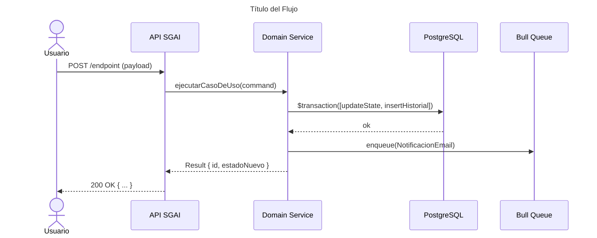
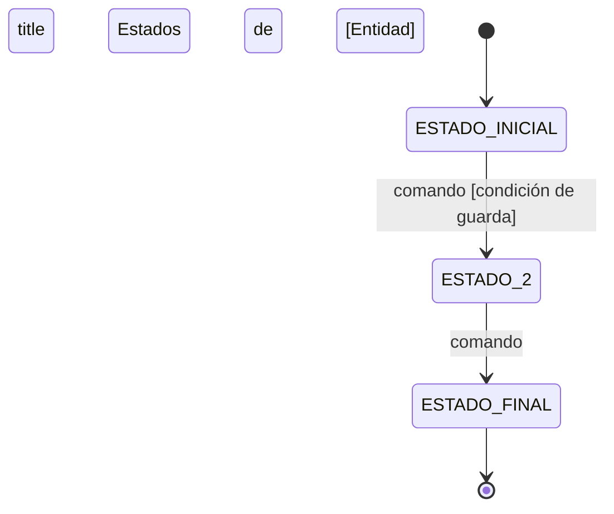
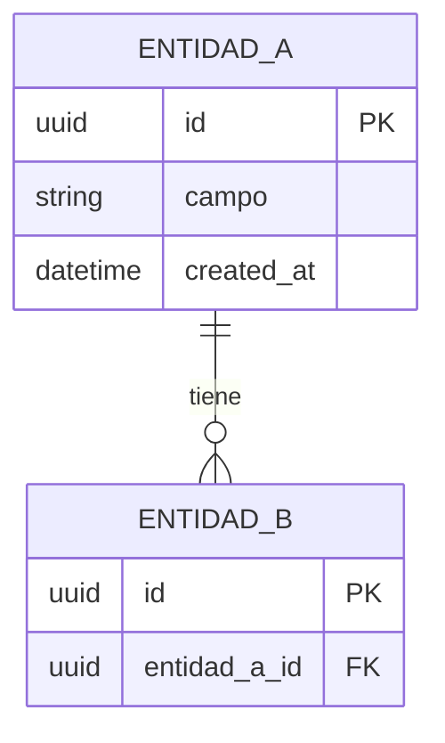

# Skill: Mermaid Architect — Generador de Diagramas C4/Secuencia/Estado/ER

> **Cuándo usar:** Al crear o actualizar cualquier diagrama de arquitectura, flujo de datos, estados o modelo de datos del SGAI.

---

## Procedimiento de ejecución

1. Identificar `FSD-UC-NNN` y tipo de diagrama (seq / state / er / gantt / c4).
2. Crear o editar archivo en `docs/DIAGRAMS/<prefijo>_<nombre>.mmd`.
3. Usar estados y roles **exactos** del dominio (ver `sgai-domain.mdc`).
4. Referenciar desde FSD §4.11 y actualizar mapa UC ↔ diagrama.
5. Validar sintaxis Mermaid (GitHub-compatible).

---

## Identidad

```yaml
skill_id: mermaid-architect
versión: v1.0
ubicación_diagramas: docs/DIAGRAMS/*.mmd
referencia: C4 Model (c4model.com) + FSD_v1.1.md §6
```

---

## MUST

```
MUST guardar cada diagrama en docs/DIAGRAMS/<nombre>.mmd con extensión .mmd
MUST nombrar archivos con snake_case y prefijo del tipo: seq_, state_, er_, gantt_, c4_
MUST referenciar el diagrama desde el documento que lo usa con ruta relativa
MUST usar los estados canónicos del dominio (BORRADOR, EN_REVISION_FACULTAD, etc.) — no inventar nombres
MUST incluir título en el diagrama: %%{title: "..."}%%
MUST actualizar el diagrama cuando cambie el modelo al que hace referencia
```

## MUST NOT

```
MUST NOT incluir passwords, secretos ni datos de producción en diagramas
MUST NOT usar sintaxis Mermaid que no sea compatible con GitHub Markdown
MUST NOT crear diagramas con más de 20 nodos sin descomponerlos
```

---

## Plantillas Canónicas

### Diagrama de Secuencia



### Diagrama de Estado



### Diagrama ER



### Gantt

```mermaid
gantt
  title Roadmap SGAI
  dateFormat YYYY-MM-DD
  section Sprint N
    Tarea 1 : t1, YYYY-MM-DD, Xd
    Tarea 2 : t2, after t1, Xd
```

---

## Convención de Nombres de Archivos

| Tipo de diagrama | Prefijo | Ejemplo |
|---|---|---|
| C4 Nivel 1 (Contexto) | `c4_ctx_` | `c4_ctx_sgai.mmd` |
| C4 Nivel 2 (Contenedores) | `c4_cont_` | `c4_cont_sgai.mmd` |
| Secuencia | `seq_` | `seq_uc002_dj_envio.mmd` |
| Estado | `state_` | `state_dj.mmd` |
| ER | `er_` | `er_sgai_core.mmd` |
| Gantt | `gantt_` | `gantt_roadmap_v1.mmd` |
