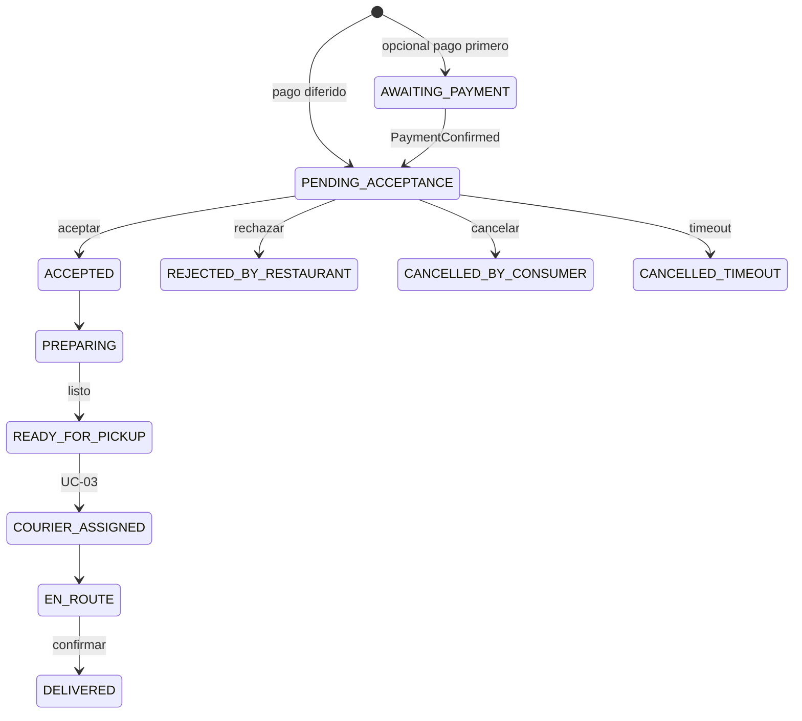
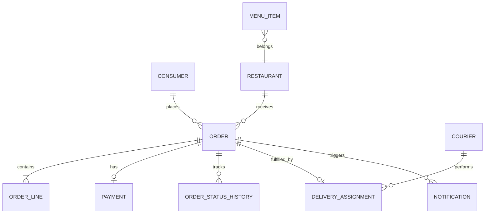

# Functional Specification Document (FSD) – FTGO (Food To Go)

> **Instrucciones**: especificación funcional trazable al PRD `exam-lab/docs/PRD.md`, Brief FTGO [Brief §A.4] y *Microservices Patterns* (Richardson). Deriva ADRs, C4 y plan de pruebas.
>
> Audiencia: Desarrollo, QA, Arquitectura, Producto, Operaciones.

## Modos soportados por esta plantilla

| Modo | Cuándo elegirlo | Marca |
|------|------------------|-------|
| **FSD clásico** | Cobertura completa; entrega final del módulo | 🔧 |
| **LFSD — Lightweight FSD** | Iteración sprint a sprint | ⚡ |

**Modo declarado en este documento**: **FSD clásico 🔧**

---

## 0. Metadatos ⚡🔧

| Campo | Valor |
|-------|-------|
| Producto | **FTGO (Food To Go)** — especificación funcional v1.0 (migración Strangler Fig) |
| Grupo | Exam Lab — Módulo 4 |
| Versión del documento | `v1.1` |
| Fecha | `24/05/2026` |
| Autores | Carolina Aguilar |
| Revisores | Tech Lead + QA + Arquitectura |
| Estado | En revisión |
| **Modo elegido** | **FSD clásico 🔧** |
| Trazabilidad a PRD | `exam-lab/docs/PRD.md` v1.0 |
| Insumos M2 (UI/UX) | `exam-lab/docs/wireframes/` |
| Fase Spec Kit cubierta | Specify ✅ / Plan ✅ / Tasks ⬜ / Implement ⬜ |
| Prompts utilizados | `PR-FSD-FTGO-001` … `PR-FSD-FTGO-012` |

## 1. Resumen ejecutivo ⚡🔧

**FTGO** es una plataforma de delivery que conecta consumidores, restaurantes y couriers. Opera en producción como **monolito Java/WAR** con síntomas de *Monolithic Hell* [Cap.1 Richardson]: acoplamiento elevado, builds lentos (~45 min), despliegues de alto riesgo, escalado conflictivo entre módulos y poca resiliencia ante fallos de Stripe o Google Maps.

Este FSD define el comportamiento funcional objetivo de la **modernización incremental v1.0**: **nueve casos de uso** (UC-01–UC-09) alineados a las **siete capacidades FTGO** del PRD/Brief (Consumer Management, Restaurant Management, Order Taking, Order Fulfillment, Delivery, Billing & Accounting, Notifications), enrutados vía **API Gateway (Strangler Fig)** [Cap.2 Richardson] · [Brief §A.4]. El monolito sigue sirviendo capacidades no migradas; los flujos nuevos publican **eventos de dominio** (`OrderCreated`, `PaymentConfirmed`, `OrderCancelled`, `CourierAssigned`, `CourierRejected`, `NotificationSent`, etc.) con **consistencia eventual** (lag < 5 s p95), **timeouts 3 s**, **retry con backoff** en integraciones, y trazas distribuidas (`correlationId`) en el 100 % de caminos Must (FSD-NFR-005).

El valor para el negocio: reducir latencia de checkout (< 200 ms p95), aislar fallos externos, permitir escalado independiente de Order Taking y Delivery, y mantener disponibilidad 99.9 % durante la migración sin Big Bang Rewrite.

## 2. Alcance ⚡🔧

### 2.1 Dentro del alcance

- Especificación funcional de **UC-01 a UC-09** (FSD-UC-001 … FSD-UC-009).
- Flujos semilla: toma de pedido [US-01], tickets [US-02], asignación courier [US-03].
- Flujos derivados Brief/PRD: **pago en checkout**, **tracking tiempo real**, **dashboard back office**, **reasignación automática courier**, **cancelación consumidor**, **gestión de menú**.
- Integraciones: Stripe, Google Maps, SendGrid, Twilio; coexistencia monolito + microservicios.
- Reglas de negocio, modelo de datos funcional, NFRs verificables, plan de pruebas.
- Enrutamiento Strangler en API Gateway (canary por % tráfico).

### 2.2 Fuera del alcance (explícito)

- Big Bang Rewrite del monolito.
- Migración completa de datos históricos.
- Kafka en producción v1.0 (cola ligera / HTTP async en v1.0).
- Multi-región, ML de ruteo, reescritura total de frontend.
- Detalle de implementación (clases, esquemas DB físicos) — vive en ADRs y código.

### 2.3 Supuestos y dependencias

| Tipo | Detalle |
|------|---------|
| **Supuesto** | Monolito permanece fuente de verdad para entidades no extraídas en v1.0 [Brief §A.4]. |
| **Supuesto** | Consumidor, restaurante y courier ya autenticados vía sistema existente (Consumer Management / identidad legado). |
| **Supuesto** | Stripe es único PSP; PAN/CVV nunca en FTGO [PRD-NFR-008]. |
| **Dependencia** | SLA Stripe ~99.9 %; Maps geocoding p95 < 1.5 s en condiciones normales. |
| **Dependencia** | API Gateway enruta `POST /orders` al `order-service` según feature flag/canary. |

### 2.4 Plan técnico (Spec Kit fase Plan) 🔧

| Bloque | Contenido |
|--------|-----------|
| **Stack tecnológico** | Monolito: Java WAR legado. Microservicios v1.0: Node/Java (ADR pendiente); API Gateway; cola mensajes ligera (RabbitMQ/SQS); PostgreSQL compartido transicional inicial. |
| **Arquitectura prevista** | Microservicios por **capability** [Cap.2 Richardson]; Strangler Fig [Brief §A.4]; eventos asíncronos; bulkheads por integración externa. |
| **Project structure** | `services/order-service`, `fulfillment-service`, `delivery-service`, `billing-service`, `notification-service`, `restaurant-service`, `gateway/`, `monolith/` (legado), `docs/adr/`, `docs/c4/`. |
| **Decisiones anticipadas** | ADR-0001 Strangler routing; ADR-0002 Eventual consistency pedido; ADR-0003 PCI delegado Stripe. |
| **Restricciones técnicas** | Sin 2PC cross-service; timeouts externos 3 s; correlationId obligatorio; no detener monolito en pico. |

### 2.5 Descomposición en Tasks (Spec Kit) ⚡🔧

| Task ID | Descripción | Caso de uso | Dependencias | Prompt | Estado |
|---------|-------------|-------------|--------------|--------|--------|
| T-001 | Contrato OpenAPI `POST /orders` + validaciones UC-01 | FSD-UC-001 | — | PR-FSD-FTGO-001 | pendiente |
| T-002 | Panel tickets aceptar/rechazar UC-02 | FSD-UC-002 | T-001 | PR-FSD-FTGO-002 | pendiente |
| T-003 | Asignación y aceptación courier UC-03 | FSD-UC-003 | T-002 | PR-FSD-FTGO-003 | pendiente |
| T-004 | Integración Stripe + webhooks UC-04 | FSD-UC-004 | T-001 | PR-FSD-FTGO-004 | pendiente |
| T-005 | API tracking consumidor UC-05 | FSD-UC-005 | T-003 | PR-FSD-FTGO-005 | pendiente |
| T-006 | Consumidor eventos → SendGrid/Twilio UC-06 | FSD-UC-006 | T-001 | PR-FSD-FTGO-006 | pendiente |
| T-007 | API Gateway canary Strangler 5 % | FSD-UC-001 | T-001 | PR-FSD-FTGO-007 | pendiente |
| T-008 | OpenTelemetry correlationId E2E | todos UC | T-001 | PR-FSD-FTGO-008 | pendiente |
| T-009 | Checkout orquestado Order + Billing UC-04 | FSD-UC-004 | T-001, T-004 | PR-FSD-FTGO-009 | pendiente |
| T-010 | Dashboard ops `GET /ops/reports/daily` UC-07 | FSD-UC-007 | T-008 | PR-FSD-FTGO-010 | pendiente |
| T-011 | Cancelación consumidor `POST /orders/{id}/cancel` UC-08 | FSD-UC-008 | T-001, T-004 | PR-FSD-FTGO-011 | pendiente |
| T-012 | PATCH menú ítems UC-09 | FSD-UC-009 | — | PR-FSD-FTGO-012 | pendiente |

## 3. Actores y roles del sistema ⚡🔧

| Actor | Tipo | Responsabilidad principal | Permisos clave |
|-------|------|---------------------------|----------------|
| **Consumidor** | humano | Crear pedidos, pagar, tracking, cancelar pre-aceptación | `orders:create`, `orders:read:own`, `orders:cancel:pre-accept` |
| **Restaurante** | humano | Aceptar/rechazar tickets, marcar listo, gestionar menú | `tickets:read:own-restaurant`, `tickets:accept`, `tickets:reject`, `menu:update:own-restaurant` |
| **Courier** | humano | Aceptar asignaciones, navegar, confirmar entrega | `deliveries:accept`, `deliveries:complete` |
| **Empleado FTGO** | humano | Dashboard, reasignar courier, soporte, trazas | `ops:reports:read`, `deliveries:reassign`, `orders:read:ops`, `traces:read` |
| **Stripe** | sistema | Pagos, webhooks | Webhook firmado HMAC |
| **Google Maps** | sistema | Rutas, ETA, geocoding | API key servidor |
| **SendGrid** | sistema | Email transaccional | API key |
| **Twilio** | sistema | SMS | API key |
| **API Gateway** | sistema | Routing Strangler, TLS, rate limit | Rutas por versión/flag |
| **Monolito FTGO** | sistema (legado) | Capacidades no migradas, datos compartidos | Endpoints legacy |

> **Nota**: no se agregan stakeholders fuera del dominio FTGO definido en PRD §4.

## 4. Casos de uso funcionales ⚡🔧

> **Nueve** casos de uso críticos. ID canónico: `FSD-UC-00N` ≡ `UC-0N`. Trazabilidad obligatoria: [US-01], [US-02], [US-03], [Brief §A.4], [Cap.1 Richardson], [Cap.2 Richardson].

### Índice de casos de uso y capacidades FTGO

| UC | FSD ID | Capability | Origen PRD/Brief | Semilla |
|----|--------|------------|------------------|---------|
| UC-01 | FSD-UC-001 | Order Taking | PRD-US-001 · [US-01] | ✅ |
| UC-02 | FSD-UC-002 | Order Fulfillment | PRD-US-006 · [US-02] | ✅ |
| UC-03 | FSD-UC-003 | Delivery | PRD-US-010 · [US-03] | ✅ |
| UC-04 | FSD-UC-004 | Billing & Accounting | PRD-US-003 · Brief checkout | derivado |
| UC-05 | FSD-UC-005 | Delivery | PRD-US-004 · Brief tracking | derivado |
| UC-06 | FSD-UC-006 | Notifications | PRD-US-014 | derivado |
| UC-07 | FSD-UC-007 | Ops / Observabilidad | PRD-US-015 · [Brief §A.4] | derivado |
| UC-08 | FSD-UC-008 | Order Taking | PRD-US-005 | derivado |
| UC-09 | FSD-UC-009 | Restaurant Management | PRD-US-009 · PRD-US-002 | derivado |

### Catálogo de eventos de dominio (v1.0)

| Evento | Productores típicos | Consumidores | Consistencia |
|--------|---------------------|--------------|--------------|
| `OrderCreated` | UC-01 | UC-02, UC-06 | Eventual |
| `PaymentConfirmed` | UC-04 | UC-01, UC-06 | Eventual |
| `PaymentFailed` | UC-04 | UC-06 | Eventual |
| `OrderCancelled` | UC-01, UC-08 | UC-04, UC-06 | Eventual |
| `OrderAccepted` / `OrderRejected` | UC-02 | UC-05, UC-06 | Eventual |
| `OrderReadyForPickup` | UC-02 | UC-03 | Eventual |
| `CourierAssigned` | UC-03 | UC-05, UC-06 | Eventual |
| `CourierRejected` | UC-03 | UC-03 (retry asignación) | Eventual |
| `OrderDelivered` | UC-03 | UC-04, UC-06 | Eventual |
| `NotificationSent` | UC-06 | auditoría | Eventual |

### Verificación rubrica (autocontrol documento)

| Criterio | Estado |
|----------|--------|
| ≥ 5 UCs | ✅ 9 UCs |
| Given/When/Then por UC | ✅ (mín. 2 escenarios/UC) |
| Trazabilidad Brief/PRD/Richardson | ✅ tabla índice + filas Origen |
| Capability FTGO por UC | ✅ |
| Flujos alternativos | ✅ |
| Escenarios de error / resiliencia | ✅ timeout, retry, CB, degradación |
| Integraciones externas | ✅ §8 + por UC |
| Restricciones distribuidas | ✅ eventual consistency, Strangler, sin 2PC |

### Problemas del monolito que estos flujos mitigan

| Problema monolito [Cap.1] | Cómo lo mitiga el flujo FSD |
|---------------------------|-----------------------------|
| Acoplamiento pedido–pago–maps | UC-01 no llama Maps; UC-04/05 aislados con timeout/CB |
| Builds/despliegues lentos | Servicios por UC desplegables sin WAR completo |
| Escalado conflictivo | Order Taking y Delivery escalan por separado (NFR-001) |
| Cascading failure Stripe/Maps | Colas, retry, degradación (UC-04–UC-09) |
| Poca observabilidad ops | UC-07 dashboard + tracing UC-01–UC-09 |
| Falta de trazabilidad | `correlationId` en todos los UC (NFR-005) |

---

## UC-01 — Toma de pedido

| Campo | Valor |
|-------|-------|
| **ID FSD** | FSD-UC-001 |
| **Capability** | Order Taking |
| **Actor primario** | Consumidor |
| **Actores secundarios** | Restaurante (receptor pasivo), API Gateway, Monolito (fallback Strangler), Notification Service (evento) |
| **Prioridad** | Must |
| **Origen** | PRD-US-001 · PRD-REQ-001 · [US-01] · [Brief §A.4] |
| **NFRs relacionados** | FSD-NFR-001, FSD-NFR-002, FSD-NFR-003, FSD-NFR-004, FSD-NFR-005, FSD-NFR-007 |
| **Trazabilidad** | [US-01] · [Brief §A.4] · [Cap.1 Richardson] · [Cap.2 Richardson] |

### Restricciones arquitectura distribuida

- Sin llamadas síncronas cross-service en el camino crítico de creación (solo persistencia local + outbox).
- Menú consultado con **cache** (TTL ≤ 30 s) para no acoplar a Restaurant Management en pico.
- Cancelación explícita delegada a **UC-08** cuando el consumidor revoca antes de aceptación restaurante.

### Objetivo

Permitir que un consumidor autenticado **cree un pedido válido** contra un restaurante abierto, con ítems disponibles y dirección de entrega, iniciando el ciclo de vida en `PENDING_ACCEPTANCE` (o `AWAITING_PAYMENT` si el flujo exige pago previo), sin bloquear el sistema ante picos de tráfico en otros módulos.

**Impacto UX**: confirmación inmediata (< 200 ms p95) y sensación de pedido “recibido” aunque notificaciones lleguen de forma eventual.

**Relación arquitectura**: primera extracción Strangler — `POST /orders` en `order-service`; desacopla volumen de escritura del WAR monolítico [Cap.2 Richardson].

### Precondiciones

1. Consumidor autenticado con `consumerId` y al menos una dirección de entrega válida.
2. Restaurante en estado `OPEN` para el `restaurantId` solicitado.
3. Todos los `menuItemId` del carrito existen, están `AVAILABLE` y pertenecen al restaurante.
4. API Gateway enruta la petición a `order-service` (canary) o monolito según política [Brief §A.4].

### Flujo principal

1. Consumidor envía `POST /orders` con `restaurantId`, `lineItems[]`, `deliveryAddressId`, `correlationId` (header).
2. Sistema valida autenticación, horario restaurante, disponibilidad ítems y totales (subtotal, impuestos, delivery fee).
3. Sistema persiste `Order` con `orderId` (UUID), estado `PENDING_ACCEPTANCE`, timestamps, `correlationId`.
4. Sistema responde `201` con `orderId`, estado, total estimado en **< 200 ms p95** (FSD-NFR-002).
5. Sistema publica evento **`OrderCreated`** en cola (no bloquea respuesta HTTP).
6. Notification Service (UC-06) consume evento de forma asíncrona.

### Flujos alternativos

| ID | Condición | Comportamiento |
|----|-----------|----------------|
| A1 | Canary apagado / fallo `order-service` | Gateway enruta a monolito; mismo contrato funcional; log `STRANGLER_FALLBACK` |
| A2 | Restaurante cerrado | `422 RESTAURANT_CLOSED`; no se crea pedido |
| A3 | Ítem no disponible | `422 ITEM_UNAVAILABLE` con lista de ítems inválidos |
| A4 | Flujo “pago antes de cocina” habilitado | Estado inicial `AWAITING_PAYMENT`; UC-04 requerido antes de `PENDING_ACCEPTANCE` |
| A5 | Consumidor cancela antes de aceptación | Ver **UC-08**; evento `OrderCancelled` |
| A6 | Checkout con pago previo (Brief) | Tras crear pedido → `AWAITING_PAYMENT` → orquestación **UC-04** antes de `PENDING_ACCEPTANCE` |

### Manejo de errores

| Error | Código HTTP | Comportamiento | NFR |
|-------|-------------|----------------|-----|
| No autenticado | 401 | Mensaje genérico; sin crear pedido | — |
| Validación carrito | 422 | Detalle por campo; sin persistir | — |
| Timeout BD | 503 | **Retry** automático cliente con `Idempotency-Key` (máx. 2) | FSD-NFR-003 |
| Cola de eventos caída | 201 igual | Pedido creado; evento en **outbox** con retry exponencial | FSD-NFR-004, FSD-NFR-006 |
| order-service no disponible | 503 / fallback | Gateway → monolito (A1); disponibilidad 99.9 % agregada | FSD-NFR-003, FSD-NFR-007 |

### Postcondiciones

1. Existe `Order` con `orderId` único y estado `PENDING_ACCEPTANCE` (o `AWAITING_PAYMENT` / `CANCELLED_BY_CONSUMER`).
2. Restaurante puede ver ticket en panel (UC-02) con lag eventual < 5 s.
3. Trazas distribuidas contienen `correlationId` en Gateway y Order Service.

### Eventos relevantes

| Evento | Productor | Consumidores | Consistencia |
|--------|-----------|--------------|--------------|
| `OrderCreated` | Order Taking | Notifications, Fulfillment (lectura), auditoría | Eventual |
| `OrderCancelled` | Order Taking | Billing (void si aplica), Notifications | Eventual |

### Integraciones externas

Ninguna síncrona en el camino crítico de creación. Menú puede leerse de Restaurant Management (monolito o MS) con cache TTL corto.

### Validaciones

- `lineItems.length` ≥ 1.
- Cantidad por ítem: entero 1–99.
- `deliveryAddressId` pertenece al `consumerId`.
- Total > 0.
- `Idempotency-Key` opcional pero recomendado en reintentos.

### Given / When / Then

```gherkin
Escenario: Creación exitosa de pedido
  Given que el consumidor está autenticado
    And tiene productos válidos en el carrito para un restaurante abierto
    And la dirección de entrega es válida
  When confirma el pedido mediante POST /orders
  Then el sistema crea el pedido en estado PENDING_ACCEPTANCE
    And genera un orderId único
    And responde en menos de 200 ms p95
    And publica el evento OrderCreated
    And propaga correlationId en logs y trazas
```

```gherkin
Escenario: Restaurante cerrado
  Given un restaurante en estado CLOSED
  When el consumidor intenta crear un pedido
  Then el sistema rechaza con código RESTAURANT_CLOSED
    And no persiste ningún pedido
```

```gherkin
Escenario: Fallback Strangler al monolito
  Given el order-service no está disponible
    And la política de Gateway permite fallback
  When el consumidor confirma el pedido
  Then el monolito procesa la creación con el mismo contrato
    And se registra métrica strangler_fallback_total
```

---

## UC-02 — Gestión de tickets restaurante

| Campo | Valor |
|-------|-------|
| **ID FSD** | FSD-UC-002 |
| **Capability** | Order Fulfillment |
| **Actor primario** | Restaurante |
| **Actores secundarios** | Consumidor (notificado), Billing (reembolso si rechazo), Delivery (handoff), Empleado FTGO |
| **Prioridad** | Must |
| **Origen** | PRD-US-006 · PRD-REQ-003 · [US-02] · [Cap.2 Richardson] |
| **NFRs relacionados** | FSD-NFR-002, FSD-NFR-003, FSD-NFR-004, FSD-NFR-005, FSD-NFR-006 |
| **Trazabilidad** | [US-02] · [Brief §A.4] · [Cap.1 Richardson] · [Cap.2 Richardson] |

### Restricciones arquitectura distribuida

- Escritura local en Fulfillment Service; propagación a Order/Tracking vía eventos (lag < 5 s).
- Rechazo **no bloquea** si Billing/Stripe lento: reembolso asíncrono con retry (UC-04).

### Objetivo

Permitir al restaurante **aceptar o rechazar** pedidos pendientes y **marcar listo para pickup**, desacoplando la lógica de cocina del monolito y habilitando despliegues independientes del módulo de fulfillment.

**Impacto UX**: panel de tickets usable en hora pico; aceptación < 30 s objetivo operacional (PRD Discovery S1).

### Precondiciones

1. Pedido en estado `PENDING_ACCEPTANCE` (o `PAID` si pago previo).
2. Usuario restaurante autenticado con `restaurantId` = pedido.`restaurantId`.
3. Pedido visible en cola (replicación eventual completada).

### Flujo principal — Aceptar

1. Restaurante selecciona ticket y acción **Aceptar**.
2. Sistema valida permiso y estado actual.
3. Sistema transiciona a `ACCEPTED` → `PREPARING` (o mantiene `ACCEPTED` según política).
4. Respuesta HTTP **< 200 ms p95**.
5. Publica **`OrderAccepted`** y **`OrderStatusChanged`**.
6. Consumidor ve actualización en tracking (UC-05) con lag < 5 s.

### Flujo principal — Marcar listo

1. Restaurante marca **Listo para pickup** en pedido `PREPARING`.
2. Sistema transiciona a `READY_FOR_PICKUP`.
3. Publica **`OrderReadyForPickup`**.
4. Delivery (UC-03) inicia asignación de courier.

### Flujos alternativos

| ID | Condición | Comportamiento |
|----|-----------|----------------|
| A1 | **Rechazo** con motivo obligatorio | Estado `REJECTED_BY_RESTAURANT`; evento `OrderRejected`; Billing inicia void/reembolso (UC-04) |
| A2 | **Timeout aceptación** (p. ej. 15 min sin acción) | Job programado → `CANCELLED_TIMEOUT`; notifica consumidor; reembolso si pagó |
| A3 | Rechazo tras pago capturado | Saga: reembolso Stripe asíncrono; pedido terminal |
| A4 | Empleado FTGO fuerza cierre | Solo roles ops; audit log |

### Manejo de errores

| Error | Comportamiento |
|-------|----------------|
| Estado inválido (ya ACCEPTED) | `409 INVALID_STATE_TRANSITION` |
| Motivo rechazo vacío | `422 REJECTION_REASON_REQUIRED` |
| Billing caído en rechazo | Pedido `REJECTED`; reembolso en **cola retry** (3 intentos / 1 h) — UC-04 | FSD-NFR-006 |
| Timeout API > 200 ms p95 | Escalar réplicas Fulfillment; no degradar Order Taking | FSD-NFR-002 |

### Postcondiciones

- **Aceptar**: estado `ACCEPTED`/`PREPARING`; ticket sale de cola pendientes.
- **Rechazar**: estado `REJECTED_BY_RESTAURANT`; consumidor notificado.
- **Listo**: estado `READY_FOR_PICKUP`; elegible para UC-03.

### Eventos relevantes

`OrderAccepted`, `OrderRejected`, `OrderReadyForPickup`, `OrderStatusChanged`, `OrderCancelled` (timeout).

### Integraciones externas

- **Stripe** (indirecto vía UC-04) en rechazo/timeout con pago previo.
- Sin Maps en este UC.

### Given / When / Then

```gherkin
Escenario: Restaurante acepta pedido en hora pico
  Given un pedido en estado PENDING_ACCEPTANCE para mi restaurante
  When presiono Aceptar en el panel de tickets
  Then el pedido pasa a ACCEPTED
    And la respuesta es menor a 200 ms p95
    And se publica OrderAccepted
    And el consumidor ve el nuevo estado en menos de 5 segundos
```

```gherkin
Escenario: Restaurante rechaza con motivo
  Given un pedido en PENDING_ACCEPTANCE
  When rechazo el pedido indicando motivo "Sin stock"
  Then el pedido pasa a REJECTED_BY_RESTAURANT
    And se publica OrderRejected
    And Billing procesa reembolso o void según estado de pago
```

```gherkin
Escenario: Timeout de aceptación
  Given un pedido en PENDING_ACCEPTANCE por más de 15 minutos
  When expira el temporizador de SLA
  Then el pedido pasa a CANCELLED_TIMEOUT
    And se notifica al consumidor
    And se encola reembolso si corresponde
```

---

## UC-03 — Asignación de courier

| Campo | Valor |
|-------|-------|
| **ID FSD** | FSD-UC-003 |
| **Capability** | Delivery |
| **Actor primario** | Courier |
| **Actores secundarios** | Empleado FTGO (reasignación), Google Maps, Consumidor |
| **Prioridad** | Must |
| **Origen** | PRD-US-010 · PRD-REQ-004 · [US-03] · [Cap.2 Richardson] |
| **NFRs relacionados** | FSD-NFR-001, FSD-NFR-002, FSD-NFR-003, FSD-NFR-006, FSD-NFR-005 |
| **Trazabilidad** | [US-03] · [Brief §A.4] · [Cap.1 Richardson] · [Cap.2 Richardson] |

### Restricciones arquitectura distribuida

- Delivery Service escala **independiente** de Order Taking (FSD-NFR-001).
- Google Maps aislado con **bulkhead**: fallo Maps no detiene cola de asignación.
- Reasignación automática sin intervención humana cuando se agotan rechazos o SLA pickup.

### Objetivo

**Asignar y confirmar** un courier disponible cercano al restaurante para pedidos `READY_FOR_PICKUP`, permitiendo aceptación explícita y handoff a tracking (UC-05).

**Impacto UX**: couriers reciben ofertas relevantes; menos entregas fallidas por asignación lejana.

### Precondiciones

1. Pedido en `READY_FOR_PICKUP`.
2. Existe al menos un courier `AVAILABLE` en radio configurado (p. ej. 5 km).
3. Dirección restaurante y entrega geocodificables (cache o Maps).

### Flujo principal

1. Delivery Service consume `OrderReadyForPickup` o consulta cola de asignación.
2. Sistema calcula candidatos (distancia haversine o Maps Distance Matrix con timeout 3 s).
3. Sistema envía **oferta** al courier prioritario (push/SMS opcional vía UC-06).
4. Courier **acepta** en app → estado `COURIER_ASSIGNED`.
5. Publica **`CourierAssigned`** y **`OrderStatusChanged`**.
6. Courier recoge y transiciona a `EN_ROUTE` (handoff UC-05).

### Flujos alternativos

| ID | Condición | Comportamiento |
|----|-----------|----------------|
| A1 | **Courier rechaza** oferta | Publica **`CourierRejected`**; oferta al siguiente; máx. **N=5** couriers |
| A2 | Sin couriers / N rechazos agotados | `AWAITING_COURIER`; **reasignación automática** cada 2 min (job) hasta SLA 30 min |
| A3 | **Reasignación manual** empleado FTGO (PRD-US-012) | Desasigna courier; nueva oferta; audit |
| A4 | **Maps caído** | Distancia haversine/cache; `DEGRADED_ROUTING`; timeout 3 s |
| A5 | Courier confirma **entrega** | `DELIVERED`; `OrderDelivered`; captura UC-04 |
| A6 | **Reasignación automática** por GPS estancado > 15 min | `CourierUnassigned` → reinicio A1 sin back office |
| A7 | **Retry automático** oferta tras timeout 90 s sin respuesta | Reoferta al mismo courier 1 vez; luego siguiente |

### Manejo de errores

| Error | Comportamiento |
|-------|----------------|
| Doble aceptación concurrente | Primero gana; segundo `409 OFFER_EXPIRED` |
| Maps timeout > 3 s | Circuit breaker; modo degradado A4 |
| Courier offline post-asignación | Timeout pickup → reasignación A3 |

### Postcondiciones

- Courier aceptado: `COURIER_ASSIGNED` con `courierId`.
- Entrega confirmada: `DELIVERED`; eventos para Billing y Notifications.

### Eventos relevantes

`CourierAssigned`, `CourierRejected`, `CourierUnassigned`, `OrderDelivered`, `OrderStatusChanged`.

### Integraciones externas

- **Google Maps**: Distance Matrix / Directions (timeout 3 s, CB, 3 retries backoff).
- **Twilio** (opcional vía UC-06): alerta nueva oferta al courier.

### Given / When / Then

```gherkin
Escenario: Courier acepta asignación cercana
  Given un pedido en READY_FOR_PICKUP
    And un courier disponible dentro del radio configurado
  When el sistema propone la entrega y el courier acepta
  Then el pedido pasa a COURIER_ASSIGNED
    And se publica CourierAssigned
    And otros couriers ya no ven la oferta
```

```gherkin
Escenario: Courier rechaza pedido
  Given una oferta activa para el courier A
  When el courier A rechaza la oferta
  Then el sistema ofrece el pedido al siguiente courier elegible
    And no cambia a COURIER_ASSIGNED hasta una aceptación
```

```gherkin
Escenario: Google Maps no disponible
  Given el circuit breaker de Maps está abierto
  When se requiere asignación de courier
  Then el sistema usa distancia en cache o haversine
    And marca el pedido con degradación DEGRADED_ROUTING
    And completa la asignación sin bloquear Order Taking
```

```gherkin
Escenario: Reasignación automática tras rechazos múltiples
  Given un pedido READY_FOR_PICKUP
    And 5 couriers consecutivos publicaron CourierRejected
  When el job de reasignación automática se ejecuta
  Then el pedido permanece AWAITING_COURIER
    And se amplía el radio de búsqueda un 20 por ciento
    And se alerta al dashboard UC-07 si supera 30 minutos
```

```gherkin
Escenario: Reasignación automática por GPS estancado
  Given un pedido COURIER_ASSIGNED sin actualización GPS por 15 minutos
  When el monitor de SLA detecta la anomalía
  Then el sistema publica CourierUnassigned
    And reinicia el flujo de asignación automáticamente
```

---

## UC-04 — Pago en el checkout (Stripe)

| Campo | Valor |
|-------|-------|
| **ID FSD** | FSD-UC-004 |
| **Capability** | Billing & Accounting |
| **Actor primario** | Consumidor |
| **Actores secundarios** | Stripe, Order Taking (UC-01), Notification Service (UC-06) |
| **Prioridad** | Must |
| **Origen** | PRD-US-003 · PRD-REQ-002 · Brief checkout · [Brief §A.4] |
| **NFRs relacionados** | FSD-NFR-006, FSD-NFR-008, FSD-NFR-003, FSD-NFR-005, FSD-NFR-002 |
| **Trazabilidad** | [US-01] (checkout) · [Cap.2 Richardson] |

### Objetivo

Completar el **pago en checkout** delegando PCI a Stripe, desacoplado del monolito, para que un fallo en Maps o Delivery **no impida cobrar** ni crear pedidos en otros servicios [Cap.1 Richardson].

**Impacto UX**: checkout confiable en ≤ 3 pantallas; reembolsos automáticos en rechazo/cancelación; mensaje claro si Stripe no disponible.

### Restricciones arquitectura distribuida

- Billing Service es **único** dueño de Stripe (anti-corruption layer).
- Webhooks procesados con **idempotencia** y cola; nunca 2PC con Order Service.
- Captura post-entrega desacoplada vía evento `OrderDelivered`.

### Precondiciones

1. Pedido en `AWAITING_PAYMENT` o listo para captura post-entrega según política.
2. `orderId` y monto válidos en Billing Service.
3. Stripe disponible o política de degradación activa.

### Flujo principal — Autorización (checkout)

1. Consumidor inicia pago; FTGO crea **PaymentIntent** en Stripe (server-side).
2. Consumidor completa flujo Stripe Hosted / Elements (PCI en Stripe).
3. Stripe envía webhook `payment_intent.succeeded`.
4. Billing valida firma, idempotencia (`eventId`).
5. Actualiza pago local `PAID`; pedido → `PAID` o `PENDING_ACCEPTANCE`.
6. Publica **`PaymentConfirmed`**; Notifications envía recibo (UC-06).

### Flujo principal — Captura (post-entrega)

1. Al `OrderDelivered`, Billing solicita **capture** del PaymentIntent autorizado.
2. Publica **`PaymentCaptured`**.
3. Fallo captura → cola retry exponencial (máx. 5 intentos / 24 h).

### Flujos alternativos

| ID | Condición | Comportamiento |
|----|-----------|----------------|
| A1 | **Stripe caído** en checkout | `503 PAYMENT_PROVIDER_UNAVAILABLE`; pedido permanece `AWAITING_PAYMENT`; UI “intente más tarde” |
| A2 | Webhook duplicado | Ignorar por `eventId` procesado |
| A3 | **Reembolso** por rechazo/timeout/cancelación | `refund` Stripe; estado pago `REFUNDED` |
| A4 | **Retry pago** consumidor | Nuevo PaymentIntent; mismo `orderId` con idempotency; máx. 3 intentos / 15 min |
| A5 | Captura fallida post-entrega | Alerta finanzas + UC-07; pedido `DELIVERED` no se revierte; **retry automático** 5×/24 h |
| A6 | Orquestación checkout tras UC-01 A6 | `POST /orders` → `AWAITING_PAYMENT` → redirect Stripe → webhook → `PENDING_ACCEPTANCE` |

### Manejo de errores

| Error | Comportamiento |
|-------|----------------|
| Tarjeta declinada | `402 CARD_DECLINED`; mensaje usuario; sin cambio a PAID |
| Timeout Stripe > 3 s | CB abierto; A1 |
| Firma webhook inválida | `401`; no actualizar estado; alerta seguridad |

### Postcondiciones

- Éxito: registro pago `AUTHORIZED` o `CAPTURED`; pedido avanza según máquina de estados.
- Reembolso: pago `REFUNDED`; conciliación ledger Billing.

### Eventos relevantes

`PaymentInitiated`, `PaymentConfirmed`, `PaymentFailed`, `PaymentCaptured`, `PaymentRefunded`.

### Integraciones externas

- **Stripe**: PaymentIntent, webhooks, refunds. Única integración PCI [PRD-NFR-008].

### Given / When / Then

```gherkin
Escenario: Pago exitoso vía Stripe
  Given un pedido en AWAITING_PAYMENT
  When el consumidor completa el pago en Stripe
    And Stripe envía webhook payment_intent.succeeded
  Then Billing marca el pago como PAID
    And actualiza el pedido según la política configurada
    And publica PaymentConfirmed
    And no almacena PAN ni CVV en FTGO
```

```gherkin
Escenario: Stripe no disponible
  Given Stripe no responde dentro de 3 segundos
  When el consumidor intenta pagar
  Then el sistema responde PAYMENT_PROVIDER_UNAVAILABLE
    And el pedido permanece AWAITING_PAYMENT
    And Order Taking sigue operativo para otros pedidos
```

```gherkin
Escenario: Reintento de webhook de pago
  Given un webhook payment_intent.succeeded ya procesado
  When Stripe reenvía el mismo eventId
  Then Billing ignora el duplicado
    And mantiene idempotencia del estado de pago
```

```gherkin
Escenario: Retry automático de captura post-entrega
  Given un pedido DELIVERED con PaymentIntent autorizado
    And la captura en Stripe falló transitoriamente
  When el worker de Billing ejecuta el retry programado
  Then se reintenta la captura con backoff exponencial
    And se publica PaymentCaptured al tener éxito
    And el pedido operativo no se revierte
```

```gherkin
Escenario: Checkout orquestado tras crear pedido
  Given un pedido recién creado en AWAITING_PAYMENT
  When el consumidor inicia el pago en checkout
  Then Billing crea PaymentIntent en Stripe en menos de 200 ms p95
    And tras PaymentConfirmed el pedido pasa a PENDING_ACCEPTANCE
    And UC-06 envía recibo por SendGrid de forma eventual
```

---

## UC-05 — Tracking en tiempo real del consumidor

| Campo | Valor |
|-------|-------|
| **ID FSD** | FSD-UC-005 |
| **Capability** | Delivery |
| **Actor primario** | Consumidor |
| **Actores secundarios** | Courier (GPS), Google Maps, Empleado FTGO |
| **Prioridad** | Must |
| **Origen** | PRD-US-004 · PRD-REQ-005 · Brief tracking · [US-01] · [US-03] |
| **NFRs relacionados** | FSD-NFR-002, FSD-NFR-003, FSD-NFR-004, FSD-NFR-006, FSD-NFR-005 |
| **Trazabilidad** | [US-01] · [US-03] · [Brief §A.4] · [Cap.2 Richardson] |

### Restricciones arquitectura distribuida

- Vista **agregada** (read model) eventual; sin join síncrono cross-DB en request path.
- Polling/WebSocket tolera lag; UI muestra `syncing` si replicas desfasadas > 5 s.

### Objetivo

Exponer **estado del pedido y ubicación del courier** al consumidor con actualización perceptible en tiempo casi real, tolerando consistencia eventual entre servicios.

**Impacto UX**: reduce ansiedad y llamadas a soporte; mapa con ETA cuando `EN_ROUTE`.

### Precondiciones

1. Consumidor autenticado es titular del `orderId` consultado.
2. Pedido existe y no está en estado terminal oculto (`CANCELLED_*` según política de visibilidad).

### Flujo principal

1. Consumidor abre detalle pedido o `GET /orders/{orderId}/tracking`.
2. API agrega vista: estado pedido (Order/Fulfillment) + asignación courier (Delivery) + última posición GPS.
3. Si `EN_ROUTE`, solicita ETA a Maps (timeout 3 s) o usa cache.
4. Respuesta JSON: `statusTimeline[]`, `courierLocation?`, `etaMinutes?`, `lastUpdatedAt`.
5. Cliente hace polling cada 3–5 s o WebSocket (v1.1); lag agregado < 5 s p95 (FSD-NFR-004).

### Flujos alternativos

| ID | Condición | Comportamiento |
|----|-----------|----------------|
| A1 | Estados desincronizados entre MS | Mostrar último conocido + `syncing: true` |
| A2 | **Maps caído** | Mostrar posición GPS sin ruta; ETA “no disponible” |
| A3 | Courier sin GPS temporal | Última posición conocida + timestamp |
| A4 | Pedido pre-`COURIER_ASSIGNED` | Timeline sin mapa; solo estados cocina (**cancelación antes de preparación** visible si UC-08) |
| A5 | **Retry** lectura agregada fallida | 2 reintentos cliente; cache última respuesta válida 10 s |

### Manejo de errores

| Error | Comportamiento |
|-------|----------------|
| orderId de otro consumidor | `403 FORBIDDEN` (BR-001) |
| Pedido no encontrado | `404` |
| Delivery Service caído | Estado pedido sin mapa; `degraded: true`; disponibilidad agregada 99.9 % | FSD-NFR-003 |
| Timeout agregación > 200 ms p95 | Respuesta parcial (solo timeline) sin mapa |

### Postcondiciones

- Consumidor informado con datos no más viejos que umbral de SLA (5 s p95 agregado).
- `correlationId` en traza de consulta.

### Eventos relevantes

Consume proyección de: `OrderStatusChanged`, `CourierAssigned`, actualizaciones GPS (no siempre evento de negocio; puede ser stream técnico).

### Integraciones externas

- **Google Maps**: ETA/ruta cuando disponible.
- Lectura cross-service vía API o materialized view (eventual).

### Given / When / Then

```gherkin
Escenario: Consumidor ve tracking en entrega
  Given un pedido en estado EN_ROUTE asignado a un courier
    And el consumidor es el titular del pedido
  When consulta GET /orders/{orderId}/tracking
  Then recibe la línea de tiempo de estados
    And la última ubicación del courier si está disponible
    And el ETA cuando Maps responde en menos de 3 segundos
    And lastUpdatedAt con lag menor a 5 segundos p95
```

```gherkin
Escenario: Pérdida temporal de Google Maps
  Given un pedido EN_ROUTE
    And Maps no responde dentro del timeout
  When el consumidor consulta tracking
  Then ve la posición GPS del courier sin polilínea de ruta
    And etaMinutes es null
    And degraded es true
```

```gherkin
Escenario: Tracking antes de preparación en restaurante
  Given un pedido en PENDING_ACCEPTANCE o ACCEPTED sin courier
  When el consumidor consulta tracking
  Then ve la línea de tiempo de estados de cocina
    And no muestra mapa ni ETA
    And lastUpdatedAt respeta consistencia eventual menor a 5 segundos
```

---

## UC-06 — Notificaciones del sistema

| Campo | Valor |
|-------|-------|
| **ID FSD** | FSD-UC-006 |
| **Capability** | Notifications |
| **Actor primario** | Sistema FTGO (orquestado) |
| **Actores secundarios** | Consumidor, Restaurante, Courier; SendGrid; Twilio |
| **Prioridad** | Must |
| **Origen** | PRD-US-014 · PRD-REQ-006 · [Cap.2 Richardson] · [Brief §A.4] |
| **NFRs relacionados** | FSD-NFR-004, FSD-NFR-006, FSD-NFR-009, FSD-NFR-003 |
| **Trazabilidad** | [Cap.2 Richardson] · [Brief §A.4] |

### Restricciones arquitectura distribuida

- Procesamiento **100 % asíncrono**; nunca en hilo HTTP de UC-01/02/03.
- SendGrid y Twilio con **bulkheads** independientes (fallo email no bloquea SMS).

### Objetivo

Entregar **notificaciones transaccionales** (email/SMS) ante eventos de pedido y pago, sin bloquear flujos síncronos, con reintentos y dead-letter.

**Impacto UX**: consumidor informado < 60 s eventual; fallo de Twilio no cancela pedido.

### Precondiciones

1. Evento de dominio válido en cola (`OrderCreated`, `OrderStatusChanged`, `PaymentConfirmed`, etc.).
2. Destinatario con canal configurado (email/teléfono).
3. Plantilla de mensaje existente para el `eventType`.

### Flujo principal

1. Notification Service consume mensaje de cola.
2. Resuelve preferencias y canal (SMS crítico vs email recibo).
3. Invoca **Twilio** (SMS) o **SendGrid** (email) con timeout 3 s.
4. Persiste `Notification` con estado `SENT` o `FAILED`.
5. Publica **`NotificationSent`** (métricas/auditoría).

### Flujos alternativos

| ID | Condición | Comportamiento |
|----|-----------|----------------|
| A1 | **Twilio caído** | Retry 3 veces backoff; luego DLQ; pedido no afectado |
| A2 | **SendGrid caído** | Retry; si SMS disponible para mismo evento, enviar SMS |
| A3 | Email recibo post-pago | Trigger en `PaymentConfirmed` (PRD-US-017) |
| A4 | Notificación duplicada por reentrega cola | Idempotencia por `eventId` + `channel` + `recipientId` |

### Manejo de errores

| Error | Comportamiento |
|-------|----------------|
| Destinatario inválido | `FAILED`; log; no reintento infinito |
| Rate limit Twilio | Backoff; alerta ops si backlog > 1000 |
| Plantilla ausente | DLQ; alerta desarrollo |

### Postcondiciones

- Al menos un intento registrado por evento crítico configurado.
- Métrica `notification_sent_total` / `notification_failed_total`.

### Eventos relevantes

**Consume**: `OrderCreated`, `OrderAccepted`, `OrderRejected`, `OrderReadyForPickup`, `CourierAssigned`, `CourierRejected`, `OrderDelivered`, `PaymentConfirmed`, `PaymentCaptured`, `OrderCancelled`.  
**Produce**: `NotificationSent`, `NotificationFailed` (auditoría).

### Integraciones externas

- **SendGrid**: email transaccional.
- **Twilio**: SMS.

### Given / When / Then

```gherkin
Escenario: SMS por pedido en camino
  Given un evento OrderStatusChanged con estado EN_ROUTE
    And el consumidor tiene teléfono válido
  When Notification Service procesa el mensaje
  Then Twilio envía el SMS con el template configurado
    And registra Notification en estado SENT
    And publica NotificationSent en menos de 60 segundos desde el evento
```

```gherkin
Escenario: Fallo de notificación no bloquea pedido
  Given un evento OrderCreated en cola
    And Twilio no está disponible tras 3 reintentos
  When Notification Service agota reintentos
  Then el mensaje pasa a dead-letter queue
    And el pedido permanece creado en Order Taking
    And se dispara alerta operacional por backlog
```

```gherkin
Escenario: Notificación fallida con compensación SMS
  Given un recibo email por PaymentConfirmed
    And SendGrid no está disponible tras 3 reintentos
  When existe teléfono válido del consumidor
  Then el sistema envía SMS resumen vía Twilio
    And registra NotificationFailed para email y NotificationSent para SMS
```

---

## UC-07 — Dashboard y reportes operacionales (back office)

| Campo | Valor |
|-------|-------|
| **ID FSD** | FSD-UC-007 |
| **Capability** | Consumer Management / Observabilidad (lectura transversal) |
| **Actor primario** | Empleado FTGO |
| **Actores secundarios** | Sistemas Stripe, Maps, Twilio (métricas de fallo) |
| **Prioridad** | Should |
| **Origen** | PRD-US-015 · PRD-REQ-010 · OP-05 · [Brief §A.4] |
| **NFRs relacionados** | FSD-NFR-005, FSD-NFR-009, FSD-NFR-003 |
| **Trazabilidad** | [Brief §A.4] · [Cap.1 Richardson] |

### Objetivo

Proveer al **back office** una vista agregada de operación diaria (pedidos, cancelaciones, fallos de integración, pedidos `AWAITING_COURIER`) y búsqueda por `orderId` / `correlationId`, reduciendo MTTR [Cap.1 Richardson].

### Precondiciones

1. Empleado FTGO autenticado con rol `ops` o superior.
2. Métricas y logs exportados a plataforma observabilidad (FSD-NFR-005).

### Flujo principal

1. Empleado accede a `GET /ops/reports/daily?date=YYYY-MM-DD`.
2. Sistema agrega: pedidos completados, cancelados, rechazados, tiempo medio aceptación, incidentes Stripe/Maps/Twilio.
3. Empleado filtra pedidos atascados (`AWAITING_COURIER` > 30 min, `PENDING_ACCEPTANCE` > timeout).
4. Desde un pedido, enlaza a traza distribuida por `correlationId` (UC-05/UC-03).

### Flujos alternativos

| ID | Condición | Comportamiento |
|----|-----------|----------------|
| A1 | Fuente métricas parcialmente caída | Dashboard `degraded` con última snapshot cacheada (TTL 5 min) |
| A2 | Export CSV | `GET /ops/reports/daily/export` asíncrono; email ops cuando listo (UC-06) |

### Manejo de errores

| Error | Comportamiento |
|-------|----------------|
| Sin permisos ops | `403` |
| Timeout agregación > 3 s | Respuesta parcial + warning; **retry** automático backend |

### Postcondiciones

- Reporte generado con timestamp; no expone PII financiera (montos agregados solamente).

### Eventos relevantes

Consume métricas derivadas de: `NotificationFailed`, `PaymentFailed`, `CourierRejected`, pedidos `AWAITING_COURIER`.

### Integraciones externas

Lectura de health: Stripe, Maps, SendGrid, Twilio (synthetic checks); sin escritura.

### Given / When / Then

```gherkin
Escenario: Reporte diario operacional
  Given un empleado FTGO con rol ops autenticado
  When solicita el reporte diario del día en curso
  Then recibe agregados de pedidos completados cancelados y rechazados
    And ve conteo de fallos por integración externa
    And la respuesta incluye correlationId de ejemplo para drill-down
```

```gherkin
Escenario: Identificar pedidos sin courier
  Given pedidos en AWAITING_COURIER por más de 30 minutos
  When el empleado abre el widget de alertas del dashboard
  Then ve la lista ordenada por antigüedad
    And puede navegar a reasignación manual UC-03 A3
```

---

## UC-08 — Cancelación de pedido por consumidor

| Campo | Valor |
|-------|-------|
| **ID FSD** | FSD-UC-008 |
| **Capability** | Order Taking |
| **Actor primario** | Consumidor |
| **Actores secundarios** | Billing (void/refund), Notification Service |
| **Prioridad** | Should |
| **Origen** | PRD-US-005 · PRD-REQ-008 · Brief cancelación · [US-01] |
| **NFRs relacionados** | FSD-NFR-004, FSD-NFR-006, FSD-NFR-002, FSD-NFR-005 |
| **Trazabilidad** | [US-01] · [Brief §A.4] · [Cap.2 Richardson] |

### Objetivo

Permitir **cancelar antes de que el restaurante acepte** (y en `AWAITING_PAYMENT` sin captura), evitando carga en cocina y disparando reembolso/void automático.

### Precondiciones

1. Pedido en `PENDING_ACCEPTANCE` o `AWAITING_PAYMENT` (BR-006).
2. Consumidor titular del pedido.
3. Pedido **no** en `PREPARING` ni estados posteriores (cancelación antes de preparación).

### Flujo principal

1. Consumidor invoca `POST /orders/{orderId}/cancel` con motivo opcional.
2. Order Service valida estado y titularidad.
3. Transición a `CANCELLED_BY_CONSUMER`.
4. Publica **`OrderCancelled`**.
5. Billing consume evento: void o refund según estado Stripe (UC-04 A3).
6. UC-06 notifica cancelación (SMS + email eventual).

### Flujos alternativos

| ID | Condición | Comportamiento |
|----|-----------|----------------|
| A1 | Pedido ya `ACCEPTED` | `409 CANCEL_NOT_ALLOWED`; sugerir contacto soporte |
| A2 | Stripe refund lento | Pedido cancelado; refund en cola retry; consumidor informado |
| A3 | **Retry** cancelación duplicada | Idempotente: mismo estado, `200` sin doble refund |

### Manejo de errores

| Error | Comportamiento |
|-------|----------------|
| Estado no cancelable | `409` + mensaje UX |
| Billing caído | Cancelación confirmada; refund encolado (eventual) |

### Postcondiciones

- Pedido terminal `CANCELLED_BY_CONSUMER`; ticket removido de cola restaurante (eventual < 5 s).

### Eventos relevantes

`OrderCancelled` → Billing, Notifications.

### Integraciones externas

- **Stripe**: void/refund (timeout 3 s, retry asíncrono).

### Given / When / Then

```gherkin
Escenario: Cancelación antes de aceptación del restaurante
  Given un pedido en PENDING_ACCEPTANCE del consumidor autenticado
  When solicita cancelar el pedido
  Then el pedido pasa a CANCELLED_BY_CONSUMER
    And se publica OrderCancelled
    And Billing inicia void o reembolso si hubo pago
    And el restaurante deja de ver el ticket en menos de 5 segundos
```

```gherkin
Escenario: Cancelación no permitida tras inicio de preparación
  Given un pedido en estado PREPARING
  When el consumidor intenta cancelar
  Then el sistema responde CANCEL_NOT_ALLOWED
    And el estado del pedido no cambia
```

---

## UC-09 — Gestión de menú del restaurante

| Campo | Valor |
|-------|-------|
| **ID FSD** | FSD-UC-009 |
| **Capability** | Restaurant Management |
| **Actor primario** | Restaurante |
| **Actores secundarios** | Order Taking (lectura menú), Consumidor (vista menú) |
| **Prioridad** | Should |
| **Origen** | PRD-US-009 · PRD-US-002 · [Brief §A.4] |
| **NFRs relacionados** | FSD-NFR-001, FSD-NFR-004, FSD-NFR-002 |
| **Trazabilidad** | [US-01] · [Brief §A.4] · [Cap.2 Richardson] |

### Objetivo

Actualizar **disponibilidad de ítems** del menú en hora pico para evitar pedidos inválidos en UC-01, con propagación eventual al cache de lectura.

### Precondiciones

1. Restaurante autenticado con permiso `menu:update:own-restaurant`.
2. `menuItemId` pertenece al restaurante del usuario.

### Flujo principal

1. Restaurante invoca `PATCH /restaurants/{restaurantId}/menu-items/{menuItemId}` con `{ available: false }`.
2. Restaurant Service persiste cambio y timestamp.
3. Invalida cache menú (TTL 30 s) vía evento **`MenuItemAvailabilityChanged`**.
4. UC-01 rechazará nuevos pedidos con ítem agotado; pedidos en curso no se modifican.

### Flujos alternativos

| ID | Condición | Comportamiento |
|----|-----------|----------------|
| A1 | Reactivar ítem | `available: true`; evento menú |
| A2 | Actualización masiva (fin de turno) | `PATCH` bulk ≤ 50 ítems; procesamiento asíncrono si > 200 ms |

### Manejo de errores

| Error | Comportamiento |
|-------|----------------|
| Ítem de otro restaurante | `403` |
| Restaurant Service caído | `503`; restaurante reintenta; menú legado monolito fallback Strangler |

### Postcondiciones

- Ítem reflejado en lecturas UC-01 con lag < 5 s (FSD-NFR-004).

### Eventos relevantes

`MenuItemAvailabilityChanged` (invalidación cache Order Taking / BFF).

### Integraciones externas

Ninguna externa; opcional invalidación CDN interna.

### Given / When / Then

```gherkin
Escenario: Marcar ítem agotado en hora pico
  Given un ítem disponible en mi restaurante
  When marco el ítem como no disponible
  Then el ítem queda AVAILABLE false en Restaurant Management
    And en menos de 5 segundos los nuevos carritos no pueden seleccionarlo
    And se publica MenuItemAvailabilityChanged
```

```gherkin
Escenario: Consumidor no ve ítems agotados
  Given un ítem marcado no disponible
  When un consumidor consulta el menú del restaurante
  Then el ítem no aparece como seleccionable
    And UC-01 rechaza lineItems con ese menuItemId
```

---

## 5. Reglas de negocio ⚡🔧

| ID | Regla | Tipo | Origen | Casos afectados |
|----|-------|------|--------|-----------------|
| BR-001 | Solo consumidor titular consulta tracking/pedido propio | autorización | PRD · Ley datos | FSD-UC-005 |
| BR-002 | Restaurante solo gestiona tickets de su `restaurantId` | autorización | PRD | FSD-UC-002 |
| BR-003 | Rechazo restaurante requiere motivo no vacío (≥ 5 caracteres) | validación | PRD-US-006 | FSD-UC-002 |
| BR-004 | PAN/CVV nunca persistidos ni logueados en FTGO | compliance | [Brief §A.4] · PRD-NFR-008 | FSD-UC-004 |
| BR-005 | Transiciones de estado pedido son finitas y auditable | política | PRD-REQ-012 | Todos UC |
| BR-006 | Cancelación consumidor solo en `PENDING_ACCEPTANCE` o `AWAITING_PAYMENT` (antes de preparación) | política | PRD-US-005 | FSD-UC-008 |
| BR-011 | Reasignación automática courier tras 5 `CourierRejected` o GPS > 15 min | política | Brief · PRD-US-012 | FSD-UC-003 A2, A6 |
| BR-012 | Dashboard ops no expone montos PII por pedido; solo agregados | privacidad | [Brief §A.4] | FSD-UC-007 |
| BR-013 | Menú agotado no seleccionable en nuevos pedidos (lag < 5 s) | validación | PRD-US-009 | FSD-UC-009, FSD-UC-001 |
| BR-007 | Timeout aceptación restaurante default 15 min (configurable) | política | FSD-UC-002 A2 | FSD-UC-002 |
| BR-008 | Idempotencia en creación pedido y webhooks Stripe | integridad | [Cap.2 Richardson] | FSD-UC-001, FSD-UC-004 |
| BR-009 | Una oferta de courier activa por pedido | concurrencia | — | FSD-UC-003 |
| BR-010 | Captura pago tras `DELIVERED` si modelo authorize-capture | cálculo | PRD | FSD-UC-004, FSD-UC-003 A5 |

### Máquina de estados del pedido (resumen)



## 6. Modelo de datos funcional ⚡🔧

### 6.1 Diagrama ER (Mermaid)



### 6.2 Diccionario de datos

| Entidad | Atributo | Tipo | Obligatorio | Validaciones | Origen |
|---------|----------|------|-------------|--------------|--------|
| `Order` | `orderId` | UUID | sí | UUIDv4 | sistema |
| `Order` | `consumerId` | UUID | sí | FK Consumer | consumidor |
| `Order` | `restaurantId` | UUID | sí | FK Restaurant | pedido |
| `Order` | `status` | enum | sí | Ver BR-005 | sistema |
| `Order` | `correlationId` | string(64) | sí | propagado header | Gateway |
| `Order` | `totalAmount` | money | sí | > 0 | cálculo |
| `OrderLine` | `menuItemId` | UUID | sí | disponible | menú |
| `OrderLine` | `quantity` | int | sí | 1–99 | consumidor |
| `Payment` | `paymentId` | UUID | sí | — | Billing |
| `Payment` | `stripePaymentIntentId` | string | sí | id Stripe | Stripe |
| `Payment` | `status` | enum | sí | PENDING, PAID, REFUNDED… | Billing |
| `DeliveryAssignment` | `courierId` | UUID | condicional | si asignado | Delivery |
| `Notification` | `channel` | enum | sí | EMAIL, SMS | sistema |
| `Notification` | `status` | enum | sí | SENT, FAILED | sistema |
| `MenuItem` | `available` | boolean | sí | — | restaurante |
| `MenuItem` | `restaurantId` | UUID | sí | FK | restaurante |
| `OpsReport` | `date` | date | sí | — | empleado FTGO |
| `OpsReport` | `ordersStuckCourier` | int | sí | ≥ 0 | agregación |

## 7. Prompt como Contrato Funcional ⚡🔧

### 7.1 Prompt‑contrato FSD-UC-001 (Toma de pedido)

```markdown
# Role
Eres el servicio Order Taking de FTGO detrás del API Gateway Strangler.

# Task
Crear un pedido válido y publicar OrderCreated sin superar 200 ms p95.

# Context
- Entrada: POST /orders { restaurantId, lineItems[], deliveryAddressId }
- Headers: Authorization, Idempotency-Key?, X-Correlation-Id
- Reglas: BR-005, BR-006, BR-008
- Restricciones: no llamar Stripe ni Maps en este flujo

# Reasoning
1. Validar JWT y ownership dirección
2. Validar restaurante OPEN e ítems AVAILABLE
3. Calcular totales
4. Persistir Order PENDING_ACCEPTANCE
5. Encolar OrderCreated (outbox)
6. Responder 201

# Stop condition
Detente al responder 201 con orderId o al devolver error 4xx/503 documentado.

# Output
JSON: { orderId, status, totalAmount, correlationId }
```

**Invariants**: `status` ∈ estados iniciales permitidos; `orderId` único.  
**Failure modes**: `RESTAURANT_CLOSED`, `ITEM_UNAVAILABLE`, `503`.

### 7.2 Prompt‑contrato FSD-UC-002

```markdown
# Role
Eres Order Fulfillment — panel tickets restaurante.

# Task
Transicionar pedido por aceptar, rechazar o marcar listo; publicar eventos.

# Context
- BR-002, BR-003, BR-007
- Estados: PENDING_ACCEPTANCE → ACCEPTED | REJECTED | READY_FOR_PICKUP

# Stop condition
Estado persistido y evento publicado o error 409/422.
```

### 7.3 Prompt‑contrato FSD-UC-003

```markdown
# Role
Eres Delivery Service — asignación courier.

# Task
Proponer y confirmar courier para READY_FOR_PICKUP con degradación Maps.

# Context
- BR-009; timeout Maps 3s; eventos CourierAssigned
```

### 7.4 Prompt‑contrato FSD-UC-004

```markdown
# Role
Eres Billing Service — único integrador Stripe.

# Task
Procesar PaymentIntent y webhooks con idempotencia; PCI solo en Stripe.

# Context
- BR-004, BR-008; eventos PaymentConfirmed, PaymentCaptured
```

### 7.5 Prompt‑contrato FSD-UC-005

```markdown
# Role
Eres API de tracking agregada para consumidor.

# Task
Devolver timeline + GPS + ETA con lag < 5s y modo degradado.
```

### 7.6 Prompt‑contrato FSD-UC-006

```markdown
# Role
Eres Notification Service — consumidor de eventos.

# Task
Enviar SMS/email con retry y DLQ; nunca bloquear otros servicios.
```

### 7.7 Prompt‑contrato FSD-UC-007 (Dashboard ops)

```markdown
# Role
Eres API de reportes operacionales FTGO.

# Task
Agregar métricas diarias y listar pedidos atascados sin PII financiera por línea.

# Context
- BR-012; FSD-NFR-005; lectura cross-service eventual
```

### 7.8 Prompt‑contrato FSD-UC-008 (Cancelación)

```markdown
# Role
Eres Order Taking — cancelación consumidor.

# Task
Cancelar solo estados permitidos; publicar OrderCancelled; encolar refund.

# Context
- BR-006, BR-008; coordinación async con Billing
```

### 7.9 Prompt‑contrato FSD-UC-009 (Menú)

```markdown
# Role
Eres Restaurant Management.

# Task
Actualizar disponibilidad ítem e invalidar cache menú < 5 s lag.
```

### 7.10 Métricas de prompt‑contract *(opcional)*

| Métrica | Umbral | Medición |
|---------|--------|----------|
| Prompt coverage | ≥ 100 % UC críticos | 9/9 contratos |
| Spec fidelity | ≥ 90 % | tests contractuales |

## 8. Integraciones externas 🔧

| Sistema | Tipo | Protocolo | Operaciones | SLA esperado | Autenticación | UC |
|---------|------|-----------|-------------|--------------|---------------|-----|
| **Stripe** | sync + webhook | HTTPS REST | PaymentIntent, capture, refund | 99.9 % / 3 s timeout | API key + webhook secret | UC-04, UC-08 |
| **Google Maps** | sync | HTTPS REST | Distance Matrix, Directions | best-effort / 3 s | API key | UC-03, UC-05 |
| **SendGrid** | async | HTTPS REST | send email | 99 % | API key | UC-06, UC-07 A2 |
| **Twilio** | async | HTTPS REST | send SMS | 99 % | API key | UC-06 |
| **Monolito** | sync | HTTPS interno | fallback Strangler | misma SLA FTGO | mTLS interno | UC-01, UC-09 |
| **Cola mensajes** | async | AMQP/SQS | publish/consume eventos | 99.9 % | IAM/VPC | UC-01–UC-09 |

**Resiliencia común** [PRD-NFR-006]: timeout 3 s, 3 reintentos backoff, circuit breaker, cola DLQ.

## 9. Interfaces de usuario (referencia) ⚡🔧

| Pantalla | Caso de uso |
|----------|-------------|
| App consumidor — Checkout | FSD-UC-001, FSD-UC-004 |
| App consumidor — Seguimiento pedido | FSD-UC-005 |
| Panel restaurante — Tickets | FSD-UC-002 |
| App courier — Ofertas / Navegación | FSD-UC-003, FSD-UC-005 |
| Consola back office — Dashboard / Trazas | FSD-UC-007, FSD-UC-003 A3, FSD-UC-005 |
| Panel restaurante — Menú / disponibilidad | FSD-UC-009 |
| App consumidor — Cancelar pedido | FSD-UC-008 |

### 9.1 Trazabilidad con M2 (UI/UX) ⚡🔧

| Wireframe M2 | Pantalla FSD | FSD-UC | Estado |
|--------------|--------------|--------|--------|
| `consumer_checkout_v1.png` | Checkout | FSD-UC-001, FSD-UC-004 | ✅ |
| `restaurant_ticket_board.png` | Panel tickets | FSD-UC-002 | ✅ |
| `courier_offer_list.png` | Ofertas | FSD-UC-003 | ✅ |
| `consumer_tracking_map.png` | Tracking | FSD-UC-005 | ✅ |
| `ops_trace_lookup.png` | Consola ops | FSD-UC-007, FSD-UC-005, FSD-UC-003 | ⚠️ parcial |
| `ops_daily_dashboard.png` | Dashboard reportes | FSD-UC-007 | pendiente M2 |
| `restaurant_menu_availability.png` | Gestión menú | FSD-UC-009 | validado |

## 10. Requerimientos No Funcionales (NFR) ⚡🔧

| ID | Categoría | Requisito | Métrica | Umbral | Cómo se verifica | UC principales |
|----|-----------|-----------|---------|--------|------------------|----------------|
| FSD-NFR-001 | Escalabilidad | Escalado horizontal independiente por servicio | réplicas | 2–10 auto-scale | k8s HPA + load test | UC-01, UC-03, UC-09 |
| FSD-NFR-002 | Rendimiento | Latencia APIs síncronas críticas | p95 | < 200 ms | k6 POST /orders, accept, checkout | UC-01–02, UC-04, UC-08 |
| FSD-NFR-003 | Disponibilidad | Plataforma pedidos | uptime mensual | 99.9 % | SLO Prometheus | UC-01–UC-09 |
| FSD-NFR-004 | Consistencia | Eventual consistency estados | lag | < 5 s p95 | test E2E + reloj eventos | UC-01–UC-09 |
| FSD-NFR-005 | Observabilidad | Distributed tracing | % requests | 100 % Must | OpenTelemetry + Jaeger | Todos UC |
| FSD-NFR-006 | Resiliencia | Tolerancia fallos externos | timeout/CB/retry | 3 s / 3 retries | chaos Stripe/Maps/Twilio | UC-03–UC-06, UC-04, UC-08 |
| FSD-NFR-007 | Migración | Strangler Fig incremental | % tráfico MS | canary 5→40 % | feature flags Gateway | UC-01, UC-09 |
| FSD-NFR-008 | Seguridad | PCI delegado Stripe | PAN en FTGO | 0 | auditoría código + logs | UC-04, UC-08 |
| FSD-NFR-009 | Observabilidad | Dashboards E2E / ops | MTTR P1 | < 45 min | Grafana + UC-07 | UC-05, UC-06, UC-07 |

**Trazabilidad PRD**: FSD-NFR-00N ↔ PRD-NFR-00N (misma numeración semántica).

## 11. Trazabilidad MRD → PRD → FSD ⚡🔧

| MRD | PRD | FSD UC | NFR | Prueba |
|-----|-----|--------|-----|--------|
| MRD-FTGO-01 | PRD-US-001 · PRD-REQ-001 | FSD-UC-001 (UC-01) | FSD-NFR-002 | TC-001 |
| MRD-FTGO-02 | PRD-US-006 · PRD-REQ-003 | FSD-UC-002 (UC-02) | FSD-NFR-002 | TC-002 |
| MRD-FTGO-03 | PRD-US-010 · PRD-REQ-004 | FSD-UC-003 (UC-03) | FSD-NFR-001 | TC-003 |
| MRD-FTGO-04 | PRD-US-003 · PRD-REQ-002 | FSD-UC-004 (UC-04) | FSD-NFR-008 | TC-004 |
| MRD-FTGO-05 | PRD-US-004 · PRD-REQ-005 | FSD-UC-005 (UC-05) | FSD-NFR-004 | TC-005 |
| MRD-FTGO-06 | PRD-US-014 · PRD-REQ-006 | FSD-UC-006 (UC-06) | FSD-NFR-006 | TC-006 |
| MRD-FTGO-07 | PRD-US-015 · PRD-REQ-010 | FSD-UC-007 (UC-07) | FSD-NFR-009 | TC-011 |
| MRD-FTGO-08 | PRD-US-005 · PRD-REQ-008 | FSD-UC-008 (UC-08) | FSD-NFR-006 | TC-008 |
| MRD-FTGO-09 | PRD-US-009 · PRD-US-002 | FSD-UC-009 (UC-09) | FSD-NFR-004 | TC-012 |
| — | OP-06 · PRD-REQ-011 | FSD-UC-001 + Gateway | FSD-NFR-007 | TC-007 |
| — | [US-01][US-02][US-03] | UC-01–UC-03 | — | suite E2E-FTGO |
| — | Brief checkout | UC-04 | FSD-NFR-008 | TC-004 |
| — | Brief tracking | UC-05 | FSD-NFR-004 | TC-005 |
| — | Brief reasignación auto | UC-03 A2,A6 | FSD-NFR-006 | TC-013 |
| — | [Brief §A.4] | Todos | FSD-NFR-007 | TC-STRANGLE |
| — | [Cap.1 Richardson] | Contexto §4 | FSD-NFR-001 | — |
| — | [Cap.2 Richardson] | Eventos §4 | FSD-NFR-004 | TC-EVENT |

## 12. Plan de pruebas funcionales 🔧

### Estrategia

| Nivel | Alcance | Herramientas |
|-------|---------|--------------|
| **Unitarias** | Reglas BR, máquina estados | JUnit / Jest |
| **Integración** | Adaptadores Stripe/Maps mock | Testcontainers, WireMock |
| **Contract** | OpenAPI Gateway ↔ order-service | Pact |
| **E2E** | UC-01 → UC-09 feliz y alternativos | Playwright + API tests |
| **Carga** | p95 < 200 ms POST /orders | k6 |
| **Chaos** | Stripe/Maps/Twilio caídos | TC-004-A1, TC-003-A4, TC-006-A1 |
| **Observabilidad** | 100 % traces Must | Assert correlationId en Jaeger |

### Casos de prueba críticos (muestra)

| TC ID | Escenario | UC | Alternativo |
|-------|-----------|-----|-------------|
| TC-001 | Crear pedido feliz | UC-01 | — |
| TC-002 | Restaurante rechaza | UC-02 | Reembolso UC-04 |
| TC-003 | Courier rechaza → segundo courier | UC-03 | A1 |
| TC-004 | Stripe caído checkout | UC-04 | A1 |
| TC-005 | Maps caído tracking degradado | UC-05 | A2 |
| TC-006 | Twilio caído → DLQ | UC-06 | A1 |
| TC-007 | Canary Strangler 5 % | UC-01 | Gateway |
| TC-008 | Cancelación pre-aceptación | UC-01 | A5 |
| TC-009 | Timeout aceptación 15 min | UC-02 | A2 |
| TC-010 | Reasignación back office | UC-03 | A3 |
| TC-011 | Dashboard pedidos atascados | UC-07 | — |
| TC-012 | Menú ítem agotado | UC-09 | — |
| TC-013 | Reasignación automática GPS | UC-03 | A6 |
| TC-014 | Notificación fallida SMS backup | UC-06 | A1 compensación |
| TC-015 | Checkout orquestado | UC-04 | A6 |

**Cobertura objetivo**: ≥ 80 % dominio core (Order, Fulfillment, Delivery, Billing, Restaurant Management).

### 12.1 Exploración con Vibe Coding *(opcional)*

| Exploración | Pregunta | Prompt | Conclusión FSD |
|-------------|----------|--------|----------------|
| Spike Strangler 5 % | ¿Regresión en POST /orders? | PR-VIBE-FTGO-001 | TC-007; FSD-NFR-007 |
| Outbox OrderCreated | ¿Pérdida evento si cola cae? | PR-VIBE-FTGO-009 | UC-01 manejo errores cola |

## 13. Riesgos funcionales ⚡🔧

| Riesgo | Prob. | Impacto | Mitigación | Responsable |
|--------|-------|---------|------------|-------------|
| Estados inconsistentes entre MS | alta | medio | FSD-NFR-004; UI syncing; TC E2E | Arquitectura |
| Doble cargo Stripe | baja | alto | BR-008 idempotencia webhooks | Billing |
| Pérdida notificación crítica | media | medio | DLQ + alerta; SMS backup | Ops |
| Asignación courier incorrecta sin Maps | media | medio | Modo degradado UC-03 A4 | Delivery |
| Fallback Strangler divergente | media | alto | Contract tests monolito/MS | QA |
| Menú desactualizado en pico | media | medio | UC-09 + invalidación cache BR-013 | Restaurant MS |
| Cancelación sin refund | baja | alto | UC-08 + cola Billing retry | Billing |

## 14. Glosario 🔧

| Término | Definición |
|---------|------------|
| **FTGO** | Food To Go — plataforma delivery |
| **Capability** | Capacidad de negocio desplegable (Order Taking, etc.) |
| **Strangler Fig** | Patrón migración incremental [Cap.2 Richardson] |
| **Monolithic Hell** | Síntomas del monolito [Cap.1 Richardson] |
| **correlationId** | Identificador traza E2E |
| **Eventual consistency** | Lag aceptable entre vistas (< 5 s) |
| **Outbox** | Persistencia evento + publicación atómica local |
| **DLQ** | Dead-letter queue para mensajes fallidos |
| **CourierRejected** | Evento: courier declinó oferta; dispara siguiente candidato |
| **MenuItemAvailabilityChanged** | Evento: cambio stock/ disponibilidad en menú |

## 15. Registro de cambios ⚡🔧

| Versión | Fecha | Autor | Cambio |
|---------|-------|-------|--------|
| v0.1 | 20/05/2026 | Carolina Aguilar | Plantilla inicial |
| v1.0 | 24/05/2026 | Carolina Aguilar | FSD FTGO completo: UC-01–UC-06, BR, modelo datos, NFRs, pruebas, trazabilidad PRD/Richardson |
| v1.1 | 24/05/2026 | Carolina Aguilar | Refuerzo rubrica: UC-07–UC-09 derivados Brief, eventos CourierRejected, reasignación automática, índice capacidades, verificación rubrica, trazabilidad ampliada |

---

## Checklist de entrega — modo FSD clásico 🔧

- [x] §0 Metadatos, modo **FSD clásico 🔧**
- [x] §1 Resumen ejecutivo (150–250 palabras)
- [x] §2 Alcance + §2.4 Plan técnico + §2.5 Tasks (12 tasks)
- [x] §3 Actores y permisos
- [x] **9 casos de uso críticos** (UC-01–UC-09) con flujos principal, alternativos, errores, Gherkin
- [x] §5 Reglas de negocio (13 BR) + diagrama estados
- [x] §6 Modelo de datos (ER + diccionario)
- [x] **9 prompt‑contratos** (§7.1–7.9)
- [x] §8 Integraciones con SLA y auth
- [x] §9 + §9.1 Trazabilidad M2
- [x] §10 NFRs (9) con verificación
- [x] §11 Matriz trazabilidad MRD → PRD → FSD
- [x] §12 Plan de pruebas detallado
- [x] §13 Riesgos funcionales
- [x] §14 Glosario
- [x] §15 Registro de cambios
- [ ] Revisión por pares en PR
