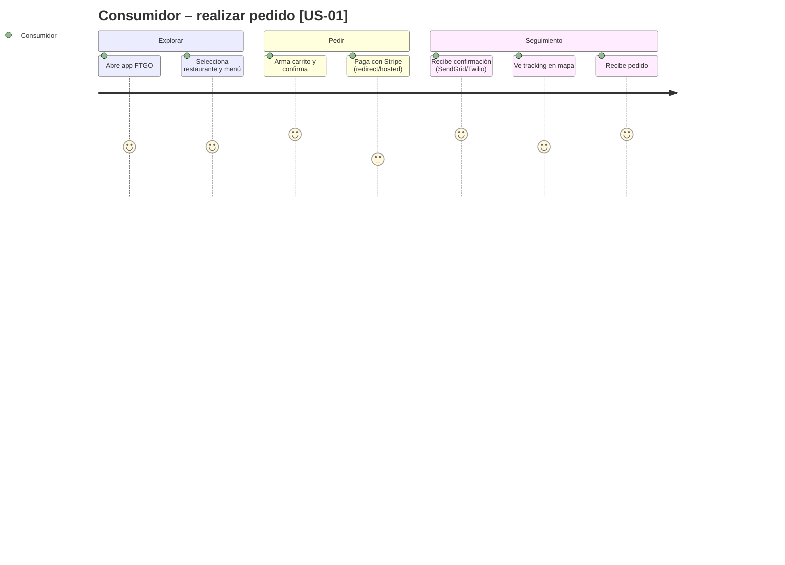
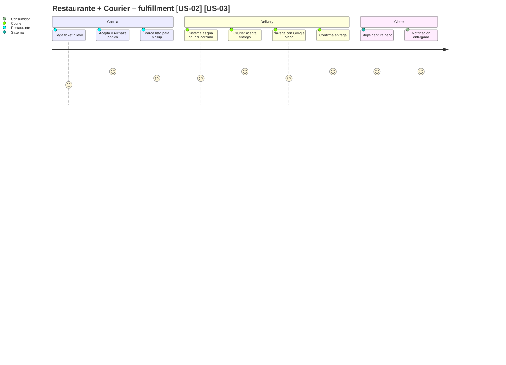

# Product Requirements Document (PRD) – FTGO (Food To Go)

> **Propósito del PRD**: describir **qué debe hacer el producto** para cumplir los requerimientos del MRD y BRD, con nivel suficiente para que diseño, ingeniería y QA puedan proceder. Responde a **"¿qué hace el producto?"** (no *cómo* lo hace).
>
> Audiencia: Product, Diseño (UX/UI), Ingeniería, QA, Arquitectura.

---

## 0. Metadatos

| Campo | Valor |
|-------|-------|
| Producto | **FTGO (Food To Go)** — modernización incremental hacia microservicios |
| Grupo | Exam Lab — Módulo 4 |
| Versión | `v1.0` |
| Fecha | `24/05/2026` |
| Product Manager / Autor | Carolina Aguilar |
| Revisores | Docente + Tech Lead + QA + Arquitectura |
| Estado | En revisión |
| BRD de referencia | `BRD-FTGO v1.0` (Brief §A.4) |
| MRD de referencia | `MRD-FTGO v1.0` |
| Insumos M2 (UI/UX) | `exam-lab/docs/wireframes/` (consumidor, restaurante, courier, back office) |
| Fase Spec Kit cubierta | Specify ✅ / Plan ⬜ / Tasks ⬜ / Implement ⬜ |
| Prompts utilizados | `PR-PRD-FTGO-001` |

## 0.1 Constitution (opcional — Spec Kit)

- **Principio 1**: El monolito Java/WAR en producción **permanece operativo** durante toda la migración; ningún release puede interrumpir pedidos en horario pico. [Cap.1 Richardson] · [Brief §A.4]
- **Principio 2**: Toda extracción de capacidad sigue el patrón **Strangler Fig** — el tráfico se redirige gradualmente; no se permite Big Bang Rewrite. [Cap.2 Richardson]
- **Principio 3**: Datos de pago (PAN, CVV) **nunca** transitan ni se almacenan en FTGO; cumplimiento PCI-DSS delegado íntegramente a **Stripe**. [Brief §A.4]
- **Principio 4**: Toda decisión de descomposición prioriza **aislamiento de fallos** y **escalado independiente** por capacidad de negocio, no por capa técnica. [Cap.1 Richardson]

> Estos principios funcionan como *invariantes a nivel de producto*: aparecerán como guardrails en el FSD y como criterios de auditoría en revisiones y ADRs.

## 1. Resumen del producto

**FTGO (Food To Go)** es una plataforma de delivery de comida en producción que conecta **consumidores**, **restaurantes** y **couriers** en un flujo de pedido → preparación → entrega → facturación. Hoy opera como **monolito Java empaquetado en WAR**, con los síntomas clásicos de *Monolithic Hell* descritos en [Cap.1 Richardson]: builds lentos, despliegues de alto riesgo, escalado conflictivo entre módulos (p. ej. picos de *order taking* vs. *delivery*), acoplamiento elevado y equipos bloqueados por dependencias internas.

El problema de negocio no es “falta de features”, sino **incapacidad de evolucionar el producto con la velocidad y confiabilidad** que exigen horarios pico, integraciones externas (Stripe, Google Maps, SendGrid, Twilio) y expectativas de latencia y tracking en tiempo real. Consumidores abandonan pedidos ante retrasos; restaurantes pierden visibilidad de tickets; couriers reciben asignaciones subóptimas; el back office carece de observabilidad end-to-end para incidentes.

La dirección de FTGO definió una **migración incremental a microservicios** mediante **Strangler Fig** [Cap.2 Richardson]: extraer capacidades de negocio (Consumer Management, Order Taking, Delivery, Billing, Notifications, etc.) sin detener el monolito. El producto objetivo de este PRD es el **programa de modernización v1.0**: documentar alcance, historias, NFRs y trazabilidad para derivar FSD, ADRs y diagramas C4, garantizando que el sistema siga facturando y entregando mientras cada capability evoluciona de forma independiente.

## 2. Objetivos del producto

Cada objetivo enlaza a un objetivo de negocio (BRD) y a la estrategia de migración [Brief §A.4].

| ID | Objetivo del producto | BRD vinculado | Métrica | Meta |
|----|------------------------|---------------|---------|------|
| OP-01 | Reducir tiempo de despliegue de cambios en *Order Taking* sin afectar *Delivery* | BO-01 | lead time deploy (p95) | ≤ 30 min (vs. ~4 h monolito) |
| OP-02 | Escalar horizontalmente *Order Taking* y *Delivery* de forma independiente en horario pico | BO-02 | réplicas activas por servicio | auto-scale 2–10 réplicas |
| OP-03 | Mantener latencia percibida del consumidor en flujos críticos [US-01] | BO-03 | API p95 | < 200 ms |
| OP-04 | Aislar fallos de integraciones externas (Stripe, Maps) del núcleo de pedidos | BO-04 | error budget mensual | 99.9 % disponibilidad |
| OP-05 | Habilitar observabilidad operacional para back office e incidentes | BO-05 | MTTR incidentes P1 | < 45 min |
| OP-06 | Completar primera ola Strangler: *Order Taking* + *Notifications* detrás de API Gateway | BO-06 | % tráfico en microservicios | ≥ 40 % pedidos nuevos |

## 3. Alcance (*Scope*)

### 3.1 Dentro del alcance (release v1.0)

- **Documentación objetivo** del programa de modernización (PRD, trazabilidad a FSD/ADR/C4). [Brief §A.4]
- **Definición y priorización** de microservicios candidatos alineados a capacidades de negocio: Consumer Management, Restaurant Management, Order Taking, Order Fulfillment, Delivery, Billing & Accounting, Notifications.
- **Toma de pedidos** [US-01]: creación de pedido, validación de menú, estimación inicial. Primera extracción Strangler.
- **Gestión de tickets** [US-02]: aceptar/rechazar pedidos en restaurante.
- **Delivery** [US-03]: asignación, aceptación courier, tracking básico.
- **Billing**: cobro vía Stripe, estados de pago, reembolsos parciales acordados a política FTGO.
- **Notifications**: email (SendGrid), SMS (Twilio), eventos de estado de pedido.
- **Integraciones externas**: Stripe, Google Maps, SendGrid, Twilio — con contratos de resiliencia y timeouts documentados en FSD.
- **API Gateway / routing Strangler** para redirigir tráfico incremental desde el monolito.
- **Observabilidad mínima v1.0**: logs estructurados, métricas por servicio, distributed tracing (correlation ID end-to-end).
- **Historias derivadas**: pagos, tracking, cancelaciones, gestión de menú (lectura), reporting operacional básico, reasignación de couriers.

### 3.2 Fuera del alcance (backlog)

| Ítem | Justificación |
|------|---------------|
| Reemplazo total inmediato del monolito (Big Bang) | Riesgo operacional inaceptable en producción [Cap.1 Richardson] |
| Migración completa de datos históricos en v1.0 | Requiere estrategia dual-write/event sourcing — fase posterior |
| Reescritura full del frontend | Clientes existentes siguen en apps actuales; BFF evolutivo |
| Multi-región global / CDN edge | No es driver del mercado actual FTGO |
| Machine learning (ruteo predictivo, demand forecasting) | Complejidad fuera del MVP de modernización |
| Kafka en producción v1.0 | Evaluado en roadmap v1.2; v1.0 usa cola ligera / HTTP async donde aplique |

### 3.3 Roadmap de versiones (Delivery track)

| Versión | Contenido | Fecha objetivo |
|---------|-----------|----------------|
| v1.0 | Strangler ola 1: Order Taking + Notifications + API Gateway; NFR base; Stripe | Q3 2026 |
| v1.1 | Delivery Service + tracking Maps; reasignación courier [US-03 ext.] | Q4 2026 |
| v1.2 | Billing Service completo; event bus (Kafka) para desacoplamiento | Q1 2027 |
| v2.0 | Order Fulfillment + Restaurant Management desacoplados; 80 % tráfico fuera del monolito | Q2 2027 |

### 3.4 Roadmap de validación (Discovery track)

| Sprint / Semana | Hipótesis a validar | Método | Criterio de éxito | Estado |
|-----------------|---------------------|--------|-------------------|--------|
| S1 | Restaurantes aceptan tickets en < 30 s durante pico | shadow traffic + 5 entrevistas | ≥ 85 % aceptación < 30 s | abierta |
| S2 | Consumidores toleran consistencia eventual en estado de pedido si tracking es < 5 s | prueba A/B | NPS ≥ baseline | abierta |
| S3 | Strangler sin downtime en deploy nocturno | canary 5 % tráfico | 0 incidentes P1 | abierta |

> **Regla de oro**: ninguna *user story* `Must` entra al Delivery track sin una hipótesis validada en el Discovery track.

## 4. Personas y *user journeys*

### 4.1 Personas (resumen, extendidas en MRD)

| Persona | Rol | Necesidad principal | Dolor actual (monolito) |
|---------|-----|---------------------|-------------------------|
| **Consumidor** | Cliente final | Pedidos rápidos, tracking en tiempo real, pagos confiables | Latencia en pico, estados desactualizados, errores en checkout |
| **Restaurante** | Partner cocina | Gestionar carga, aceptar/rechazar tickets, visibilidad de cola | UI lenta en hora pico; caídas del monolito bloquean toda la cocina |
| **Courier** | Repartidor | Asignaciones cercanas, rutas, pagos y tracking | Asignaciones subóptimas; sin aislamiento si falla módulo de billing |
| **Empleado FTGO** | Back office / soporte | Monitoreo, incidentes, reasignaciones | Falta tracing distribuido; logs acoplados en un solo WAR |
| **Arquitecto / DevOps** | Equipo plataforma | Despliegues rápidos, escalado independiente, resiliencia | Build 45+ min; deploy “todo o nada”; lock-in Java monolítico |
| **Sistemas externos** | Stripe, Maps, SendGrid, Twilio | Contratos estables, SLAs, webhooks | Fallo en un adaptador tumba flujos no relacionados |

#### Stakeholders — problemas, expectativas y necesidades

**Consumidor**  
Quiere completar un pedido en pocos toques y recibir confirmación inmediata. Necesita **tracking en tiempo real** del estado (confirmado → en cocina → en camino → entregado) y notificaciones proactivas ante retrasos. Es **altamente sensible** a latencia > 3 s en checkout y a errores de pago. Espera que FTGO no exponga datos de tarjeta (delegación Stripe). Su experiencia empeora cuando el monolito escala mal en pico: timeouts y estados inconsistentes.

**Restaurante**  
Debe **gestionar la carga de cocina** sin saturar la UI. Requiere **aceptar o rechazar pedidos en segundos** [US-02] y ver tickets en cola priorizada. Busca **estabilidad en horas pico** (viernes–domingo). El monolito actual mezcla lógica de menú, pedidos y reportes; un deploy de billing puede afectar la pantalla de tickets.

**Courier**  
Necesita **asignaciones geográficamente cercanas** y aceptación explícita de entregas [US-03]. Busca **optimización de rutas** (Google Maps) y **pagos confiables** al cerrar entrega. Requiere tracking GPS y comunicación con consumidor vía FTGO, no apps paralelas.

**Empleado FTGO (back office)**  
Necesita **monitoreo operacional** (pedidos atascados, couriers sin asignar, fallos Stripe). Requiere **observabilidad end-to-end** (trace ID desde [US-01] hasta entrega). Gestiona **incidentes y soporte** con capacidad de reasignar couriers y cancelar con política.

**Equipo de arquitectura**  
Debe **reducir deuda técnica** y permitir **escalabilidad horizontal independiente** por capability. Necesita **despliegues más rápidos** y **mantenibilidad** (bounded contexts claros). Busca **resiliencia** (circuit breakers, bulkheads) y migración **trazable** vía Strangler Fig [Cap.2 Richardson].

**Sistemas externos**

| Sistema | Dependencia FTGO | Riesgo si falla / degrada |
|---------|------------------|---------------------------|
| **Stripe** | Autorización, captura, reembolsos; webhooks de estado de pago | Pedidos quedan en “pendiente pago”; ingresos bloqueados |
| **Google Maps** | Geocodificación, ETA, rutas courier | Asignación degradada; ETAs incorrectos |
| **SendGrid** | Email transaccional (confirmación, recibos) | Menor impacto inmediato si SMS compensa |
| **Twilio** | SMS tracking y alertas courier/consumidor | Pérdida de canal crítico en última milla |

FTGO **no puede** asumir disponibilidad 100 % de terceros; la arquitectura objetivo aísla fallos (timeouts, colas de reintento, degradación controlada) — ver PRD-NFR-006.

### 4.2 *User journeys* principales (mínimo 2)





## 5. *User stories* y criterios de aceptación

> Mínimo **15 historias** priorizadas. Formato INVEST. Trazabilidad base: [US-01], [US-02], [US-03].

### 5.1 Épica E1 – Toma de pedidos y consumidor [US-01]

| ID | Historia | Prioridad | Valor | Esfuerzo | Criterios Gherkin |
|----|----------|-----------|-------|----------|-------------------|
| PRD-US-001 | Como **consumidor**, quiero **realizar un pedido desde un restaurante** para recibir comida en mi domicilio | Must | 10 | 8 | §5.1.1 |
| PRD-US-002 | Como **consumidor**, quiero **ver el menú actualizado** del restaurante para elegir ítems disponibles | Must | 8 | 5 | §5.1.2 |
| PRD-US-003 | Como **consumidor**, quiero **pagar con tarjeta vía Stripe** para completar el pedido de forma segura | Must | 9 | 5 | §5.1.3 |
| PRD-US-004 | Como **consumidor**, quiero **seguir el estado de mi pedido en tiempo real** para saber cuándo llegará | Must | 9 | 6 | §5.1.4 |
| PRD-US-005 | Como **consumidor**, quiero **cancelar un pedido antes de que el restaurante acepte** para corregir errores | Should | 7 | 4 | §5.1.5 |

#### 5.1.1 Criterios PRD-US-001 [US-01]

```gherkin
Escenario: Consumidor crea pedido válido en horario operativo
  Dado un consumidor autenticado con dirección de entrega válida
    Y un restaurante abierto con ítems en stock
  Cuando confirma el carrito y envía el pedido
  Entonces el sistema crea un pedido en estado PENDING_ACCEPTANCE
    Y retorna orderId en menos de 200 ms p95
    Y publica evento OrderCreated para notificaciones (consistencia eventual)
```

#### 5.1.2 Criterios PRD-US-002

```gherkin
Escenario: Menú refleja disponibilidad del restaurante
  Dado un restaurante con ítems agotados marcados no disponibles
  Cuando el consumidor consulta el menú
  Entonces solo ve ítems disponibles
    Y la respuesta es servida por Restaurant Management o monolito vía Strangler
```

#### 5.1.3 Criterios PRD-US-003

```gherkin
Escenario: Pago exitoso delegado a Stripe
  Dado un pedido en estado AWAITING_PAYMENT
  Cuando el consumidor completa el flujo Stripe
  Entonces FTGO recibe webhook payment_intent.succeeded
    Y el pedido transiciona a PAID sin almacenar PAN/CVV en FTGO
```

#### 5.1.4 Criterios PRD-US-004

```gherkin
Escenario: Tracking visible tras aceptación restaurante
  Dado un pedido en estado PREPARING o EN_ROUTE
  Cuando el consumidor abre detalle del pedido
  Entonces ve línea de tiempo de estados actualizada en menos de 5 s
    Y mapa con posición courier cuando EN_ROUTE
```

#### 5.1.5 Criterios PRD-US-005

```gherkin
Escenario: Cancelación antes de aceptación restaurante
  Dado un pedido en PENDING_ACCEPTANCE
  Cuando el consumidor solicita cancelar
  Entonces el pedido pasa a CANCELLED_BY_CONSUMER
    Y se inicia reembolso según política Stripe si ya hubo captura autorizada
```

### 5.2 Épica E2 – Restaurante y tickets [US-02]

| ID | Historia | Prioridad | Valor | Esfuerzo | Criterios Gherkin |
|----|----------|-----------|-------|----------|-------------------|
| PRD-US-006 | Como **restaurante**, quiero **aceptar o rechazar pedidos entrantes** para controlar carga de cocina | Must | 10 | 6 | §5.2.1 |
| PRD-US-007 | Como **restaurante**, quiero **ver cola de tickets priorizada** para organizar preparación | Must | 8 | 5 | §5.2.2 |
| PRD-US-008 | Como **restaurante**, quiero **marcar pedido listo para pickup** para notificar al courier | Must | 9 | 4 | §5.2.3 |
| PRD-US-009 | Como **restaurante**, quiero **actualizar disponibilidad de ítems del menú** para evitar pedidos inválidos | Should | 7 | 5 | §5.2.4 |

#### 5.2.1 Criterios PRD-US-006 [US-02]

```gherkin
Escenario: Restaurante acepta ticket en hora pico
  Dado un pedido en PENDING_ACCEPTANCE para mi restauranteId
  Cuando presiono Aceptar
  Entonces el pedido pasa a ACCEPTED en menos de 200 ms p95
    Y el consumidor recibe notificación en menos de 30 s (eventual)
```

```gherkin
Escenario: Restaurante rechaza con motivo
  Dado un pedido en PENDING_ACCEPTANCE
  Cuando presiono Rechazar con motivo obligatorio
  Entonces el pedido pasa a REJECTED_BY_RESTAURANT
    Y se dispara reembolso/autorización void vía Billing
```

#### 5.2.2 Criterios PRD-US-007

```gherkin
Escenario: Cola ordenada por antigüedad y prioridad
  Dado múltiples tickets pendientes y en preparación
  Cuando abro panel de cocina
  Entonces veo lista ordenada por SLA restante
```

#### 5.2.3 Criterios PRD-US-008

```gherkin
Escenario: Pedido listo dispara asignación delivery
  Dado un pedido ACCEPTED en preparación completa
  Cuando marco "Listo para pickup"
  Entonces el pedido pasa a READY_FOR_PICKUP
    Y el servicio Delivery recibe evento para asignación [US-03]
```

#### 5.2.4 Criterios PRD-US-009

```gherkin
Escenario: Ítem agotado no aparece en nuevos pedidos
  Dado un ítem marcado no disponible
  Cuando un consumidor consulta menú
  Entonces el ítem no es seleccionable
```

### 5.3 Épica E3 – Delivery y couriers [US-03]

| ID | Historia | Prioridad | Valor | Esfuerzo | Criterios Gherkin |
|----|----------|-----------|-------|----------|-------------------|
| PRD-US-010 | Como **courier**, quiero **recibir y aceptar asignaciones de entrega** para ganar por entrega completada | Must | 10 | 7 | §5.3.1 |
| PRD-US-011 | Como **courier**, quiero **navegar con ruta optimizada** para reducir tiempo de entrega | Must | 8 | 6 | §5.3.2 |
| PRD-US-012 | Como **empleado FTGO**, quiero **reasignar un pedido a otro courier** cuando hay incidencia | Should | 7 | 5 | §5.3.3 |
| PRD-US-013 | Como **courier**, quiero **confirmar entrega con prueba** para cerrar el ciclo de pago | Must | 9 | 4 | §5.3.4 |

#### 5.3.1 Criterios PRD-US-010 [US-03]

```gherkin
Escenario: Courier acepta asignación cercana
  Dado un pedido READY_FOR_PICKUP
    Y un courier disponible dentro del radio configurado
  Cuando el sistema propone la asignación
    Y el courier acepta en la app
  Entonces el pedido pasa a COURIER_ASSIGNED
    Y otros couriers dejan de ver la oferta
```

#### 5.3.2 Criterios PRD-US-011

```gherkin
Escenario: Ruta sugerida vía Google Maps
  Dado un pedido COURIER_ASSIGNED
  Cuando el courier inicia navegación
  Entonces la app muestra ruta y ETA desde Maps API
    Y si Maps no responde en 3 s se muestra última ruta cacheada o modo degradado
```

#### 5.3.3 Criterios PRD-US-012

```gherkin
Escenario: Back office reasigna courier
  Dado un pedido atascado sin movimiento GPS > 15 min
  Cuando un empleado FTGO ejecuta reasignación
  Entonces el pedido se desasigna del courier anterior
    Y se ofrece a otro courier disponible
    Y queda auditado en log operacional
```

#### 5.3.4 Criterios PRD-US-013

```gherkin
Escenario: Entrega confirmada dispara captura
  Dado un pedido EN_ROUTE
  Cuando el courier confirma entrega con código o foto
  Entonces el pedido pasa a DELIVERED
    Y Billing solicita captura Stripe si aplica
```

### 5.4 Épica E4 – Billing, notificaciones y operaciones

| ID | Historia | Prioridad | Valor | Esfuerzo | Criterios Gherkin |
|----|----------|-----------|-------|----------|-------------------|
| PRD-US-014 | Como **consumidor**, quiero **recibir notificaciones de cambio de estado** para estar informado sin abrir la app | Must | 8 | 4 | §5.4.1 |
| PRD-US-015 | Como **empleado FTGO**, quiero **un reporte diario de pedidos y fallos** para reuniones operativas | Should | 6 | 5 | §5.4.2 |
| PRD-US-016 | Como **empleado FTGO**, quiero **ver trazas distribuidas de un pedido** para diagnosticar incidentes | Must | 8 | 6 | §5.4.3 |
| PRD-US-017 | Como **consumidor**, quiero **recibir recibo por email** tras pago exitoso para mis registros | Could | 5 | 3 | §5.4.4 |

#### 5.4.1 Criterios PRD-US-014

```gherkin
Escenario: Notificación SMS en cambio crítico
  Dado un pedido que pasa a EN_ROUTE
  Cuando se publica evento OrderStatusChanged
  Entonces Twilio envía SMS al consumidor en menos de 60 s
    Y si Twilio falla el evento queda en cola de reintento
```

#### 5.4.2 Criterios PRD-US-015

```gherkin
Escenario: Reporte operacional diario
  Dado el cierre del día operativo
  Cuando un empleado FTGO solicita reporte
  Entonces obtiene agregados: pedidos completados, cancelados, tiempo medio entrega, incidentes por integración
```

#### 5.4.3 Criterios PRD-US-016

```gherkin
Escenario: Trace end-to-end por orderId
  Dado un orderId con incidente reportado
  Cuando busco en herramienta de observabilidad
  Entonces veo spans de Order Taking, Fulfillment, Delivery, Billing y Notifications con mismo correlationId
```

#### 5.4.4 Criterios PRD-US-017

```gherkin
Escenario: Recibo email post-pago
  Dado pago Stripe exitoso
  Cuando se procesa webhook
  Entonces SendGrid envía recibo al email del consumidor
```

## 6. Priorización

| Método | Ranking |
|--------|---------|
| MoSCoW | Must > Should > Could > Won't |
| RICE | `Reach × Impact × Confidence ÷ Effort` |

Tabla RICE (top 10):

| ID | Reach | Impact (0.25–3) | Confidence (%) | Effort | RICE |
|----|-------|-----------------|----------------|--------|------|
| PRD-US-001 | 500000 | 3 | 90 | 8 | 168750 |
| PRD-US-006 | 15000 | 3 | 85 | 6 | 6375 |
| PRD-US-010 | 8000 | 3 | 80 | 7 | 2743 |
| PRD-US-003 | 500000 | 2.5 | 90 | 5 | 225000 |
| PRD-US-004 | 500000 | 2 | 85 | 6 | 141667 |
| PRD-US-008 | 15000 | 2 | 90 | 4 | 6750 |
| PRD-US-013 | 8000 | 2.5 | 85 | 4 | 4250 |
| PRD-US-014 | 500000 | 1.5 | 80 | 4 | 150000 |
| PRD-US-016 | 50 | 2 | 75 | 6 | 12.5 |
| PRD-US-012 | 50 | 1.5 | 70 | 5 | 10.5 |

## 7. Requerimientos funcionales (alto nivel)

| ID | Requisito | Historia(s) | Prioridad |
|----|-----------|-------------|-----------|
| PRD-REQ-001 | El sistema debe permitir a un consumidor autenticado crear pedidos contra un restaurante con ítems válidos | PRD-US-001, PRD-US-002 | Must |
| PRD-REQ-002 | El sistema debe integrar pagos con Stripe sin persistir datos de tarjeta en FTGO | PRD-US-003 | Must |
| PRD-REQ-003 | El restaurante debe poder aceptar o rechazar pedidos con transición de estado auditable | PRD-US-006 | Must |
| PRD-REQ-004 | El sistema debe asignar y permitir aceptación de entregas por couriers disponibles | PRD-US-010 | Must |
| PRD-REQ-005 | El consumidor debe consultar estado y ubicación de pedido en curso | PRD-US-004 | Must |
| PRD-REQ-006 | El sistema debe enviar notificaciones por SendGrid y Twilio ante cambios de estado relevantes | PRD-US-014, PRD-US-017 | Must |
| PRD-REQ-007 | El back office debe poder reasignar couriers ante incidencias operativas | PRD-US-012 | Should |
| PRD-REQ-008 | El sistema debe soportar cancelación de pedido según reglas de estado y política de reembolso | PRD-US-005 | Should |
| PRD-REQ-009 | El restaurante debe gestionar disponibilidad de ítems de menú | PRD-US-009 | Should |
| PRD-REQ-010 | El sistema debe exponer reportes operativos agregados para empleados FTGO | PRD-US-015 | Should |
| PRD-REQ-011 | El API Gateway debe enrutar tráfico Strangler entre monolito y microservicios por ruta/versión | OP-06 | Must |
| PRD-REQ-012 | Toda transición de estado de pedido debe propagarse vía eventos para consumidores downstream (consistencia eventual) | PRD-US-001, PRD-US-006 | Must |

### 7.1 Capacidades de negocio

#### 7.1.1 Consumer Management

| Aspecto | Descripción |
|---------|-------------|
| **Propósito** | Registrar, autenticar y mantener perfiles de consumidores, direcciones y preferencias. |
| **Stakeholders** | Consumidor, Empleado FTGO (soporte), Arquitectura. |
| **Problema que resuelve** | Identidad y contexto de entrega para [US-01]; sin ello no hay pedido válido. |
| **Importancia operacional** | Alta — dato maestro para billing y notificaciones. |
| **Escalabilidad** | Lecturas frecuentes en pico; candidato a servicio con réplicas de lectura. |
| **UX** | Login rápido, direcciones guardadas, historial de pedidos. |
| **Microservicio futuro** | `consumer-service` — extraíble en ola 2; bajo acoplamiento con Order Taking vía IDs. |

#### 7.1.2 Restaurant Management

| Aspecto | Descripción |
|---------|-------------|
| **Propósito** | Onboarding de restaurantes, horarios, menús, disponibilidad de ítems. |
| **Stakeholders** | Restaurante, Empleado FTGO. |
| **Problema que resuelve** | Catálogo correcto para PRD-US-002, PRD-US-009; evita pedidos a ítems agotados. |
| **Importancia operacional** | Crítica en hora pico — lecturas masivas de menú. |
| **Escalabilidad** | Escalar lecturas independiente de escrituras de pedidos. |
| **UX** | Menú preciso, tiempos de preparación estimados. |
| **Microservicio futuro** | `restaurant-service` — Strangler en endpoints `/restaurants`, `/menus`. |

#### 7.1.3 Order Taking

| Aspecto | Descripción |
|---------|-------------|
| **Propósito** | Crear y validar pedidos, carrito, totales, inicio de ciclo de vida. [US-01] |
| **Stakeholders** | Consumidor, Restaurante (indirecto), Arquitectura. |
| **Problema que resuelve** | Cuello de botella principal en monolito; mayor volumen en pico. |
| **Importancia operacional** | Máxima — ingreso directo. |
| **Escalabilidad** | **Primera ola Strangler** — escalado horizontal agresivo. |
| **UX** | Checkout < 200 ms p95; confirmación inmediata. |
| **Microservicio futuro** | `order-service` — bounded context central [Cap.2 Richardson]. |

#### 7.1.4 Order Fulfillment

| Aspecto | Descripción |
|---------|-------------|
| **Propósito** | Orquestar preparación: aceptación, rechazo, tiempos, handoff a delivery. [US-02] |
| **Stakeholders** | Restaurante, Courier (handoff), Empleado FTGO. |
| **Problema que resuelve** | Desacopla cocina de cobro y asignación; reduce contención en monolito. |
| **Importancia operacional** | Alta en SLA restaurante–consumidor. |
| **Escalabilidad** | Escrituras burst al aceptar tickets; eventos a Delivery. |
| **UX** | Tickets claros, menos timeouts en panel cocina. |
| **Microservicio futuro** | `kitchen-ticket-service` o módulo dentro de fulfillment aggregate. |

#### 7.1.5 Delivery

| Aspecto | Descripción |
|---------|-------------|
| **Propósito** | Asignación, aceptación courier, tracking GPS, confirmación entrega. [US-03] |
| **Stakeholders** | Courier, Consumidor, Empleado FTGO. |
| **Problema que resuelve** | Lógica geo-distribuida y dependencia Maps no debe arrastrar Order Taking. |
| **Importancia operacional** | Crítica para promesa de entrega. |
| **Escalabilidad** | Segunda ola; picos correlacionados con pedidos pero patrones CPU/IO distintos. |
| **UX** | ETAs confiables, reasignación transparente. |
| **Microservicio futuro** | `delivery-service` + integración Maps aislada con circuit breaker. |

#### 7.1.6 Billing & Accounting

| Aspecto | Descripción |
|---------|-------------|
| **Propósito** | Autorización, captura, reembolsos, conciliación con Stripe; comisiones restaurante/courier. |
| **Stakeholders** | Consumidor, Restaurante, Courier, Finanzas FTGO. |
| **Problema que resuelve** | PCI scope y reglas financieras aisladas del flujo operativo. |
| **Importancia operacional** | Alta — error = pérdida de ingresos o disputas. |
| **Escalabilidad** | Throughput moderado pero **consistencia fuerte** en transacciones monetarias vs. eventual en estado pedido. |
| **UX** | Pagos transparentes; reembolsos automáticos en rechazo. |
| **Microservicio futuro** | `billing-service` — único dueño de integración Stripe [PRD-NFR-008]. |

#### 7.1.7 Notifications

| Aspecto | Descripción |
|---------|-------------|
| **Propósito** | Email, SMS, push internos ante eventos de dominio. |
| **Stakeholders** | Todos los actores externos. |
| **Problema que resuelve** | Desacopla SendGrid/Twilio del monolito; reintentos sin bloquear pedidos. |
| **Importancia operacional** | Media-alta — percepción de confiabilidad. |
| **Escalabilidad** | Cola de mensajes; primera ola junto a Order Taking. |
| **UX** | Información oportuna (< 60 s eventual). |
| **Microservicio futuro** | `notification-service` — consume eventos OrderStatusChanged. |

## 8. Requerimientos no funcionales (alto nivel)

> Detalle de verificación en FSD. Cada NFR explica el **porqué**, impacto negocio/técnico y riesgo.

| ID | Categoría | Requerimiento | Métrica | Umbral | Problema que resuelve | Impacto negocio | Impacto técnico | Riesgo si no se cumple | Arquitectura distribuida |
|----|-----------|---------------|---------|--------|----------------------|-----------------|-----------------|------------------------|--------------------------|
| PRD-NFR-001 | Escalabilidad | Escalado horizontal **independiente** por servicio | réplicas / CPU | auto-scale por servicio | Monolito escala todo el WAR por un pico en pedidos [Cap.1 Richardson] | Costo infra y lentitud en pico | HPA/K8s por deployment | Caída en hora pico; pérdida de ingresos | Core de microservicios |
| PRD-NFR-002 | Rendimiento | Latencia API síncrona crítica | p95 | < 200 ms | UX consumidor/restaurante [US-01][US-02] | Abandono de carrito | SLAs por servicio, caching lectura menú | NPS cae; churn | Gateway + servicios stateless |
| PRD-NFR-003 | Disponibilidad | Uptime plataforma pedidos | mensual | 99.9 % | Ingresos ligados a disponibilidad | ~43 min downtime/mes máx. | SLO, error budgets, health checks | Multas reputacionales | Replicas multi-AZ, bulkheads |
| PRD-NFR-004 | Consistencia | **Eventual consistency** entre servicios | lag estado | < 5 s p95 | Transacciones distribuidas 2PC no escalan [Cap.2 Richardson] | Estados “casi” en tiempo real aceptables | Saga / eventos; UI optimista | Usuario ve estado viejo > 30 s | Event-driven entre bounded contexts |
| PRD-NFR-005 | Observabilidad | **Distributed tracing** | % traces | 100 % flujos Must | Monolito oculta cuellos de botella | MTTR alto en incidentes | OpenTelemetry, correlationId | Incidentes P1 prolongados | Trace cross-service obligatorio |
| PRD-NFR-006 | Resiliencia | **Tolerancia a fallos externos** | timeout + CB | 3 s timeout, CB abierto < 30 s | Stripe/Maps caen y tumbaron monolito | Pedidos bloqueados globalmente | Circuit breaker, retry exponencial, colas | Cascading failure | Anti-corruption layers por integración |
| PRD-NFR-007 | Migración | **Strangler Fig incremental** | % tráfico migrado | plan por ola [Brief §A.4] | Big Bang inaceptable | Parar negocio semanas | API Gateway, feature flags, dual routing | Rollback imposible | Coexistencia monolito + MS |
| PRD-NFR-008 | Seguridad | **PCI-DSS delegado a Stripe** | alcance PCI | SAQ A / hosted fields | FTGO no es expertos en PAN storage | Multas y brechas | Tokenización; sin PAN en logs/BD | Pérdida licencia procesamiento | Billing aislado |
| PRD-NFR-009 | Observabilidad | **Observabilidad end-to-end** | métricas + logs + traces | dashboards por servicio | Back office ciego [PRD-US-016] | Soporte reactivo lento | Prometheus/Grafana, alertas SLO | Escalación manual caótica | Plataforma observability compartida |

### 8.1 Contexto arquitectónico de migración (producto)

| Tema | Decisión de producto |
|------|---------------------|
| **Por qué microservicios** | Escalar y desplegar por **capability** (Order Taking vs Delivery), equipos autónomos, aislamiento de fallos [Cap.1 Richardson]. |
| **Por qué NO Big Bang** | FTGO está en producción; reescritura detiene innovación y concentra riesgo. |
| **Strangler Fig** | Nuevas rutas en API Gateway → microservicio; legado sigue sirviendo hasta 0 % tráfico [Cap.2 Richardson]. |
| **Eventual consistency** | Aceptable en estado de pedido/notificaciones; **no** en ledger Stripe (strong consistency local en Billing). |
| **Evolución independiente** | Cada capability §7.1 despliega en su ciclo; contratos de API/eventos versionados. |
| **Kafka (futuro)** | v1.2+ para fan-out de eventos (OrderCreated, OrderStatusChanged) y desacoplar Notifications, Analytics. |
| **Operación durante migración** | Monolito y MS comparten BD transicional al inicio (shared database anti-pattern mitigado con vistas y migración por dominio); sin downtime de pedidos. |

## 9. Dependencias e integraciones

| Sistema | Tipo | Propósito | Riesgo | Mitigación (producto) |
|---------|------|-----------|--------|------------------------|
| **Monolito FTGO (Java WAR)** | legado / coexistencia | Funcionalidad no migrada | Alto — cambios accidentales | Strangler routing; congelar features en módulos en extracción |
| **Stripe** | consumo + webhooks | Pagos, reembolsos [PRD-REQ-002] | Alto | Idempotency keys, cola webhooks, PRD-NFR-006 |
| **Google Maps** | consumo | Rutas, ETA, geocoding [PRD-US-011] | Medio | Cache ETA, modo degradado |
| **SendGrid** | consumo | Email transaccional [PRD-US-017] | Medio | Reintento async; no bloquea pedido |
| **Twilio** | consumo | SMS tracking [PRD-US-014] | Medio | Cola dead-letter; alerta si backlog > 1000 |
| **API Gateway** | infra producto | Enrutamiento Strangler [PRD-REQ-011] | Medio | Canary releases por % tráfico |

## 10. Supuestos y restricciones

**Supuestos**

- El monolito permanece **fuente de verdad** para datos no migrados en v1.0. [Brief §A.4]
- Equipos pueden operar **≥ 2 servicios** en paralelo (Order + Notifications) con pipeline CI/CD existente extendido.
- Stripe permanece único PSP en v1.0.
- Volumen pico actual cabe en escalado horizontal 10× del servicio Order Taking.

**Restricciones**

- **No Big Bang Rewrite** — restricción de dirección y riesgo operacional.
- Stack objetivo de microservicios: a definir en ADR (Java/Spring o polyglot) — no bloquea PRD.
- Presupuesto cloud acotado: escalado con límites máximos por servicio.
- Cumplimiento: PCI vía Stripe; datos personales consumidor según política FTGO y regulación local.
- Plazo v1.0: Q3 2026 con primera ola en producción con canary ≥ 5 %.

## 11. Experiencia de usuario

- **Consumidor**: flujo pedido ≤ 4 pantallas; feedback inmediato en checkout; mapa tracking nativo.
- **Restaurante**: panel tickets full-screen, botones Aceptar/Rechazar grandes, alertas sonoras opcionales.
- **Courier**: lista ofertas + mapa; confirmación entrega en un gesto.
- **Back office**: consola con búsqueda por `orderId` / `correlationId`.
- **Accesibilidad**: WCAG 2.2 AA en apps web restaurante y back office.
- **Design system**: tokens FTGO (marca, estados pedido con color semántico consistente).

### 11.1 Trazabilidad con M2 (UI/UX)

#### Use Cases del M2 ↔ User Stories del PRD

| Use Case M2 | User Story PRD | Estado de la traza |
|-------------|----------------|---------------------|
| UC-M2-01: Consumidor arma pedido | PRD-US-001 | ✅ cubierto |
| UC-M2-02: Restaurante gestiona tickets | PRD-US-006, PRD-US-007 | ✅ cubierto |
| UC-M2-03: Courier acepta entrega | PRD-US-010 | ✅ cubierto |
| UC-M2-04: Tracking en mapa | PRD-US-004, PRD-US-011 | ✅ cubierto |
| UC-M2-05: Back office incidentes | PRD-US-012, PRD-US-016 | ⚠️ parcial |

#### Wireframes M2 ↔ Pantallas del PRD

| Wireframe M2 | Pantalla / flujo PRD | Estado |
|--------------|----------------------|--------|
| `consumer_checkout_v1.png` | §4.2 journey consumidor | validado |
| `restaurant_ticket_board.png` | PRD-US-006, PRD-US-007 | validado |
| `courier_offer_list.png` | PRD-US-010 | validado |
| `ops_trace_lookup.png` | PRD-US-016 | pendiente M2 |

### 11.2 Exploración con Vibe Coding (opcional)

| Exploración | Pregunta de Discovery | Prompts utilizados | Conclusión que entra al PRD |
|-------------|----------------------|--------------------|-----------------------------|
| Prototipo Strangler routing | ¿Podemos enrutar 5 % POST /orders al MS sin regresión? | `PR-VIBE-FTGO-001` | Confirma OP-06, PRD-REQ-011 |
| Panel tickets responsive | ¿Aceptar pedido usable en tablet 10"? | `PR-VIBE-FTGO-002` | Ajuste §11 restaurante |

## 12. Métricas de éxito del producto

- **North Star**: **Pedidos entregados exitosamente por semana** (throughput confiable end-to-end).
- **KPIs de adopción**: tasa de repetición consumidor 30 días; % restaurantes con SLA aceptación < 30 s.
- **KPIs de calidad**: error rate checkout < 0.5 %; p95 latencia < 200 ms; disponibilidad 99.9 %.
- **KPIs de modernización**: % pedidos creados vía `order-service`; lead time deploy Order Taking < 30 min; MTTR P1 < 45 min.
- **KPIs de migración**: 0 rollbacks catastróficos en canary; 100 % traces en flujos Must.

## 13. Riesgos del producto

| Riesgo | Prob. | Impacto | Mitigación |
|--------|-------|---------|------------|
| Regresión en Strangler routing | media | alto | Canary 5→25→100 %; tests contract; rollback Gateway |
| Inconsistencia de estado visible al consumidor | alta | medio | PRD-NFR-004; UI “actualizando”; polling/WebSocket v1.1 |
| Fallo prolongado Stripe | baja | alto | Modo solo efectivo no — pausar nuevos checkout; cola webhooks |
| Dual-write monolito/MS corrupto | media | alto | Idempotencia; feature flag por restaurante piloto |
| Equipo saturado manteniendo monolito + MS | alta | medio | Roadmap por ola; congelar módulos en extracción |
| Deuda de shared database | alta | medio | Plan migración datos por dominio en v1.2+ |

## 14. Trazabilidad

| PRD ID | BRD / Brief | MRD | Richardson | FSD (próximo) |
|--------|-------------|-----|------------|----------------|
| PRD-US-001 | BR-001 | MRD-FTGO-01 | [US-01] · [Cap.1] | FSD-UC-001 |
| PRD-US-006 | BR-002 | MRD-FTGO-02 | [US-02] | FSD-UC-002 |
| PRD-US-010 | BR-003 | MRD-FTGO-03 | [US-03] · [Cap.2] | FSD-UC-003 |
| PRD-REQ-001 | BR-001 | — | [US-01] | FSD-UC-001 |
| PRD-REQ-011 | BO-006 | — | [Cap.2] Strangler | FSD-UC-010 |
| PRD-NFR-001 | BO-002 | — | [Cap.1] Monolithic Hell | FSD-NFR-001 |
| PRD-NFR-004 | BO-003 | — | [Cap.2] Saga/eventual | FSD-NFR-004 |
| PRD-NFR-007 | BO-006 | [Brief §A.4] | [Cap.2] Strangler Fig | FSD-NFR-007 |
| OP-01 – OP-06 | BO-01 – BO-06 | MRD-FTGO | [Brief §A.4] | — |

**Referencias explícitas consolidadas**: [Brief §A.4] · [US-01] · [US-02] · [US-03] · [Cap.1 Richardson] · [Cap.2 Richardson]

## 15. Anexos

- **A.1** Mapa de bounded contexts FTGO (borrador C4 Context) — derivar en `docs/c4/`.
- **A.2** Diagrama de estados de pedido (PENDING_ACCEPTANCE → DELIVERED) — input FSD.
- **A.3** Catálogo de eventos de dominio v1.0: `OrderCreated`, `OrderAccepted`, `OrderRejected`, `OrderReadyForPickup`, `CourierAssigned`, `OrderDelivered`, `PaymentCaptured`.
- **A.4** Glosario: FTGO, Strangler Fig, Monolithic Hell, eventual consistency, capability.

## 16. Registro de cambios

| Versión | Fecha | Autor | Cambio |
|---------|-------|-------|--------|
| v0.1 | 20/05/2026 | Carolina Aguilar | Plantilla inicial |
| v1.0 | 24/05/2026 | Carolina Aguilar | PRD completo FTGO: stakeholders, capabilities, 17 US, NFRs migración Strangler, trazabilidad Richardson/Brief |

---

## Checklist mínimo

- [x] ≥ 15 *user stories* con INVEST y Gherkin.
- [x] Priorización MoSCoW + RICE para top‑10.
- [x] ≥ 2 *user journeys* en Mermaid.
- [x] NFRs alto nivel con umbrales y justificación arquitectónica.
- [x] Roadmap de versiones.
- [x] Trazabilidad BRD → MRD → PRD → FSD iniciada.
- [ ] Revisión documentada por pares.
